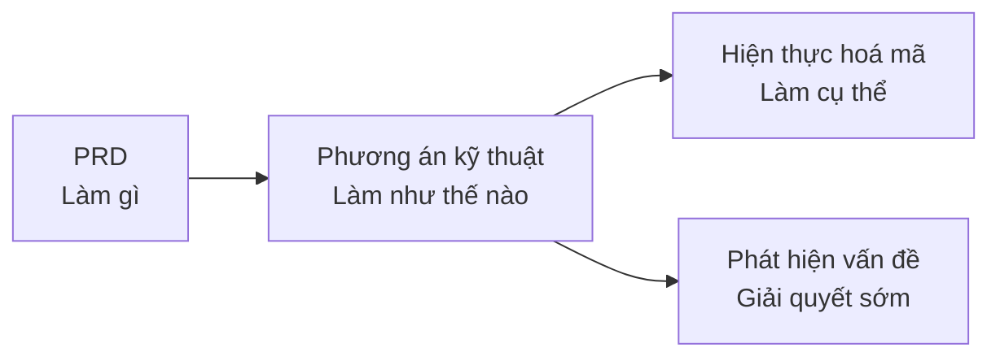

# 5.6 Phương án là để giảm rủi ro——Phương án kỹ thuật

### Mục đích viết phương án kỹ thuật

Phương án kỹ thuật không phải để "làm theo quy trình", mà là để **phát hiện vấn đề trước khi viết mã**.



### Phương án kỹ thuật nên bao gồm gì

Một phương án kỹ thuật tối thiểu nhưng hiệu quả:

```markdown
## Mẫu phương án kỹ thuật

### 1. Thiết kế giao diện
- Đường dẫn API, phương thức, tham số
- Định dạng yêu cầu/phản hồi

### 2. Thiết kế bảng dữ liệu
- Cấu trúc bảng, định nghĩa trường
- Mối quan hệ giữa các bảng

### 3. Ranh giới hệ thống
- Những gì tự mình triển khai
- Những gì phụ thuộc vào dịch vụ bên ngoài

### 4. Đánh giá rủi ro
- Những khó khăn kỹ thuật có thể gặp phải
- Biện pháp ứng phó

### 5. Ước tính khối lượng công việc
- Thời gian phát triển của mỗi mô-đun
- Lịch trình thời gian tổng thể
```

### Tại sao các lập trình viên độc lập cũng cần phương án kỹ thuật

| Tình huống | Không viết phương án | Viết phương án |
|------|----------|--------|
| Trong quá trình phát triển | Phát hiện vấn đề thiết kế, cần viết lại | Phát hiện sớm, điều chỉnh phương án |
| Để AI hiện thực | AI hoạt động độc lập, giao diện không thống nhất | AI triển khai theo phương án, phong cách nhất quán |
| Ước tính thời gian | Đoán mò, thường thiếu | Có cơ sở, chính xác hơn |

### Phương án kỹ thuật vs Chú thích mã

Phương án kỹ thuật là **thiết kế cấp cao**, trả lời "tại sao làm như vậy":
- Tại sao dùng PostgreSQL thay vì MongoDB?
- Tại sao dùng JWT thay vì Session?
- Tại sao lại thiết kế cấu trúc bảng như vậy?

Chú thích mã là **chi tiết hiện thực**, trả lời "đoạn mã này làm gì".

### Mục tiêu của phần này

Sau khi học xong phần này, bạn sẽ nắm vững:

1. **Thiết kế giao diện**：Cách thiết kế API rõ ràng
2. **Thiết kế bảng dữ liệu**：Cách thiết kế cấu trúc dữ liệu hợp lý
3. **Ranh giới hệ thống**：Cách phân chia sự phụ thuộc ngoài
4. **Đánh giá rủi ro**：Cách xác định và giảm thiểu rủi ro kỹ thuật
5. **Tự đánh giá cá nhân**：Cách đánh giá khả năng hoàn thành của mình

**Nguyên tắc cốt lõi**: Viết phương án kỹ thuật càng sớm càng tốt, chi phí sửa đổi phương án thấp hơn nhiều so với sửa đổi mã.
