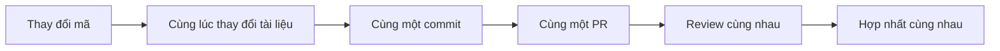

# 5.7.2 Thay đổi mã phải thay đổi tài liệu — Quy trình PR

### Giải đáp nhanh

Thời điểm tốt nhất để cập nhật tài liệu là **khi bạn thay đổi mã**, không phải "sẽ làm sau".

### Cập nhật mã và tài liệu đồng bộ



### Khi nào cần cập nhật tài liệu

| Loại thay đổi mã | Tài liệu cần cập nhật |
|--------------|----------------|
| Thêm giao diện API mới | Tài liệu API |
| Sửa thông số giao diện | Tài liệu API |
| Thêm chức năng mới | Hướng dẫn sử dụng |
| Sửa cách cấu hình | Tài liệu triển khai |
| Sửa cấu trúc cơ sở dữ liệu | Tài liệu kiến trúc |

### Quy chuẩn gửi PR

Thông tin commit chứa cập nhật tài liệu:

```bash
# Phát triển tính năng + tài liệu
feat: Thêm chức năng tìm kiếm bài viết

- Cài đặt giao diện API tìm kiếm từ khóa
- Thêm phân trang kết quả tìm kiếm
- Cập nhật tài liệu API

# Sửa lỗi + tài liệu
fix: Sửa lỗi đăng nhập hết hạn

- Kéo dài thời gian hiệu lực token
- Cập nhật giải thích tài liệu xác thực

# Cập nhật tài liệu riêng
docs: Cập nhật tài liệu triển khai

- Thêm giải thích triển khai Docker
- Sửa cấu hình biến môi trường
```

### Danh sách kiểm tra PR

Trước khi gửi PR, kiểm tra:

```markdown
## Danh sách kiểm tra PR

### Mã
- [ ] Mã chạy bình thường
- [ ] Vượt qua tất cả các bài kiểm tra
- [ ] Không có lỗi lint

### Tài liệu
- [ ] Thay đổi API có cập nhật docs/api.md không
- [ ] Chức năng mới có thêm giải thích sử dụng không
- [ ] Thay đổi cấu hình có cập nhật README không
- [ ] Thay đổi cơ sở dữ liệu có cập nhật tài liệu kiến trúc không
```

### Quy trình đơn giản hóa cho nhà phát triển độc lập

Khi phát triển một mình, quy trình có thể đơn giản hóa:


Chìa khóa là tạo thói quen:
- Mỗi lần thay đổi mã, hỏi bản thân: "Thay đổi này có cần cập nhật tài liệu không?"
- Nếu cần, **hãy cập nhật ngay**, đừng trì hoãn

### Thời điểm tốt nhất để cập nhật tài liệu

```
Cách làm sai
1. Viết xong tất cả mã
2. Dự án sắp trực tuyến
3. Nhớ ra là chưa viết tài liệu
4. Bổ sung tài liệu (đã quên nhiều chi tiết)

Cách làm đúng
1. Viết mã giao diện API
2. Viết ngay tài liệu giao diện API
3. commit: "feat: Thêm giao diện đăng ký người dùng"
4. Tiếp tục tính năng tiếp theo
```

### Để AI giúp bạn viết tài liệu

```
Bạn: Tôi vừa viết một giao diện đăng nhập người dùng, giúp tôi viết tài liệu

POST /api/auth/login
Tham số: email, password
Trả về: đối tượng user và token

AI: ## POST /api/auth/login

Giao diện đăng nhập người dùng.

### Tham số yêu cầu

| Tham số | Loại | Bắt buộc | Giải thích |
|------|------|------|------|
| email | string | Có | Email người dùng |
| password | string | Có | Mật khẩu người dùng |

### Phản hồi thành công

\`\`\`json
{
  "user": {
    "id": "user_123",
    "email": "user@example.com",
    "name": "Nguyễn Văn A"
  },
  "token": "eyJhbGciOiJIUzI1NiIs..."
}
\`\`\`

### Phản hồi lỗi

| Mã trạng thái | Mã lỗi | Giải thích |
|--------|--------|------|
| 400 | MISSING_EMAIL | Email không được để trống |
| 401 | INVALID_CREDENTIALS | Email hoặc mật khẩu sai |
```

### Lời khuyên thực tế

1. **Mã và tài liệu cùng một commit**: Đảm bảo phiên bản tương ứng
2. **Không trì hoãn**: Viết xong mã thì viết ngay tài liệu
3. **Dùng AI để tăng tốc**: Để AI tạo dự thảo tài liệu
4. **Ưu tiên tóm tắt**: Tài liệu đủ dùng là được, không cần quá chi tiết
