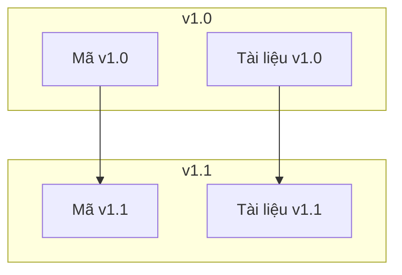

# 5.7.3 Tài liệu cũng cần phương thuốc pānirvāna — Kiểm soát phiên bản tài liệu

### Giải đáp nhanh

Quản lý tài liệu bằng Git, bạn có thể **truy vết lịch sử, hoàn tác thay đổi, so sánh những thay đổi**.

### Tại sao phải kiểm soát phiên bản tài liệu

```
Tình huống 1: Tài liệu viết sai
  Không kiểm soát phiên bản → Sửa rồi, không biết lúc đầu viết gì
  Có kiểm soát phiên bản   → git diff để xem sửa gì, git revert để hoàn tác

Tình huống 2: Tra cứu quyết định lịch sử
  Không kiểm soát phiên bản → Không biết tại sao thiết kế như vậy
  Có kiểm soát phiên bản   → git log để xem thông tin commit lúc đó

Tình huống 3: Tài liệu nhiều phiên bản
  Không kiểm soát phiên bản → v1-doc.md, v2-doc.md, v2-final-doc.md
  Có kiểm soát phiên bản   → git checkout v1.0 để xem tài liệu phiên bản đó
```

### Kiến thức cơ bản kiểm soát phiên bản tài liệu

```bash
# Xem lịch sử thay đổi tài liệu
git log --oneline docs/

# Xem thay đổi của một tài liệu cụ thể
git log --oneline docs/api.md

# Xem thay đổi chi tiết
git diff HEAD~1 docs/api.md

# Hoàn tác về phiên bản trước
git checkout HEAD~1 -- docs/api.md
```

### Quy chuẩn thông tin commit

Commit liên quan đến tài liệu nên dùng tiền tố `docs:`:

```bash
# Thêm tài liệu mới
docs: Thêm tài liệu API

# Cập nhật tài liệu
docs: Cập nhật giải thích triển khai

# Sửa lỗi tài liệu
docs: Sửa giải thích thông số giao diện API

# Tổ chức lại cấu trúc tài liệu
docs: Tổ chức lại cấu trúc thư mục tài liệu
```

### Tài liệu và phiên bản mã tương ứng

Đảm bảo mỗi phiên bản mã có tài liệu tương ứng:



Cách cài đặt:
```bash
# Khi ghi nhãn phiên bản, đảm bảo tài liệu cũng được cập nhật
git tag -a v1.0.0 -m "Release v1.0.0"

# Xem tài liệu của phiên bản nào đó
git checkout v1.0.0 -- docs/
```

### Chiến lược nhánh tài liệu

Với dự án phức tạp, tài liệu có thể có nhánh:

```
Nhánh main
├── Tài liệu phiên bản ổn định mới nhất

Nhánh develop
├── Cập nhật tài liệu đang phát triển

Nhánh feature/xxx
├── Dự thảo tài liệu liên quan chức năng mới
```

Với dự án cá nhân, thường chỉ dùng nhánh main là đủ.

### Ví dụ xem thay đổi tài liệu

```bash
# Xem 5 lần sửa gần đây của api.md
git log --oneline -5 docs/api.md

# Ví dụ kết quả
a1b2c3d docs: Thêm tài liệu giao diện tìm kiếm
e4f5g6h docs: Cập nhật thông số giao diện xác thực
i7j8k9l feat: Cài đặt đăng ký người dùng (có tài liệu)
m0n1o2p docs: Khởi tạo tài liệu API
q3r4s5t docs: Tạo cấu trúc thư mục tài liệu

# Xem nội dung thay đổi cụ thể
git show a1b2c3d
```

### Phát hành phiên bản tài liệu

Khi phát hành phiên bản mới, đảm bảo tài liệu đồng bộ:

```markdown
## Danh sách kiểm tra phát hành

### Mã
- [ ] Tất cả chức năng được phát triển xong
- [ ] Bài kiểm tra vượt qua
- [ ] Cập nhật số phiên bản

### Tài liệu
- [ ] Tài liệu API phù hợp với mã
- [ ] Cập nhật CHANGELOG
- [ ] Cập nhật số phiên bản trong README
- [ ] Kiểm tra tài liệu triển khai
```

### Duy trì CHANGELOG

Ghi lại thay đổi của mỗi phiên bản:

```markdown
# Changelog

## [1.1.0] - 2024-01-20

### Added (Thêm mới)
- Chức năng tìm kiếm bài viết
- Chức năng quản lý nhãn

### Changed (Thay đổi)
- Tối ưu tốc độ tải danh sách bài viết

### Fixed (Sửa)
- Sửa lỗi hết thời gian đăng nhập

## [1.0.0] - 2024-01-01

### Added (Thêm mới)
- Phiên bản đầu tiên
- CRUD bài viết
- Xác thực người dùng
```

### Lời khuyên thực tế

1. **Tài liệu và mã cùng gửi**: Đảm bảo phiên bản tương ứng
2. **Thông tin commit phải rõ ràng**: Dễ tìm sau này
3. **Ghi nhãn phiên bản quan trọng**: Tiện truy lùi lịch sử
4. **Dọn dẹp định kỳ tài liệu lỗi thời**: Xóa hoặc lưu trữ
