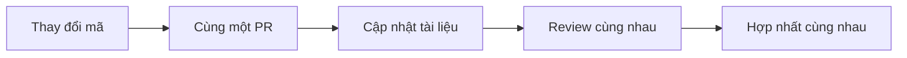

# 5.7 Đừng để tài liệu dở dang — Tài liệu như mã

### Khó khăn của tài liệu

Hầu hết các dự án đều gặp phải vấn đề tương tự:

```
Dự án vừa bắt đầu → Viết tài liệu một cách nghiêm túc
Giữa quá trình phát triển → Cập nhật lâu lâu
Dự án trực tuyến → Tài liệu lỗi thời
Vài tháng sau → Tài liệu và mã hoàn toàn không khớp
```

### Khái niệm tài liệu như mã

**Docs as Code**: Quản lý tài liệu giống như quản lý mã.

| Thực hành mã | Thực hành tài liệu |
|----------|----------|
| Lưu trữ trong kho Git | Tài liệu cũng lưu trữ trong Git |
| PR phải review | Tài liệu cũng phải review |
| Có kiểm tra CI | Tài liệu cũng dùng kiểm tra CI |
| Thay đổi mã thì gửi PR | Khi thay đổi mã thì sửa tài liệu |

### Tại sao phải dùng tài liệu như mã



Lợi ích:
- **Cập nhật đồng bộ**: Mã và tài liệu ở cùng một PR
- **Phiên bản tương ứng**: Mỗi phiên bản mã có tài liệu tương ứng
- **Có thể truy vết**: Lịch sử thay đổi tài liệu rõ ràng
- **Tự động hóa**: CI có thể kiểm tra tính hoàn chỉnh của tài liệu

### Mục tiêu của phần này

Sau khi hoàn thành phần này, bạn sẽ nắm vững:

1. **Cấu trúc thư mục**: Cách tổ chức tài liệu để nó tương ứng với cấu trúc mã
2. **Quy trình PR**: Cách cập nhật tài liệu đồng bộ khi thay đổi mã
3. **Kiểm soát phiên bản**: Cách dùng Git để quản lý lịch sử tài liệu
4. **Kiểm tra tự động**: Cách dùng CI để xác minh tính hoàn chỉnh của tài liệu

### Chiến lược tài liệu cho nhà phát triển độc lập

Với dự án của một người, bạn có thể đơn giản hóa nhưng không thể bỏ qua:

| Đội hoàn chỉnh | Nhà phát triển độc lập |
|----------|------------|
| Tài liệu API chi tiết | Giải thích giao diện chính |
| Tài liệu thiết kế kiến trúc | Giải thích cấu trúc đơn giản |
| Tài liệu quy chuẩn phát triển | Ghi chú trong README |
| Hướng dẫn người dùng | Giải thích chức năng chính |

**Nguyên tắc cốt lõi**: Ghi lại những thứ **bản thân tương lai** sẽ quên.
