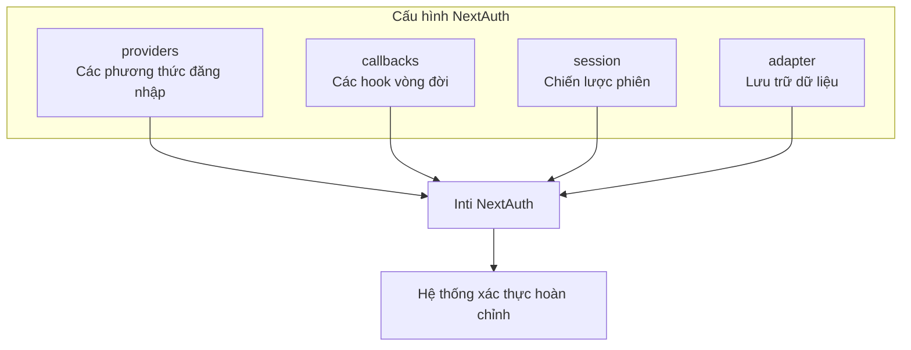
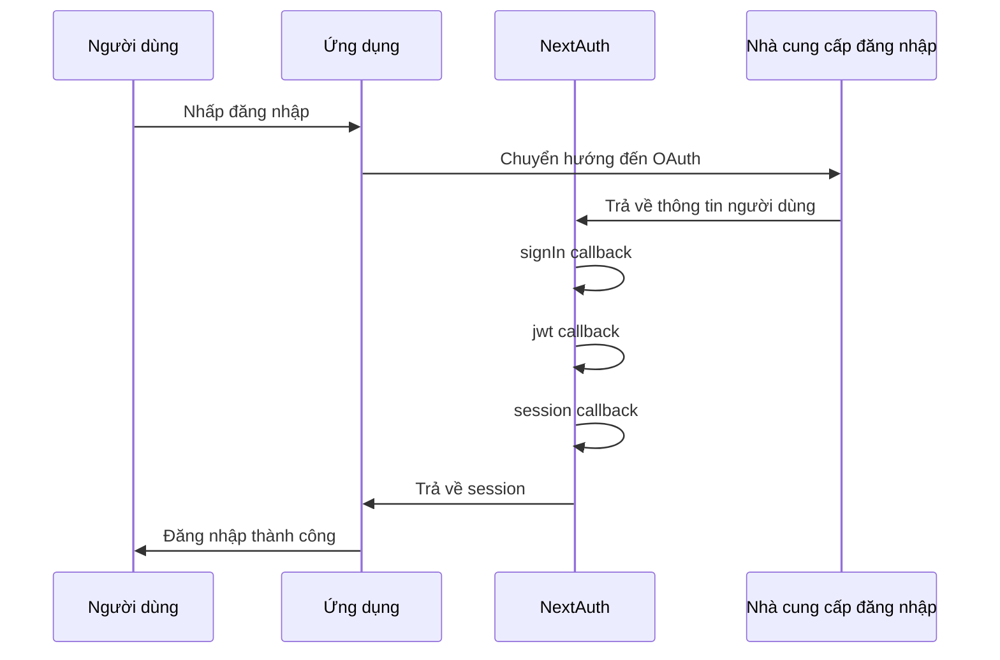

# 6.1.1 Xác thực sẵn sàng—Cấu hình NextAuth

## Khôi phục bản chất

NextAuth là một **framework xác thực được điều khiển bằng cấu hình**. Bạn chỉ cần cho nó biết "bằng cách nào để đăng nhập" (providers) và "có gì thêm cần làm trong quá trình đăng nhập" (callbacks), phần còn lại nó sẽ lo.



## Cấu trúc file cấu hình

Trong App Router, file cấu hình NextAuth nằm ở `app/api/auth/[...nextauth]/route.ts`:

```typescript
import NextAuth, { type NextAuthOptions } from "next-auth"
import GoogleProvider from "next-auth/providers/google"

export const authOptions: NextAuthOptions = {
  // 1. providers: Xác định các phương thức đăng nhập được hỗ trợ
  providers: [
    GoogleProvider({
      clientId: process.env.GOOGLE_CLIENT_ID!,
      clientSecret: process.env.GOOGLE_CLIENT_SECRET!,
    }),
  ],

  // 2. callbacks: Tùy chỉnh hành vi trong quá trình xác thực
  callbacks: {
    // Được kích hoạt khi đăng nhập, trả về true để cho phép đăng nhập
    async signIn({ user, account, profile }) {
      return true
    },
    // Được kích hoạt khi tạo JWT
    async jwt({ token, user, account }) {
      if (user) {
        token.id = user.id
      }
      return token
    },
    // Được kích hoạt khi lấy session
    async session({ session, token }) {
      if (session.user) {
        session.user.id = token.id as string
      }
      return session
    },
  },

  // 3. session: Chiến lược lưu trữ phiên
  session: {
    strategy: "jwt", // hoặc "database"
    maxAge: 30 * 24 * 60 * 60, // 30 ngày
  },

  // 4. pages: Tùy chỉnh tuyến đường trang
  pages: {
    signIn: "/login",      // Trang đăng nhập tùy chỉnh
    error: "/auth/error",  // Trang lỗi
  },
}

const handler = NextAuth(authOptions)
export { handler as GET, handler as POST }
```

## Giải thích chi tiết về Providers

Providers quyết định người dùng có thể đăng nhập vào ứng dụng của bạn bằng cách nào:

### OAuth Providers (Đăng nhập mạng xã hội)

```typescript
import GoogleProvider from "next-auth/providers/google"
import GitHubProvider from "next-auth/providers/github"
import DiscordProvider from "next-auth/providers/discord"

providers: [
  GoogleProvider({
    clientId: process.env.GOOGLE_CLIENT_ID!,
    clientSecret: process.env.GOOGLE_CLIENT_SECRET!,
  }),
  GitHubProvider({
    clientId: process.env.GITHUB_ID!,
    clientSecret: process.env.GITHUB_SECRET!,
  }),
]
```

### Credentials Provider (Đăng nhập bằng tài khoản/mật khẩu)

```typescript
import CredentialsProvider from "next-auth/providers/credentials"

providers: [
  CredentialsProvider({
    name: "Credentials",
    credentials: {
      email: { label: "Email", type: "email" },
      password: { label: "Mật khẩu", type: "password" }
    },
    async authorize(credentials) {
      // Xác thực thông tin đăng nhập người dùng ở đây
      const user = await validateUser(
        credentials?.email,
        credentials?.password
      )
      if (user) {
        return user
      }
      return null
    }
  })
]
```

::: warning Cảnh báo bảo mật
Khi sử dụng Credentials Provider, bạn cần tự xử lý mã hóa mật khẩu, phòng chống tấn công vũ phu, v.v. Đối với người mới, nên sử dụng OAuth Provider trước.
:::

## Giải thích chi tiết về Callbacks

Callbacks là các hàm hook của NextAuth, cho phép bạn chèn logic tùy chỉnh vào các điểm quan trọng của quá trình xác thực:



### Các trường hợp Callback thường dùng

```typescript
callbacks: {
  // Trường hợp 1: Chỉ cho phép người dùng với tên miền email cụ thể đăng nhập
  async signIn({ user }) {
    const allowedDomain = "@company.com"
    if (user.email?.endsWith(allowedDomain)) {
      return true
    }
    return false // Từ chối đăng nhập
  },

  // Trường hợp 2: Thêm vai trò người dùng vào token
  async jwt({ token, user }) {
    if (user) {
      // Lần đầu đăng nhập, lấy vai trò người dùng từ cơ sở dữ liệu
      const dbUser = await prisma.user.findUnique({
        where: { email: user.email! }
      })
      token.role = dbUser?.role || "user"
    }
    return token
  },

  // Trường hợp 3: Hiển thị vai trò người dùng trong session
  async session({ session, token }) {
    if (session.user) {
      session.user.role = token.role as string
    }
    return session
  },
}
```

## Cấu hình biến môi trường

```bash
# .env.local
NEXTAUTH_URL=http://localhost:3000
NEXTAUTH_SECRET=your-secret-key-here

# Google OAuth
GOOGLE_CLIENT_ID=your-google-client-id
GOOGLE_CLIENT_SECRET=your-google-client-secret

# GitHub OAuth
GITHUB_ID=your-github-client-id
GITHUB_SECRET=your-github-client-secret
```

::: danger Quan trọng
- `NEXTAUTH_SECRET` là bắt buộc, được sử dụng để mã hóa JWT. Trong môi trường sản xuất, hãy sử dụng chuỗi ngẫu nhiên mạnh
- Sử dụng `openssl rand -base64 32` để tạo khóa an toàn
- Không bao giờ commit những giá trị này vào Git
:::

## Nhận thức: Các điểm kiểm tra để xem xét mã được AI tạo

Khi AI giúp bạn tạo cấu hình NextAuth, hãy kiểm tra kỹ những điều sau:

1. **Tham chiếu biến môi trường**: Có sử dụng `process.env.XXX` chứ không phải giá trị được hardcode không
2. **An toàn kiểu**: Có thêm `!` hoặc kiểm tra giá trị null không
3. **Giá trị trả về của Callback**: `signIn` phải trả về boolean, `jwt` và `session` phải trả về đối tượng đã sửa đổi
4. **Vị trí tệp route**: App Router phải đặt ở `app/api/auth/[...nextauth]/route.ts`
