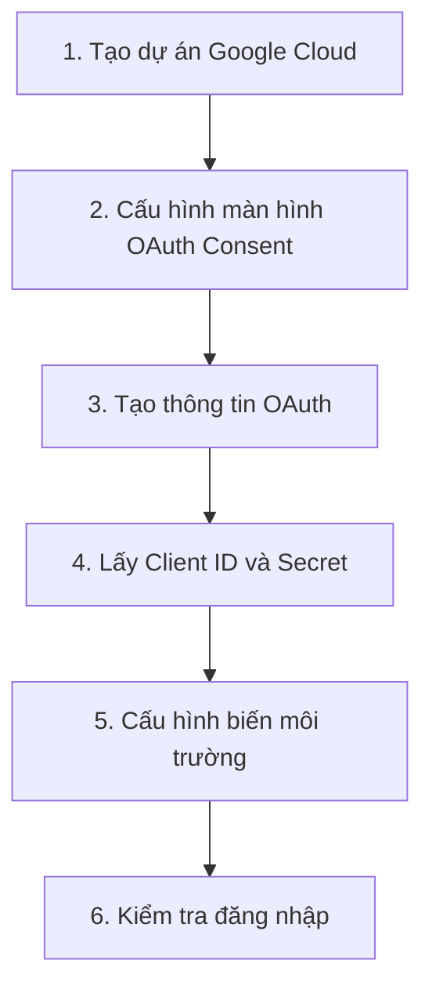

# 6.1.2 Đăng nhập Google như thế nào—Google OAuth thực hành

## Tóm tắt trong một câu

Kết nối đăng nhập Google chỉ cần ba bước: Tạo ứng dụng trên Google Cloud Console, cấu hình địa chỉ callback, sau đó điền Client ID và Secret vào biến môi trường.

## Sơ đồ quy trình hoàn chỉnh



## Bước 1: Tạo dự án Google Cloud

1. Truy cập [Google Cloud Console](https://console.cloud.google.com/)
2. Nhấp vào bộ chọn dự án ở trên cùng → "Tạo dự án"
3. Nhập tên dự án (ví dụ: `my-nextjs-app`) → Tạo

## Bước 2: Cấu hình màn hình OAuth Consent

1. Trong menu bên trái, chọn **"API và Dịch vụ"** → **"Màn hình OAuth Consent"**
2. Chọn loại người dùng:
   - **Bên ngoài**: Dành cho ứng dụng công khai, bất kỳ tài khoản Google nào cũng có thể đăng nhập
   - **Bên trong**: Chỉ sử dụng trong tổ chức (cần Google Workspace)
3. Điền các thông tin bắt buộc:
   - Tên ứng dụng
   - Email hỗ trợ người dùng
   - Thông tin liên hệ nhà phát triển

::: tip Giai đoạn phát triển
Sau khi chọn "Bên ngoài", ứng dụng sẽ ở trạng thái "Thử nghiệm". Ở trạng thái thử nghiệm, chỉ các người dùng thử nghiệm mà bạn thêm mới có thể đăng nhập. Trước khi phát hành, cần phải gửi để xem xét.
:::

## Bước 3: Tạo thông tin OAuth

1. Đi tới **"API và Dịch vụ"** → **"Thông tin OAuth"**
2. Nhấp vào **"Tạo thông tin"** → **"ID máy khách OAuth"**
3. Chọn loại ứng dụng là **"Ứng dụng Web"**
4. Điền tên (ví dụ: `NextJS App`)
5. Cấu hình URI chuyển hướng:

```
# Môi trường phát triển
http://localhost:3000/api/auth/callback/google

# Môi trường sản xuất
https://your-domain.com/api/auth/callback/google
```

::: warning Định dạng địa chỉ callback
NextAuth sử dụng cố định `/api/auth/callback/google` làm đường dẫn callback cho Google Provider, đừng sửa đổi.
:::

6. Sau khi tạo xong, sao chép **Client ID** và **Client Secret**

## Bước 4: Cấu hình biến môi trường

```bash
# .env.local
GOOGLE_CLIENT_ID=your-client-id-here.apps.googleusercontent.com
GOOGLE_CLIENT_SECRET=your-client-secret-here
```

## Bước 5: Cấu hình NextAuth

```typescript
// app/api/auth/[...nextauth]/route.ts
import NextAuth from "next-auth"
import GoogleProvider from "next-auth/providers/google"

const handler = NextAuth({
  providers: [
    GoogleProvider({
      clientId: process.env.GOOGLE_CLIENT_ID!,
      clientSecret: process.env.GOOGLE_CLIENT_SECRET!,
    }),
  ],
})

export { handler as GET, handler as POST }
```

## Kiểm tra đăng nhập

```typescript
// app/page.tsx
"use client"

import { signIn, signOut, useSession } from "next-auth/react"

export default function Home() {
  const { data: session, status } = useSession()

  if (status === "loading") {
    return <div>Đang tải...</div>
  }

  if (session) {
    return (
      <div>
        <p>Đã đăng nhập: {session.user?.email}</p>
        
        <button onClick={() => signOut()}>Đăng xuất</button>
      </div>
    )
  }

  return (
    <button onClick={() => signIn("google")}>
      Đăng nhập bằng Google
    </button>
  )
}
```

## Các câu hỏi thường gặp

### Error 400: redirect_uri_mismatch

**Nguyên nhân**: Địa chỉ callback không khớp

**Giải pháp**: Kiểm tra xem URI chuyển hướng trong Google Console có giống với `NEXTAUTH_URL` không

### Error: Access blocked

**Nguyên nhân**: Ứng dụng đang ở trạng thái thử nghiệm và người dùng hiện tại không nằm trong danh sách thử nghiệm

**Giải pháp**:
1. Đi tới Màn hình OAuth Consent → Người dùng thử nghiệm → Thêm tài khoản hiện tại
2. Hoặc gửi ứng dụng để xem xét

## Lấy thêm thông tin người dùng

Theo mặc định, Google chỉ trả về thông tin cơ bản. Nếu cần dữ liệu khác, hãy cấu hình tham số `authorization`:

```typescript
GoogleProvider({
  clientId: process.env.GOOGLE_CLIENT_ID!,
  clientSecret: process.env.GOOGLE_CLIENT_SECRET!,
  authorization: {
    params: {
      scope: "openid email profile",
      // Có thể thêm nhiều scope khác
    },
  },
})
```
