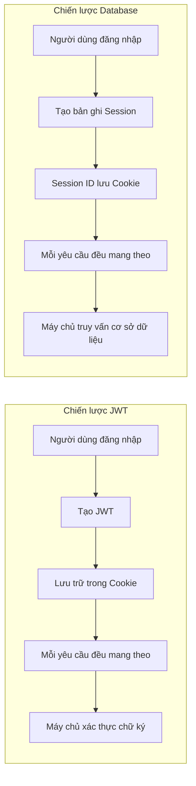

# 6.1.4 Trạng thái đăng nhập người dùng giữ lâu như thế nào—Quản lý phiên

## Khôi phục bản chất

Sau khi người dùng đăng nhập, máy chủ cần một cách để "nhớ" người dùng đó. Đó chính là **phiên (Session)**. NextAuth cung cấp hai chiến lược phiên:



## So sánh chiến lược JWT vs Database

| Tính năng | JWT | Database |
|------|-----|----------|
| Không trạng thái | ✅ Máy chủ không lưu trữ | ❌ Cần cơ sở dữ liệu |
| Khả năng mở rộng | ✅ Tốt hơn | ⚠️ Cần lưu trữ dùng chung |
| Vô hiệu hóa tức thời | ❌ Không thể vô hiệu hóa ngay | ✅ Xóa bản ghi là xong |
| Độ phức tạp cấu hình | Đơn giản | Cần Adapter |

**Đề xuất**: Đối với hầu hết ứng dụng, sử dụng chiến lược JWT là đủ.

## Cấu hình SessionProvider

Để sử dụng `useSession` trong client component, phải bao bọc ứng dụng bằng `SessionProvider`:

```typescript
// app/providers.tsx
"use client"

import { SessionProvider } from "next-auth/react"

export function Providers({ children }: { children: React.ReactNode }) {
  return <SessionProvider>{children}</SessionProvider>
}
```

```typescript
// app/layout.tsx
import { Providers } from "./providers"

export default function RootLayout({
  children,
}: {
  children: React.ReactNode
}) {
  return (
    <html>
      <body>
        <Providers>{children}</Providers>
      </body>
    </html>
  )
}
```

## Lấy Session trên client

```typescript
"use client"

import { useSession } from "next-auth/react"

export function UserProfile() {
  const { data: session, status } = useSession()

  if (status === "loading") {
    return <div>Đang tải...</div>
  }

  if (status === "unauthenticated") {
    return <div>Vui lòng đăng nhập trước</div>
  }

  return (
    <div>
      <p>Chào mừng, {session?.user?.name}</p>
      <p>Email: {session?.user?.email}</p>
    </div>
  )
}
```

## Lấy Session trên server

### Server Component

```typescript
// app/dashboard/page.tsx
import { getServerSession } from "next-auth"
import { authOptions } from "@/app/api/auth/[...nextauth]/route"
import { redirect } from "next/navigation"

export default async function DashboardPage() {
  const session = await getServerSession(authOptions)

  if (!session) {
    redirect("/login")
  }

  return <div>Chào mừng, {session.user?.name}</div>
}
```

### API Route

```typescript
// app/api/user/route.ts
import { getServerSession } from "next-auth"
import { authOptions } from "@/app/api/auth/[...nextauth]/route"
import { NextResponse } from "next/server"

export async function GET() {
  const session = await getServerSession(authOptions)

  if (!session) {
    return NextResponse.json({ error: "Chưa được phép truy cập" }, { status: 401 })
  }

  return NextResponse.json({ user: session.user })
}
```

## Bảo vệ tuyến đường

### Cách 1: Bảo vệ cấp trang

```typescript
// app/dashboard/page.tsx
import { getServerSession } from "next-auth"
import { authOptions } from "@/app/api/auth/[...nextauth]/route"
import { redirect } from "next/navigation"

export default async function DashboardPage() {
  const session = await getServerSession(authOptions)

  if (!session) {
    redirect("/login")
  }

  return <div>Nội dung được bảo vệ</div>
}
```

### Cách 2: Bảo vệ bằng Middleware

```typescript
// middleware.ts
import { withAuth } from "next-auth/middleware"

export default withAuth({
  pages: {
    signIn: "/login",
  },
})

export const config = {
  matcher: ["/dashboard/:path*", "/profile/:path*"],
}
```

### Cách 3: Middleware tùy chỉnh

```typescript
// middleware.ts
import { getToken } from "next-auth/jwt"
import { NextResponse } from "next/server"
import type { NextRequest } from "next/server"

export async function middleware(request: NextRequest) {
  const token = await getToken({
    req: request,
    secret: process.env.NEXTAUTH_SECRET,
  })

  const isAuthPage = request.nextUrl.pathname.startsWith("/login")

  if (isAuthPage) {
    if (token) {
      return NextResponse.redirect(new URL("/dashboard", request.url))
    }
    return NextResponse.next()
  }

  if (!token) {
    return NextResponse.redirect(new URL("/login", request.url))
  }

  return NextResponse.next()
}

export const config = {
  matcher: ["/dashboard/:path*", "/login"],
}
```

## Tùy chỉnh dữ liệu Session

Mặc định, session chỉ chứa `name`, `email`, `image`. Nếu cần thêm trường:

```typescript
// types/next-auth.d.ts
import { DefaultSession } from "next-auth"

declare module "next-auth" {
  interface Session {
    user: {
      id: string
      role: string
    } & DefaultSession["user"]
  }
}
```

```typescript
// Cấu hình NextAuth
callbacks: {
  async jwt({ token, user }) {
    if (user) {
      token.id = user.id
      token.role = "user" // Hoặc lấy từ cơ sở dữ liệu
    }
    return token
  },
  async session({ session, token }) {
    if (session.user) {
      session.user.id = token.id as string
      session.user.role = token.role as string
    }
    return session
  },
}
```

## Các tùy chọn cấu hình phiên

```typescript
session: {
  strategy: "jwt",
  maxAge: 30 * 24 * 60 * 60, // 30 ngày
  updateAge: 24 * 60 * 60,   // Làm mới mỗi 24 giờ
}
```

::: tip Lời khuyên bảo mật
- Trong môi trường sản xuất, không nên đặt `maxAge` quá dài
- Đối với các hoạt động nhạy cảm, hãy yêu cầu người dùng xác minh lại danh tính
- Xoay vòng `NEXTAUTH_SECRET` định kỳ
:::
