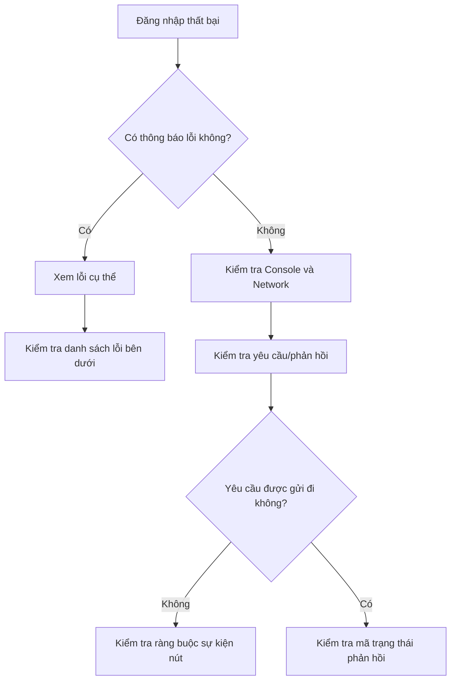

# 6.1.5 Đăng nhập thất bại thì làm sao—Khắc phục các vấn đề thường gặp

## Quy trình khắc phục sự cố



## Các lỗi phổ biến và giải pháp

### 1. NEXTAUTH_URL không được cấu hình

**Thông báo lỗi**:
```
Error: NEXTAUTH_URL environment variable is not set
```

**Giải pháp**:

```bash
# .env.local
# Môi trường phát triển
NEXTAUTH_URL=http://localhost:3000

# Môi trường sản xuất
NEXTAUTH_URL=https://your-domain.com
```

::: warning Lưu ý
- Không thêm `/` ở cuối URL
- Môi trường sản xuất phải sử dụng HTTPS
- Trên Vercel, nó tự động được thiết lập, nhưng nền tảng khác cần cấu hình thủ công
:::

### 2. NEXTAUTH_SECRET chưa được thiết lập

**Thông báo lỗi**:
```
[next-auth][error][NO_SECRET]
Please define a `secret` in production
```

**Giải pháp**:

```bash
# Tạo khóa ngẫu nhiên
openssl rand -base64 32

# Thêm vào .env.local
NEXTAUTH_SECRET=chuỗi ký tự ngẫu nhiên được tạo
```

### 3. Địa chỉ callback không khớp

**Thông báo lỗi**:
```
Error 400: redirect_uri_mismatch
```

**Các bước kiểm tra**:

1. Kiểm tra địa chỉ callback được cấu hình trên nền tảng nhà cung cấp OAuth
2. Đảm bảo định dạng chính xác:

```
# Google
http://localhost:3000/api/auth/callback/google

# GitHub
http://localhost:3000/api/auth/callback/github
```

3. Kiểm tra giao thức (http vs https) và số cổng có khớp không

### 4. Client ID/Secret OAuth sai

**Thông báo lỗi**:
```
Error: invalid_client
```

**Các bước kiểm tra**:

1. Kiểm tra tên biến môi trường chính xác
2. Kiểm tra giá trị không có khoảng trắng hoặc dòng mới thừa
3. Kiểm tra Secret chưa hết hạn (GitHub Secret chỉ hiển thị một lần)

```bash
# Kiểm tra biến môi trường được tải chính xác
console.log("GOOGLE_CLIENT_ID:", process.env.GOOGLE_CLIENT_ID)
```

### 5. SessionProvider chưa được cấu hình

**Thông báo lỗi**:
```
Error: useSession must be wrapped in a SessionProvider
```

**Giải pháp**:

```typescript
// app/providers.tsx
"use client"
import { SessionProvider } from "next-auth/react"

export function Providers({ children }: { children: React.ReactNode }) {
  return <SessionProvider>{children}</SessionProvider>
}

// app/layout.tsx
import { Providers } from "./providers"

export default function RootLayout({ children }) {
  return (
    <html>
      <body>
        <Providers>{children}</Providers>
      </body>
    </html>
  )
}
```

### 6. Sử dụng hook client trong server component

**Thông báo lỗi**:
```
Error: useSession only works in Client Components
```

**Giải pháp**:

```typescript
// ❌ Sai: Sử dụng useSession trong Server Component
export default function Page() {
  const { data: session } = useSession() // Lỗi
}

// ✅ Đúng: Sử dụng getServerSession trong Server Component
import { getServerSession } from "next-auth"

export default async function Page() {
  const session = await getServerSession(authOptions)
}

// ✅ Đúng: Sử dụng useSession trong Client Component
"use client"
export default function Page() {
  const { data: session } = useSession()
}
```

### 7. Vấn đề HTTPS trong môi trường phát triển

**Thông báo lỗi**:
```
Cookies require Secure; SameSite=None
```

**Giải pháp**:

Khi sử dụng HTTP trong môi trường phát triển, cần cấu hình:

```typescript
// Cấu hình NextAuth
cookies: {
  sessionToken: {
    name: `next-auth.session-token`,
    options: {
      httpOnly: true,
      sameSite: "lax",
      path: "/",
      secure: process.env.NODE_ENV === "production",
    },
  },
},
```

## Các mẹo gỡ lỗi

### Bật chế độ gỡ lỗi NextAuth

```typescript
const handler = NextAuth({
  debug: process.env.NODE_ENV === "development",
  // ...cấu hình khác
})
```

### Kiểm tra yêu cầu Network

1. Mở Developer Tools của trình duyệt → Thẻ Network
2. Lọc từ khóa `auth`
3. Kiểm tra các yêu cầu bắt đầu bằng `/api/auth/`
4. Xem chi tiết yêu cầu và phản hồi

### Các điểm cuối gỡ lỗi thông dụng

| Điểm cuối | Mục đích |
|------|------|
| `/api/auth/providers` | Xem các Provider đã cấu hình |
| `/api/auth/session` | Xem Session hiện tại |
| `/api/auth/csrf` | Lấy CSRF Token |

## Danh sách kiểm tra trước khi phát hành

::: tip Bắt buộc kiểm tra trước khi lên sản xuất
1. [ ] `NEXTAUTH_URL` được đặt thành tên miền sản xuất
2. [ ] `NEXTAUTH_SECRET` sử dụng chuỗi ngẫu nhiên mạnh
3. [ ] Nhà cung cấp OAuth đã thêm địa chỉ callback môi trường sản xuất
4. [ ] Biến môi trường được cấu hình chính xác trên nền tảng triển khai
5. [ ] `debug: false` hoặc đã xóa tùy chọn debug
6. [ ] HTTPS được cấu hình chính xác
:::
