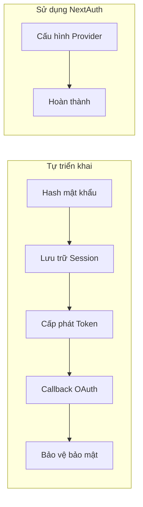

# 6.1 Đừng viết đăng nhập đăng ký từ đầu nữa—Bắt đầu nhanh với NextAuth

## Tóm tắt một câu

NextAuth.js (hiện đã đổi tên thành Auth.js) là giải pháp xác thực phổ biến nhất trong hệ sinh thái Next.js—nó cho phép bạn tích hợp các phương thức đăng nhập chính thống như Google, GitHub chỉ với vài dòng cấu hình, tiết kiệm công sức triển khai hệ thống xác thực từ đầu.

## Giá trị cốt lõi

Tự triển khai hệ thống đăng nhập nghĩa là: mã hóa mật khẩu, quản lý Session, cấp phát Token, xử lý callback OAuth, phòng thủ lỗ hổng bảo mật... mỗi thứ đều là cạm bẫy. NextAuth đóng gói những phức tạp này thành API có thể sử dụng ngay, giúp bạn tập trung vào logic nghiệp vụ.



## Nội dung chương này

| Tiểu mục | Mục tiêu học tập |
|------|----------|
| 6.1.1 Cấu hình NextAuth | Hiểu thiết lập cơ bản về providers và callbacks |
| 6.1.2 Google OAuth | Thực hành tích hợp đăng nhập Google |
| 6.1.3 GitHub OAuth | Thực hành tích hợp đăng nhập GitHub |
| 6.1.4 Quản lý phiên | Hiểu duy trì trạng thái người dùng và bảo vệ route |
| 6.1.5 Vấn đề thường gặp | Khắc phục và giải pháp khi đăng nhập thất bại |

## Xem trước nhanh

Trong 10 phút, bạn sẽ triển khai quy trình đăng nhập như sau:

```typescript
// 1. Cài đặt dependencies
// npm install next-auth

// 2. Tạo file cấu hình app/api/auth/[...nextauth]/route.ts
import NextAuth from "next-auth"
import GoogleProvider from "next-auth/providers/google"
import GitHubProvider from "next-auth/providers/github"

const handler = NextAuth({
  providers: [
    GoogleProvider({
      clientId: process.env.GOOGLE_CLIENT_ID!,
      clientSecret: process.env.GOOGLE_CLIENT_SECRET!,
    }),
    GitHubProvider({
      clientId: process.env.GITHUB_ID!,
      clientSecret: process.env.GITHUB_SECRET!,
    }),
  ],
})

export { handler as GET, handler as POST }
```

```typescript
// 3. Sử dụng trong trang
import { signIn, signOut, useSession } from "next-auth/react"

export function LoginButton() {
  const { data: session } = useSession()

  if (session) {
    return (
      <div>
        <p>Chào mừng, {session.user?.name}</p>
        <button onClick={() => signOut()}>Đăng xuất</button>
      </div>
    )
  }

  return <button onClick={() => signIn()}>Đăng nhập</button>
}
```

## Hướng dẫn hợp tác với AI

Khi mô tả nhu cầu xác thực cho AI, hãy sử dụng các từ khóa sau:

- **Ý định cốt lõi**: "Sử dụng NextAuth để triển khai đăng nhập mạng xã hội"
- **Thuật ngữ chính**: `providers`, `callbacks`, `session`, `signIn`, `signOut`
- **Chiến lược tương tác**: Trước tiên cho AI tạo cấu hình cơ bản, xác nhận chạy được rồi mới thêm callbacks tùy chỉnh

::: tip Danh sách nghiệm thu
Trước khi chấp nhận mã NextAuth do AI tạo, hãy kiểm tra:
1. Biến môi trường có được tham chiếu đúng không (không hardcode khóa)
2. Có sử dụng cách viết route handler của App Router không
3. SessionProvider có được bao bọc ở tầng phù hợp không
:::
