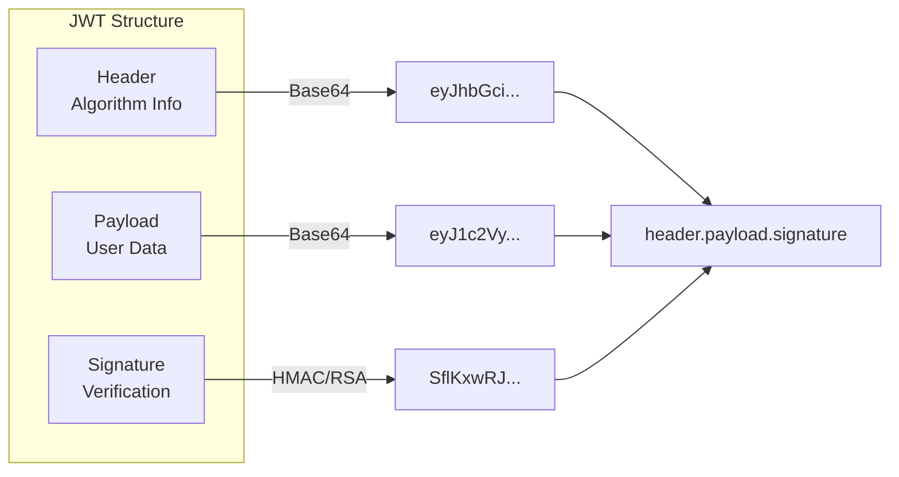
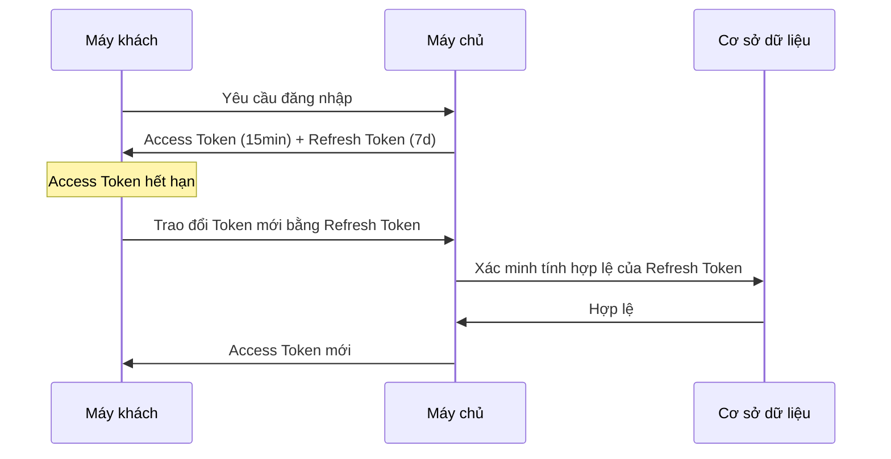

# 6.2.1 JWT Security: Quản lý khóa và chiến lược hết hạn

## Khôi phục bản chất

JWT (JSON Web Token) là một định dạng token tự chứa, mã hóa thông tin người dùng trong chính token đó. Máy chủ không cần truy vấn cơ sở dữ liệu để xác minh danh tính người dùng, nhưng điều này cũng mang lại những thách thức bảo mật độc đáo.



## Rủi ro bảo mật JWT

### 1. Rò rỉ khóa

Nếu khóa ký bị rò rỉ, kẻ tấn công có thể giả mạo Token của bất kỳ người dùng nào.

```typescript
// ❌ Nguy hiểm: Khóa mã hóa cứng
const token = jwt.sign(payload, "my-secret-key")

// ✅ An toàn: Sử dụng biến môi trường
const token = jwt.sign(payload, process.env.JWT_SECRET!)
```

### 2. Tấn công nhầm lẫn thuật toán

Một số thư viện JWT cho phép kẻ tấn công thay đổi thuật toán từ RS256 thành HS256, sử dụng khóa công khai làm khóa xác minh.

```typescript
// ✅ Chỉ định rõ ràng thuật toán, không tin tưởng thuật toán trong token
const decoded = jwt.verify(token, secret, {
  algorithms: ['HS256']  // Chỉ chấp nhận thuật toán này
})
```

### 3. Không thể hủy ngay lập tức

Khi JWT được phát hành, nó không thể bị hủy trước khi hết hạn. Ngay cả sau khi người dùng đổi mật khẩu, token cũ vẫn có hiệu lực.

## Thực hành tốt nhất quản lý khóa

### Tạo khóa mạnh

```bash
# Tạo khóa ngẫu nhiên 256-bit
openssl rand -base64 32

# Kết quả tương tự: K7gNU3sdo+OL0wNhqoVWhr3g6s1xYv72ol/pe/Unols=
```

### Xoay vòng khóa

Thay đổi khóa định kỳ, nhưng hỗ trợ kỳ chuyển tiếp xác minh token cũ:

```typescript
const CURRENT_KEY = process.env.JWT_SECRET_CURRENT!
const PREVIOUS_KEY = process.env.JWT_SECRET_PREVIOUS!

function verifyToken(token: string) {
  try {
    return jwt.verify(token, CURRENT_KEY)
  } catch {
    // Thử xác minh với khóa cũ (kỳ chuyển tiếp)
    return jwt.verify(token, PREVIOUS_KEY)
  }
}
```

### Mã hóa không đối xứng

Đối với hệ thống phân tán, khuyên dùng RS256 (RSA + SHA256):

```typescript
import { readFileSync } from 'fs'

const privateKey = readFileSync('private.pem')
const publicKey = readFileSync('public.pem')

// Ký (chỉ dịch vụ xác thực có khóa riêng)
const token = jwt.sign(payload, privateKey, { algorithm: 'RS256' })

// Xác minh (bất kỳ dịch vụ nào cũng có thể xác minh bằng khóa công khai)
const decoded = jwt.verify(token, publicKey, { algorithms: ['RS256'] })
```

## Chiến lược hết hạn

### Access Token + Refresh Token



```typescript
// Phát hành dual token
function issueTokens(userId: string) {
  const accessToken = jwt.sign(
    { userId, type: 'access' },
    process.env.JWT_SECRET!,
    { expiresIn: '15m' }  // Hợp lệ trong thời gian ngắn
  )

  const refreshToken = jwt.sign(
    { userId, type: 'refresh' },
    process.env.JWT_REFRESH_SECRET!,
    { expiresIn: '7d' }   // Hợp lệ trong thời gian dài
  )

  // Lưu refresh token vào cơ sở dữ liệu (có thể hủy)
  await db.refreshToken.create({
    data: { token: refreshToken, userId }
  })

  return { accessToken, refreshToken }
}
```

### Endpoint làm mới Token

```typescript
// app/api/auth/refresh/route.ts
export async function POST(request: Request) {
  const { refreshToken } = await request.json()

  try {
    const decoded = jwt.verify(
      refreshToken,
      process.env.JWT_REFRESH_SECRET!
    )

    // Kiểm tra xem token có trong cơ sở dữ liệu không (chưa bị hủy)
    const stored = await db.refreshToken.findUnique({
      where: { token: refreshToken }
    })

    if (!stored) {
      return Response.json({ error: 'Refresh token không hợp lệ' }, { status: 401 })
    }

    // Phát hành access token mới
    const newAccessToken = jwt.sign(
      { userId: decoded.userId, type: 'access' },
      process.env.JWT_SECRET!,
      { expiresIn: '15m' }
    )

    return Response.json({ accessToken: newAccessToken })
  } catch {
    return Response.json({ error: 'Token đã hết hạn' }, { status: 401 })
  }
}
```

## Cơ chế hủy Token

### Phương pháp 1: Danh sách đen Token

```typescript
// Khi đăng xuất, thêm token vào danh sách đen
async function logout(token: string) {
  const decoded = jwt.decode(token) as { exp: number }
  const ttl = decoded.exp - Math.floor(Date.now() / 1000)

  // Lưu vào Redis, thời gian hết hạn trùng với token
  await redis.setex(`blacklist:${token}`, ttl, '1')
}

// Kiểm tra danh sách đen khi xác minh
async function verifyToken(token: string) {
  const isBlacklisted = await redis.get(`blacklist:${token}`)
  if (isBlacklisted) throw new Error('Token đã bị hủy')

  return jwt.verify(token, process.env.JWT_SECRET!)
}
```

### Phương pháp 2: Số phiên bản Token

```typescript
// Thêm trường tokenVersion vào bảng người dùng
// Tăng số phiên bản khi đổi mật khẩu
async function changePassword(userId: string, newPassword: string) {
  await db.user.update({
    where: { id: userId },
    data: {
      password: await hash(newPassword),
      tokenVersion: { increment: 1 }
    }
  })
}

// Bao gồm số phiên bản khi phát hành
const token = jwt.sign({ userId, tokenVersion: user.tokenVersion }, secret)

// Kiểm tra số phiên bản khi xác minh
async function verifyToken(token: string) {
  const decoded = jwt.verify(token, secret)
  const user = await db.user.findUnique({ where: { id: decoded.userId } })

  if (user.tokenVersion !== decoded.tokenVersion) {
    throw new Error('Token không hợp lệ')
  }
  return decoded
}
```

## Danh sách kiểm tra cấu hình bảo mật

::: tip Danh sách kiểm tra JWT Security
1. [ ] Độ dài khóa ít nhất 256-bit
2. [ ] Khóa được lưu trữ trong biến môi trường
3. [ ] Chỉ định rõ ràng thuật toán ký
4. [ ] Thời gian hết hạn Access Token ≤ 15 phút
5. [ ] Triển khai cơ chế Refresh Token
6. [ ] Refresh Token có thể hủy (lưu cơ sở dữ liệu)
7. [ ] Xác minh lại tính hợp lệ Token trước các hoạt động nhạy cảm
:::
