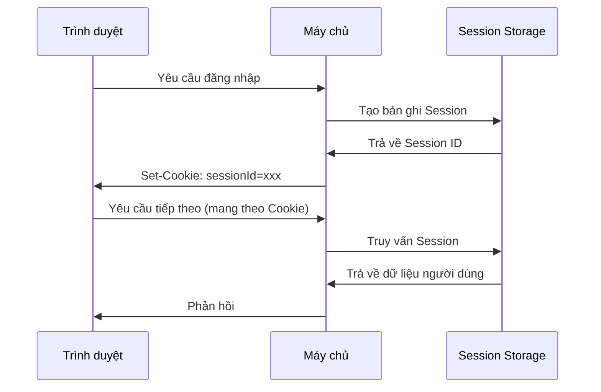

# 6.2.2 Session Security: Bảo mật lưu trữ và truyền tải

## Khôi phục bản chất

Session là cơ chế máy chủ lưu trạng thái người dùng. Không giống JWT, dữ liệu Session được lưu trữ trên máy chủ, máy khách chỉ lưu một Session ID.



## Các mối đe dọa bảo mật Session

### 1. Chiếm quyền Session

Kẻ tấn công lấy được Session ID của người dùng thông qua nhiều cách để giả mạo danh tính.

**Biện pháp bảo vệ**:

```typescript
// Sử dụng cài đặt Cookie an toàn
const sessionOptions = {
  cookie: {
    httpOnly: true,    // Ngăn chặn JS đọc
    secure: true,      // Chỉ truyền qua HTTPS
    sameSite: 'strict', // Ngăn chặn yêu cầu xuyên trang
    maxAge: 24 * 60 * 60 * 1000 // 1 ngày
  }
}
```

### 2. Tấn công cố định Session

Kẻ tấn công trước tiên lấy được một Session ID hợp lệ, sau đó lừa người dùng sử dụng ID đó để đăng nhập.

**Biện pháp bảo vệ**:

```typescript
// Tạo lại Session ID sau khi đăng nhập thành công
async function login(user: User, session: Session) {
  // Hủy session cũ
  await session.destroy()

  // Tạo session mới
  const newSession = await createSession()
  newSession.userId = user.id

  return newSession.id
}
```

### 3. Rò rỉ dữ liệu Session

Session không được lưu trữ đúng cách dẫn đến rò rỉ dữ liệu.

**Biện pháp bảo vệ**:

```typescript
// Không lưu trữ thông tin nhạy cảm trong session
// ❌ Nguy hiểm
session.password = user.password
session.creditCard = user.creditCard

// ✅ An toàn: Chỉ lưu định danh cần thiết
session.userId = user.id
session.role = user.role
```

## Phương pháp lưu trữ Session

| Phương pháp | Ưu điểm | Nhược điểm | Trường hợp sử dụng |
|----------|------|------|----------|
| Memory | Nhanh | Mất dữ liệu khi khởi động lại, không mở rộng được | Môi trường phát triển |
| File | Đơn giản | IO chậm, khó mở rộng | Ứng dụng nhỏ |
| Database | Bền vững | Overhead truy vấn | Ứng dụng vừa |
| Redis | Nhanh, mở rộng được | Cần bảo trì thêm | Môi trường sản xuất |

### Ví dụ lưu trữ Session Redis

```typescript
import Redis from 'ioredis'

const redis = new Redis(process.env.REDIS_URL)

async function getSession(sessionId: string) {
  const data = await redis.get(`session:${sessionId}`)
  return data ? JSON.parse(data) : null
}

async function setSession(sessionId: string, data: object, ttl: number) {
  await redis.setex(
    `session:${sessionId}`,
    ttl,
    JSON.stringify(data)
  )
}

async function deleteSession(sessionId: string) {
  await redis.del(`session:${sessionId}`)
}
```

## Thực hành tốt nhất cấu hình an toàn

### Tạo Session ID

```typescript
import { randomBytes } from 'crypto'

function generateSessionId(): string {
  // Sử dụng số ngẫu nhiên an toàn mã hóa
  return randomBytes(32).toString('hex')
}
```

### Chiến lược timeout Session

```typescript
const SESSION_CONFIG = {
  // Timeout tuyệt đối: Hết hạn 24 giờ sau tạo
  absoluteTimeout: 24 * 60 * 60 * 1000,

  // Timeout không hoạt động: Hết hạn sau 30 phút không hoạt động
  idleTimeout: 30 * 60 * 1000,
}

async function validateSession(session: Session) {
  const now = Date.now()

  // Kiểm tra timeout tuyệt đối
  if (now - session.createdAt > SESSION_CONFIG.absoluteTimeout) {
    throw new Error('Session đã hết hạn')
  }

  // Kiểm tra timeout không hoạt động
  if (now - session.lastActivity > SESSION_CONFIG.idleTimeout) {
    throw new Error('Session đã hết hạn do không hoạt động')
  }

  // Cập nhật thời gian hoạt động cuối cùng
  session.lastActivity = now
}
```

### Xác minh Session cho các hoạt động nhạy cảm

```typescript
async function sensitiveOperation(session: Session) {
  // Kiểm tra xem session có được tạo gần đây không trước khi thực hiện hoạt động nhạy cảm
  const sessionAge = Date.now() - session.createdAt
  const RECENT_THRESHOLD = 5 * 60 * 1000 // 5 phút

  if (sessionAge > RECENT_THRESHOLD) {
    throw new Error('Vui lòng đăng nhập lại để thực hiện hành động này')
  }
}
```

## Session Security trong NextAuth

```typescript
// Cấu hình NextAuth
export const authOptions: NextAuthOptions = {
  session: {
    strategy: 'database', // Sử dụng cơ sở dữ liệu lưu trữ
    maxAge: 24 * 60 * 60,  // 24 giờ
    updateAge: 60 * 60,    // Cập nhật mỗi giờ
  },

  callbacks: {
    async session({ session, user }) {
      // Chỉ tiếp lộ thông tin người dùng cần thiết
      session.user.id = user.id
      session.user.role = user.role
      // Không tiếp lộ thông tin nhạy cảm
      return session
    }
  }
}
```

::: tip Danh sách kiểm tra Session Security
1. [ ] Session ID sử dụng số ngẫu nhiên an toàn mã hóa
2. [ ] Cookie được cài đặt HttpOnly, Secure, SameSite
3. [ ] Tạo lại Session ID sau khi đăng nhập thành công
4. [ ] Triển khai timeout tuyệt đối và timeout không hoạt động
5. [ ] Dữ liệu Session không chứa thông tin nhạy cảm
6. [ ] Môi trường sản xuất sử dụng lưu trữ mở rộng như Redis
:::
