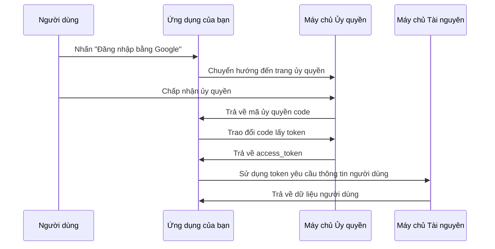

# 6.2.4 OAuth 2.0: Chế độ mã thông qua và cấu hình bảo mật

## Khôi phục bản chất

OAuth 2.0 là một khung ủy quyền cho phép các ứng dụng bên thứ ba truy cập tài nguyên của người dùng dưới sự ủy quyền của người dùng mà không cần lấy mật khẩu của người dùng.



## Các chế độ ủy quyền OAuth 2.0

| Chế độ | Trường hợp sử dụng | Bảo mật |
|------|----------|--------|
| Authorization Code | Ứng dụng Web | ⭐⭐⭐⭐⭐ |
| PKCE | Ứng dụng di động/SPA | ⭐⭐⭐⭐⭐ |
| Implicit | Đã không được khuyến cáo | ⚠️ Không khuyến cáo |
| Password | Chỉ ứng dụng riêng | ⚠️ Sử dụng cẩn thận |

## Các điểm chính của bảo mật chế độ mã thông qua

### 1. Tham số State ngăn chặn CSRF

```typescript
// Tạo state
const state = crypto.randomBytes(32).toString('hex')
session.oauthState = state

// Mang theo state trong yêu cầu ủy quyền
const authUrl = `https://accounts.google.com/oauth?
  client_id=${CLIENT_ID}&
  redirect_uri=${REDIRECT_URI}&
  state=${state}&
  response_type=code`

// Xác minh state khi callback
if (request.query.state !== session.oauthState) {
  throw new Error('Xác minh state thất bại, có thể là tấn công CSRF')
}
```

### 2. PKCE ngăn chặn bị chiếm mã thông qua

PKCE (Proof Key for Code Exchange) cung cấp bảo vệ bổ sung cho ứng dụng SPA và di động:

```typescript
import crypto from 'crypto'

// Tạo code_verifier (chuỗi ngẫu nhiên)
const codeVerifier = crypto.randomBytes(32).toString('base64url')

// Tạo code_challenge
const codeChallenge = crypto
  .createHash('sha256')
  .update(codeVerifier)
  .digest('base64url')

// Yêu cầu ủy quyền mang theo challenge
const authUrl = `${AUTH_URL}?
  code_challenge=${codeChallenge}&
  code_challenge_method=S256`

// Trao đổi token mang theo verifier
const tokenResponse = await fetch(TOKEN_URL, {
  method: 'POST',
  body: new URLSearchParams({
    code,
    code_verifier: codeVerifier,
    // ...các tham số khác
  })
})
```

### 3. Lưu trữ Client Secret an toàn

```typescript
// ❌ Nguy hiểm: Secret tiếp lộ trên front-end
const response = await fetch('/oauth/token', {
  body: JSON.stringify({
    client_secret: 'my-secret' // Tiếp lộ trong trình duyệt!
  })
})

// ✅ An toàn: Secret chỉ sử dụng trên máy chủ
// app/api/auth/callback/route.ts
export async function GET(request: Request) {
  const code = new URL(request.url).searchParams.get('code')

  // Sử dụng secret trên máy chủ
  const token = await exchangeCodeForToken(code, {
    client_secret: process.env.CLIENT_SECRET // Biến môi trường
  })
}
```

## OAuth Security trong NextAuth

NextAuth đã tích hợp sẵn các biện pháp bảo mật này:

```typescript
import GoogleProvider from "next-auth/providers/google"

export const authOptions = {
  providers: [
    GoogleProvider({
      clientId: process.env.GOOGLE_CLIENT_ID!,
      clientSecret: process.env.GOOGLE_CLIENT_SECRET!,
      // NextAuth tự động xử lý:
      // - tham số state
      // - PKCE (nếu provider hỗ trợ)
      // - lưu trữ token an toàn
    }),
  ],
}
```

## Lưu trữ Token an toàn

| Vị trí lưu trữ | Bảo mật | Mô tả |
|----------|--------|------|
| HttpOnly Cookie | ✅ Khuyên dùng | Chống XSS |
| localStorage | ❌ Không khuyên dùng | Dễ bị XSS đánh cắp |
| sessionStorage | ❌ Không khuyên dùng | Dễ bị XSS đánh cắp |
| Memory | ✅ Có thể sử dụng | Mất dữ liệu khi làm mới trang |

::: warning Danh sách kiểm tra OAuth Security
1. [ ] Sử dụng chế độ Authorization Code, không dùng Implicit
2. [ ] Ứng dụng SPA/di động sử dụng PKCE
3. [ ] Xác minh tham số state để chống CSRF
4. [ ] Client Secret chỉ sử dụng trên máy chủ
5. [ ] Lưu trữ Token trong HttpOnly Cookie
6. [ ] Giới hạn danh sách trắng redirect_uri
:::
