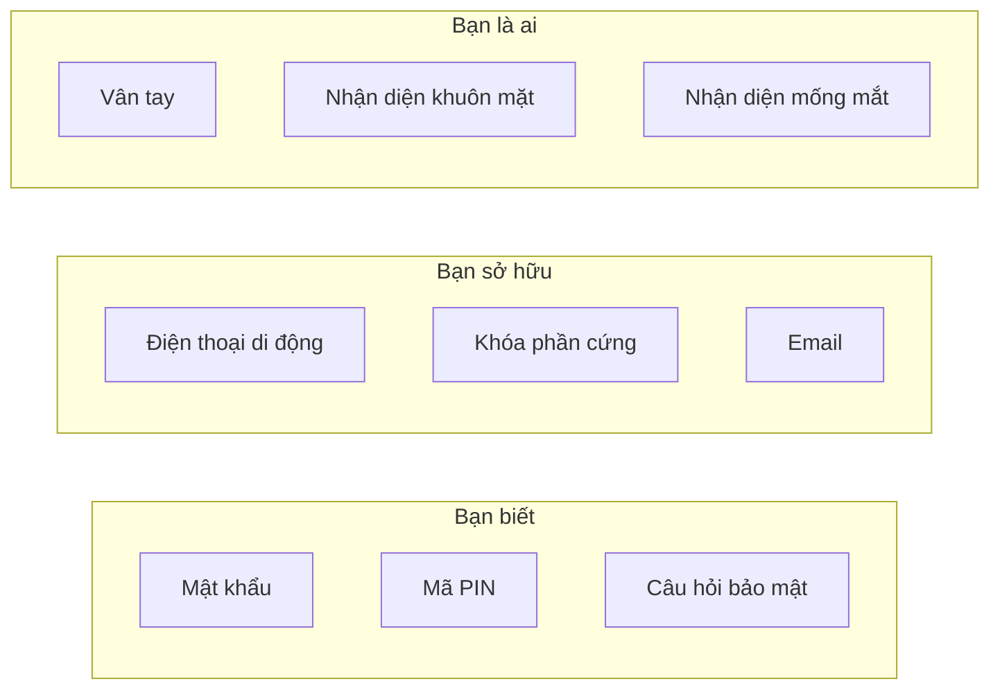

# 6.2.5 Xác thực đa yếu tố: Tăng cường bảo mật tài khoản

## Giải quyết vấn đề một câu

Xác thực đa yếu tố (MFA) yêu cầu nhiều phương pháp xác minh, ngay cả khi mật khẩu bị rò rỉ, kẻ tấn công cũng không thể đăng nhập vào tài khoản.

## Ba loại yếu tố xác thực



**MFA yêu cầu sử dụng ít nhất hai loại yếu tố khác nhau.**

## So sánh các phương pháp MFA phổ biến

| Phương pháp | Bảo mật | Trải nghiệm người dùng | Độ phức tạp |
|------|--------|----------|----------|
| TOTP (ứng dụng xác thực) | ⭐⭐⭐⭐ | ⭐⭐⭐ | Trung bình |
| Xác minh bằng SMS | ⭐⭐ | ⭐⭐⭐⭐ | Đơn giản |
| Xác minh bằng Email | ⭐⭐ | ⭐⭐⭐ | Đơn giản |
| Khóa phần cứng (WebAuthn) | ⭐⭐⭐⭐⭐ | ⭐⭐⭐⭐ | Phức tạp |
| Thông báo đẩy | ⭐⭐⭐⭐ | ⭐⭐⭐⭐⭐ | Phức tạp |

## Triển khai TOTP

TOTP (Time-based One-Time Password) là phương pháp MFA phổ biến nhất:

### 1. Cài đặt dependencies

```bash
npm install otplib qrcode
```

### 2. Tạo khóa

```typescript
import { authenticator } from 'otplib'
import QRCode from 'qrcode'

async function setupTOTP(userId: string, email: string) {
  // Tạo khóa
  const secret = authenticator.generateSecret()

  // Lưu khóa vào cơ sở dữ liệu (mã hóa lưu trữ)
  await db.user.update({
    where: { id: userId },
    data: { totpSecret: encrypt(secret) }
  })

  // Tạo mã QR để người dùng quét
  const otpauth = authenticator.keyuri(email, 'YourAppName', secret)
  const qrCodeUrl = await QRCode.toDataURL(otpauth)

  return { qrCodeUrl, secret }
}
```

### 3. Xác minh TOTP

```typescript
import { authenticator } from 'otplib'

async function verifyTOTP(userId: string, token: string) {
  const user = await db.user.findUnique({ where: { id: userId } })
  const secret = decrypt(user.totpSecret)

  const isValid = authenticator.verify({
    token,
    secret,
  })

  return isValid
}
```

### 4. Tích hợp vào quy trình đăng nhập

```typescript
async function login(email: string, password: string, totpToken?: string) {
  // Bước 1: Xác minh mật khẩu
  const user = await verifyPassword(email, password)
  if (!user) throw new Error('Mật khẩu sai')

  // Bước 2: Nếu bật MFA, xác minh TOTP
  if (user.totpEnabled) {
    if (!totpToken) {
      return { requireMFA: true }
    }

    const isValidTOTP = await verifyTOTP(user.id, totpToken)
    if (!isValidTOTP) {
      throw new Error('Mã xác minh sai')
    }
  }

  // Đăng nhập thành công
  return createSession(user)
}
```

## Mã phục hồi

Nếu người dùng mất điện thoại, cần mã phục hồi làm bản sao lưu:

```typescript
function generateRecoveryCodes(count = 10) {
  const codes: string[] = []
  for (let i = 0; i < count; i++) {
    // Tạo mã phục hồi 8 chữ số ngẫu nhiên
    codes.push(crypto.randomBytes(4).toString('hex').toUpperCase())
  }
  return codes
}

// Tạo và hiển thị mã phục hồi khi người dùng cấu hình MFA
// Mã phục hồi hết tác dụng sau khi sử dụng
```

## Khuyến nghị bảo mật

### Ngăn chặn tấn công brute force

```typescript
const MAX_ATTEMPTS = 5
const LOCKOUT_DURATION = 15 * 60 * 1000 // 15 phút

async function verifyWithRateLimit(userId: string, token: string) {
  const attempts = await getLoginAttempts(userId)

  if (attempts >= MAX_ATTEMPTS) {
    throw new Error('Quá nhiều lần thử, vui lòng thử lại sau')
  }

  const isValid = await verifyTOTP(userId, token)

  if (!isValid) {
    await incrementLoginAttempts(userId)
  } else {
    await resetLoginAttempts(userId)
  }

  return isValid
}
```

### Xác minh lại cho các hoạt động nhạy cảm

```typescript
async function sensitiveAction(session: Session, totpToken: string) {
  // Ngay cả khi đã đăng nhập, các hoạt động nhạy cảm cũng yêu cầu xác minh lại MFA
  const isValid = await verifyTOTP(session.userId, totpToken)

  if (!isValid) {
    throw new Error('Vui lòng xác minh danh tính')
  }

  // Thực hiện hoạt động nhạy cảm...
}
```

::: tip Danh sách kiểm tra triển khai MFA
1. [ ] Khóa TOTP mã hóa lưu trữ
2. [ ] Tạo đủ số lượng mã phục hồi
3. [ ] Triển khai giới hạn số lần thử đăng nhập
4. [ ] Hoạt động nhạy cảm yêu cầu xác minh lại
5. [ ] Cung cấp quy trình vô hiệu hóa MFA an toàn
:::
