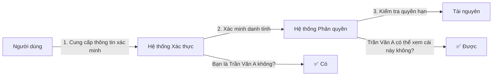

# 6.2 Bạn là ai và bạn có thể làm gì - Bảo mật Xác thực và Phân quyền

## Tái cấu trúc nhận thức: Sự khác biệt cốt lõi giữa Xác thực và Phân quyền

Nhiều người nhầm lẫn "xác thực" và "phân quyền", nhưng chúng giải quyết những vấn đề hoàn toàn khác nhau:

- **Xác thực (Authentication)**: Xác minh "bạn là ai" - Xác nhận tính xác thực của danh tính người dùng
- **Phân quyền (Authorization)**: Xác định "bạn có thể làm gì" - Quyết định người dùng có thể truy cập những tài nguyên nào



## Tại sao cần chú ý đến bảo mật xác thực

Xác thực là tuyến phòng thủ đầu tiên của toàn bộ hệ thống bảo mật. Nếu xác thực bị đột phá:

- Kẻ tấn công có thể giả mạo bất kỳ người dùng nào
- Tất cả các kiểm tra phân quyền sau đó đều mất ý nghĩa
- Dữ liệu người dùng phải đối mặt với rủi ro rò rỉ

## Nội dung phần này

| Phần | Vấn đề cốt lõi | Bạn sẽ học |
|------|----------|----------|
| 6.2.1 JWT Security | Token bị đánh cắp thì sao? | Quản lý khóa, chiến lược hết hạn, cơ chế làm mới |
| 6.2.2 Session Security | Session làm thế nào để ngăn chặn bị chiếm quyền? | Lưu trữ an toàn, mã hóa truyền tải, bảo vệ chống tấn công cố định |
| 6.2.3 Cookie Security | Cookie cần cấu hình như thế nào mới an toàn? | Chi tiết về các thuộc tính HttpOnly/Secure/SameSite |
| 6.2.4 OAuth 2.0 Security | Quy trình OAuth có những rủi ro nào? | Chế độ mã thông qua, PKCE, tham số state |
| 6.2.5 Xác thực đa yếu tố | Mật khẩu không đủ an toàn thì sao? | TOTP, xác minh SMS, khóa phần cứng |

## So sánh các phương pháp xác thực

| Phương pháp | Trường hợp sử dụng | Ưu điểm | Nhược điểm |
|------|----------|------|------|
| **Session** | Ứng dụng Web truyền thống | Máy chủ có thể kiểm soát, hết hạn ngay lập tức | Cần lưu trữ, khả năng mở rộng kém |
| **JWT** | Microservices, API | Không trạng thái, dễ mở rộng | Không thể hủy ngay lập tức |
| **OAuth 2.0** | Đăng nhập bên thứ ba | Giao thức tiêu chuẩn, trải nghiệm người dùng tốt | Triển khai phức tạp |

## Nguyên tắc thiết kế bảo mật

### 1. Phòng thủ sâu

Đừng chỉ dựa vào một lớp bảo vệ:

```typescript
// Xác minh nhiều lớp
async function protectedAction(request: Request) {
  // Lớp 1: Xác minh tính hợp lệ của Token
  const token = await verifyToken(request)

  // Lớp 2: Xác minh trạng thái người dùng
  const user = await getUser(token.userId)
  if (user.status !== 'active') throw new Error('Tài khoản đã bị vô hiệu hóa')

  // Lớp 3: Xác minh quyền thực hiện hành động
  if (!user.permissions.includes('write')) {
    throw new Error('Không có quyền thực hiện hành động này')
  }
}
```

### 2. Quyền hạn tối thiểu

Chỉ cấp quyền cần thiết:

```typescript
// ❌ Cấp quyền quá mức
const token = jwt.sign({
  userId,
  role: 'admin',  // Quá rộng
  permissions: ['*']  // Nguy hiểm
})

// ✅ Quyền hạn tối thiểu
const token = jwt.sign({
  userId,
  permissions: ['posts:read', 'posts:write']  // Quyền cụ thể
})
```

### 3. Mặc định an toàn

Từ chối theo mặc định, cho phép rõ ràng:

```typescript
// ❌ Cho phép theo mặc định
function checkPermission(user, resource) {
  if (resource.isRestricted) {
    return user.hasAccess(resource)
  }
  return true  // Cho phép theo mặc định
}

// ✅ Từ chối theo mặc định
function checkPermission(user, resource) {
  if (resource.isPublic) {
    return true
  }
  return user.hasAccess(resource)  // Cần xác minh theo mặc định
}
```

## Gợi ý hợp tác AI

Khi yêu cầu AI giúp bạn triển khai tính năng xác thực, hãy chắc chắn nhấn mạnh:

- "Sử dụng các cờ HttpOnly và Secure để thiết lập Cookie"
- "Đặt thời gian hết hạn JWT ngắn hơn và triển khai cơ chế refresh token"
- "Yêu cầu xác minh lại danh tính cho các hoạt động nhạy cảm"
- "Triển khai giới hạn số lần đăng nhập thất bại"

::: warning Điểm kiểm tra
Mã xác thực do AI tạo, hãy tập trung kiểm tra:
1. Khóa có bị mã hóa cứng không?
2. Thời gian hết hạn Token có hợp lý không?
3. Thông báo lỗi có rò rỉ thông tin nhạy cảm không?
4. Có cơ chế chống tấn công brute force không?
:::
