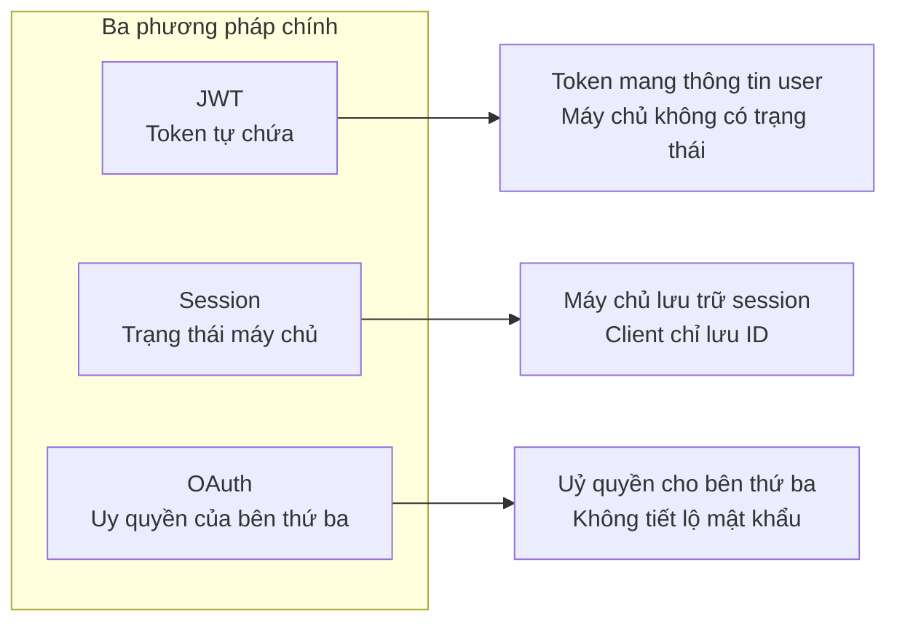
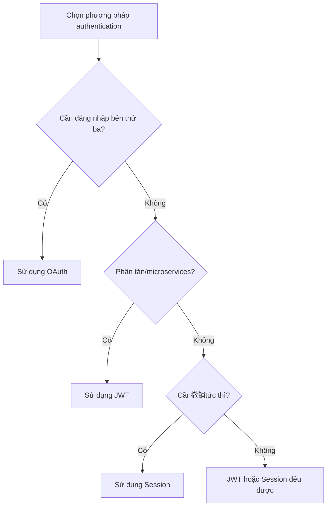

# 6.3.1 Authentication và Authorization: Lựa chọn và triển khai JWT/Session/OAuth

## Khôi phục bản chất

Vấn đề cốt lõi của authentication API chỉ có một: **Yêu cầu này đến từ ai?** Các phương pháp xác thực khác nhau, về bản chất, là những cách khác nhau để trả lời câu hỏi này.



## Sự khác biệt bản chất của ba phương pháp

| Phương pháp | Lưu trữ trạng thái | Trường hợp sử dụng | Độ khó撤销 |
|------|----------|----------|----------|
| **JWT** | Client (token tự chứa) | Hệ thống phân tán, microservices | Khó |
| **Session** | Server (memory/Redis) | Ứng dụng monolithic, cần撤销tức thì | Dễ |
| **OAuth** | Authorization server | Đăng nhập bên thứ ba, API mở | Trung bình |

## Triển khai JWT

JWT lưu trữ thông tin người dùng được mã hóa trong token, server không cần truy vấn cơ sở dữ liệu để xác minh danh tính.

```typescript
// lib/jwt.ts
import { SignJWT, jwtVerify } from 'jose'

const secret = new TextEncoder().encode(process.env.JWT_SECRET!)

export async function signToken(payload: { userId: string; role: string }) {
  return new SignJWT(payload)
    .setProtectedHeader({ alg: 'HS256' })
    .setIssuedAt()
    .setExpirationTime('15m')
    .sign(secret)
}

export async function verifyToken(token: string) {
  const { payload } = await jwtVerify(token, secret)
  return payload
}
```

```typescript
// Xác thực trong API route
export async function GET(request: Request) {
  const token = request.headers.get('Authorization')?.replace('Bearer ', '')

  if (!token) {
    return Response.json({ error: 'Không cung cấp token' }, { status: 401 })
  }

  try {
    const payload = await verifyToken(token)
    // Tiếp tục xử lý logic kinh doanh
    return Response.json({ userId: payload.userId })
  } catch {
    return Response.json({ error: 'Token không hợp lệ' }, { status: 401 })
  }
}
```

## Triển khai Session

Phương pháp Session lưu trữ trạng thái trên server, client chỉ giữ một Session ID.

```typescript
// Sử dụng iron-session
import { getIronSession } from 'iron-session'
import { cookies } from 'next/headers'

interface SessionData {
  userId?: string
  role?: string
}

export async function getSession() {
  return getIronSession<SessionData>(await cookies(), {
    password: process.env.SESSION_SECRET!,
    cookieName: 'session',
    cookieOptions: {
      httpOnly: true,
      secure: process.env.NODE_ENV === 'production',
      sameSite: 'lax',
      maxAge: 60 * 60 * 24 * 7, // 7 ngày
    },
  })
}

// Đặt session khi đăng nhập
export async function login(userId: string, role: string) {
  const session = await getSession()
  session.userId = userId
  session.role = role
  await session.save()
}

// Hủy session khi đăng xuất
export async function logout() {
  const session = await getSession()
  session.destroy()
}
```

## Làm thế nào để chọn?



### Checklist Quyết định

- **Chọn JWT**: Hàm không server (Vercel/Cloudflare Workers), chia sẻ authentication giữa nhiều dịch vụ
- **Chọn Session**: Ứng dụng monolithic truyền thống, cần kick người dùng offline bất cứ lúc nào, yêu cầu bảo vệ cực cao
- **Chọn OAuth**: Tích hợp đăng nhập Google/GitHub, v.v., mở API cho bên ngoài

## Phương pháp hỗn hợp: Cách làm của NextAuth

NextAuth mặc định sử dụng JWT để lưu trữ session, nhưng cũng hỗ trợ database session:

```typescript
// Chiến lược JWT (mặc định)
session: {
  strategy: "jwt",
  maxAge: 30 * 24 * 60 * 60, // 30 ngày
}

// Chiến lược database (cần adapter)
session: {
  strategy: "database",
  maxAge: 30 * 24 * 60 * 60,
}
```

::: tip Lời khuyên thực hành
Đối với hầu hết các ứng dụng Next.js, khuyến nghị sử dụng chiến lược JWT của NextAuth + cơ chế Refresh Token. Đơn giản, đủ dùng, và có thể撤销token khi cần.
:::
