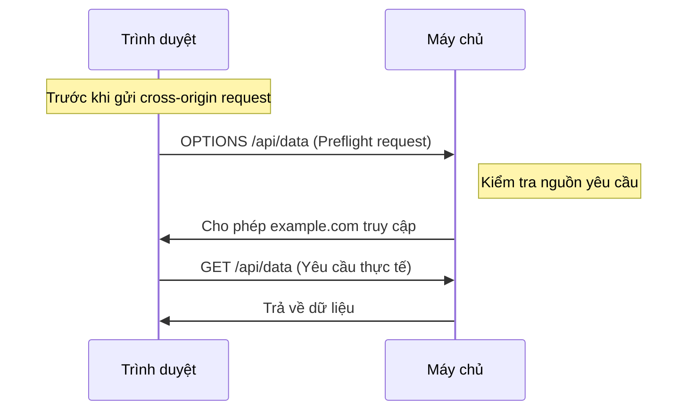

# 6.3.2 Preflight không phải rắc rối mà là bảo vệ: Cơ chế CORS

## Khôi phục bản chất

CORS (Cross-Origin Resource Sharing) không phải trình duyệt đang cố tình làm khó bạn, mà là đang bảo vệ người dùng. Bản chất của nó là: **Trình duyệt đang hỏi máy chủ "Bạn cho phép yêu cầu bên ngoài này không?"**



## Tại sao cần CORS?

Giả sử không có bảo vệ CORS:

1. Bạn đăng nhập vào website ngân hàng `bank.com`, Cookie lưu thông tin đăng nhập
2. Bạn truy cập website xấu xa `evil.com`
3. JavaScript của `evil.com` gửi yêu cầu đến `bank.com/api/transfer`
4. Trình duyệt tự động mang theo Cookie của `bank.com`
5. Tiền của bạn bị chuyển đi

**CORS tồn tại để chặn loại cross-site request này.**

## Simple request vs Preflight request

Không phải tất cả các cross-origin request đều cần preflight. Trình duyệt tự động nhận định dựa trên đặc điểm của yêu cầu:

### Simple request (không cần preflight)

Yêu cầu thỏa mãn tất cả các điều kiện sau:

- Phương pháp: `GET`, `HEAD`, `POST`
- Request headers: chỉ giới hạn `Accept`, `Accept-Language`, `Content-Language`, `Content-Type`
- Content-Type: chỉ giới hạn `text/plain`, `multipart/form-data`, `application/x-www-form-urlencoded`

```typescript
// Đây là simple request, gửi trực tiếp
fetch('https://api.example.com/data')
```

### Preflight request

Chỉ cần không thỏa mãn điều kiện của simple request, trình duyệt sẽ gửi trước một yêu cầu `OPTIONS`:

```typescript
// Đây sẽ kích hoạt preflight request (vì có custom header)
fetch('https://api.example.com/data', {
  headers: {
    'Authorization': 'Bearer xxx',
    'Content-Type': 'application/json'
  }
})
```

## Cấu hình CORS trong Next.js

### Cách 1: Xử lý trong API route

```typescript
// app/api/data/route.ts
const corsHeaders = {
  'Access-Control-Allow-Origin': 'https://your-frontend.com',
  'Access-Control-Allow-Methods': 'GET, POST, PUT, DELETE, OPTIONS',
  'Access-Control-Allow-Headers': 'Content-Type, Authorization',
  'Access-Control-Max-Age': '86400', // Lưu cache preflight result 24 giờ
}

export async function OPTIONS() {
  return new Response(null, { headers: corsHeaders })
}

export async function GET() {
  return Response.json(
    { data: 'Hello' },
    { headers: corsHeaders }
  )
}
```

### Cách 2: Xử lý tập trung qua Middleware

```typescript
// middleware.ts
import { NextResponse } from 'next/server'
import type { NextRequest } from 'next/server'

const allowedOrigins = [
  'https://your-frontend.com',
  'http://localhost:3000',
]

export function middleware(request: NextRequest) {
  const origin = request.headers.get('origin')

  // Kiểm tra xem có phải nguồn được cho phép không
  if (origin && allowedOrigins.includes(origin)) {
    // Xử lý preflight request
    if (request.method === 'OPTIONS') {
      return new NextResponse(null, {
        headers: {
          'Access-Control-Allow-Origin': origin,
          'Access-Control-Allow-Methods': 'GET, POST, PUT, DELETE, OPTIONS',
          'Access-Control-Allow-Headers': 'Content-Type, Authorization',
          'Access-Control-Max-Age': '86400',
        },
      })
    }

    // Request bình thường, thêm CORS header
    const response = NextResponse.next()
    response.headers.set('Access-Control-Allow-Origin', origin)
    return response
  }

  return NextResponse.next()
}

export const config = {
  matcher: '/api/:path*',
}
```

## Vấn đề thường gặp và cách khắc phục

### Vấn đề 1: `Access-Control-Allow-Origin` không thể dùng `*` kèm với credentials

```typescript
// ❌ Sai: không thể dùng wildcard khi có credentials
{
  'Access-Control-Allow-Origin': '*',
  'Access-Control-Allow-Credentials': 'true',
}

// ✅ Đúng: phải chỉ định domain cụ thể
{
  'Access-Control-Allow-Origin': 'https://your-frontend.com',
  'Access-Control-Allow-Credentials': 'true',
}
```

### Vấn đề 2: Preflight request không được xử lý đúng

```typescript
// ❌ Vấn đề: không xử lý OPTIONS request
export async function POST(request: Request) {
  // ...
}

// ✅ Đúng: xử lý rõ ràng OPTIONS
export async function OPTIONS() {
  return new Response(null, {
    headers: {
      'Access-Control-Allow-Origin': '*',
      'Access-Control-Allow-Methods': 'POST, OPTIONS',
      'Access-Control-Allow-Headers': 'Content-Type',
    },
  })
}

export async function POST(request: Request) {
  // ...
}
```

## Lời khuyên cấu hình bảo vệ

::: warning CORS Security Checklist
1. [ ] Không bao giờ sử dụng `Access-Control-Allow-Origin: *` trong môi trường production
2. [ ] Duy trì một danh sách trắng các domain được phép
3. [ ] Đặt `Access-Control-Max-Age` hợp lý để giảm preflight request
4. [ ] Bắt buộc xác thực `Origin` header cho các giao diện nhạy cảm
5. [ ] Cẩn thận khi sử dụng `Access-Control-Allow-Credentials`
:::
