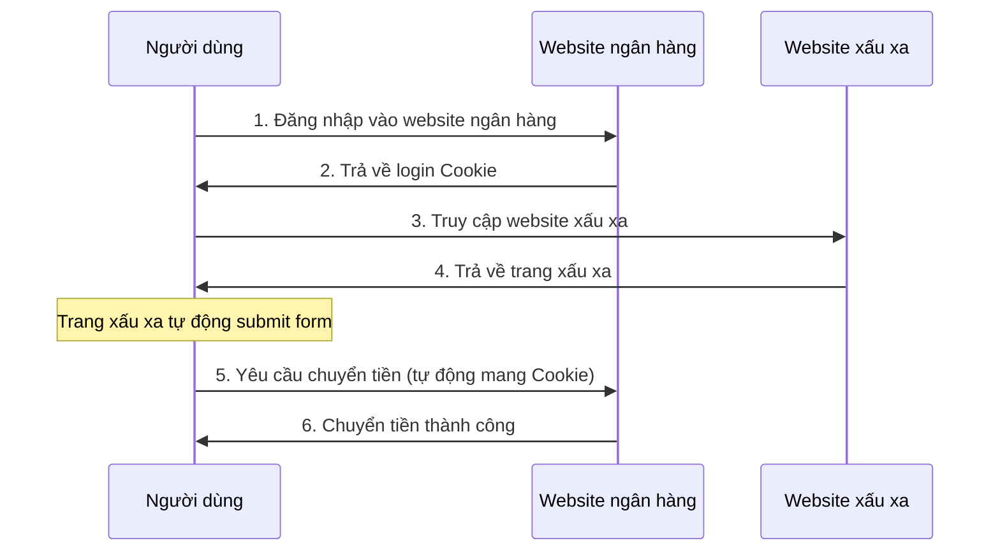

# 6.3.4 Hàng rào khi danh tính bị mượn: Tấn công CSRF

## Khôi phục bản chất

CSRF (Cross-Site Request Forgery) về bản chất là: **Kẻ tấn công mượn danh tính của bạn, khiến trình duyệt của bạn gửi yêu cầu thay cho anh ta**. Bạn đã đăng nhập vào một số website, kẻ tấn công xuyên tạo bạn truy cập trang xấu xa, trang đó tự động gửi yêu cầu đến website đích, trình duyệt sẽ tự động mang theo Cookie của bạn.



## CSRF vs XSS

| Loại tấn công | Cách tấn công | Mục tiêu tấn công |
|----------|----------|----------|
| **XSS** | Tiêm script vào website đích | Đánh cắp dữ liệu, chiếm đoạt session |
| **CSRF** | Mượn danh tính người dùng gửi request | Thực hiện các hoạt động nhạy cảm |

Sự khác biệt chính: CSRF không cần thực thi bất kỳ code nào ở website đích, chỉ cần xuyên tạo người dùng truy cập trang xấu xa.

## Ví dụ tấn công

Biểu mẫu ẩn trên website xấu xa:

```html
<!-- Trang của evil.com -->
<h1>Chúc mừng bạn trúng giải!</h1>

<!-- Biểu mẫu tự động submit ẩn -->
<form id="csrf-form" action="https://bank.com/transfer" method="POST" style="display:none">
  <input name="to" value="attacker-account" />
  <input name="amount" value="10000" />
</form>

<script>
  document.getElementById('csrf-form').submit()
</script>
```

Người dùng chỉ cần truy cập trang này, biểu mẫu sẽ tự động submit, trình duyệt sẽ mang theo Cookie của `bank.com`.

## Chiến lược phòng thủ

### Chiến lược 1: CSRF Token

Server tạo token ngẫu nhiên, nhúng vào biểu mẫu, xác thực khi submit:

```typescript
// Tạo CSRF Token
import { randomBytes } from 'crypto'

export function generateCsrfToken(): string {
  return randomBytes(32).toString('hex')
}

// Server Action
export async function transferMoney(formData: FormData) {
  const token = formData.get('csrfToken')
  const session = await getSession()

  if (token !== session.csrfToken) {
    throw new Error('CSRF validation failed')
  }

  // Thực hiện logic chuyển tiền
}
```

```tsx
// Biểu mẫu chứa Token
export default async function TransferForm() {
  const session = await getSession()

  return (
    <form action={transferMoney}>
      <input type="hidden" name="csrfToken" value={session.csrfToken} />
      <input name="to" placeholder="Số tài khoản nhận" />
      <input name="amount" type="number" placeholder="Số tiền" />
      <button type="submit">Chuyển tiền</button>
    </form>
  )
}
```

### Chiến lược 2: SameSite Cookie

Trình duyệt hiện đại hỗ trợ thuộc tính `SameSite`, giới hạn tình huống gửi Cookie:

```typescript
// Cấu hình NextAuth
cookies: {
  sessionToken: {
    name: 'session-token',
    options: {
      httpOnly: true,
      sameSite: 'lax',  // hoặc 'strict'
      secure: true,
    },
  },
}
```

Các giá trị SameSite:

| Giá trị | Hiệu quả |
|-----|------|
| `Strict` | Cookie hoàn toàn không được gửi trong cross-site request |
| `Lax` | GET request của cross-site gửi Cookie, POST không gửi (khuyến nghị) |
| `None` | Luôn gửi (cần kèm Secure) |

### Chiến lược 3: Xác thực Origin/Referer

Kiểm tra nguồn yêu cầu:

```typescript
export async function POST(request: Request) {
  const origin = request.headers.get('origin')
  const allowedOrigins = ['https://your-domain.com']

  if (!origin || !allowedOrigins.includes(origin)) {
    return Response.json({ error: 'Nguồn không hợp lệ' }, { status: 403 })
  }

  // Tiếp tục xử lý
}
```

### Chiến lược 4: Double Submit Cookie Verification

Đặt Token vào cả Cookie và request header:

```typescript
// Đặt Cookie
response.cookies.set('csrf-token', token, {
  httpOnly: false,  // Frontend cần đọc
  sameSite: 'strict',
  secure: true,
})

// Frontend gửi request đọc Cookie đặt vào Header
fetch('/api/transfer', {
  method: 'POST',
  headers: {
    'X-CSRF-Token': getCookie('csrf-token'),
  },
  body: JSON.stringify(data),
})

// Server xác thực
const cookieToken = request.cookies.get('csrf-token')
const headerToken = request.headers.get('X-CSRF-Token')

if (cookieToken !== headerToken) {
  throw new Error('CSRF validation failed')
}
```

## Bảo vệ tích hợp của Next.js Server Actions

Next.js Server Actions đã tích hợp bảo vệ CSRF:

```typescript
// Điều này an toàn, Next.js tự động xử lý CSRF
'use server'

export async function createPost(formData: FormData) {
  // Server Action sẽ xác thực nguồn yêu cầu
  const title = formData.get('title')
  // ...
}
```

::: tip Lời khuyên thực hành
Khi sử dụng Next.js Server Actions, framework đã tự động xử lý CSRF. Nhưng nếu sử dụng API Routes, vẫn cần thực hiện bảo vệ thủ công.
:::

## Security Configuration Checklist

::: warning CSRF Protection Checklist
1. [ ] Các hoạt động nhạy cảm sử dụng POST/PUT/DELETE, không dùng GET
2. [ ] Cookie được đặt `SameSite=Lax` hoặc `Strict`
3. [ ] Submit biểu mẫu xác thực CSRF Token
4. [ ] API xác thực Origin/Referer header
5. [ ] Sử dụng Server Actions để có bảo vệ tích hợp
:::
