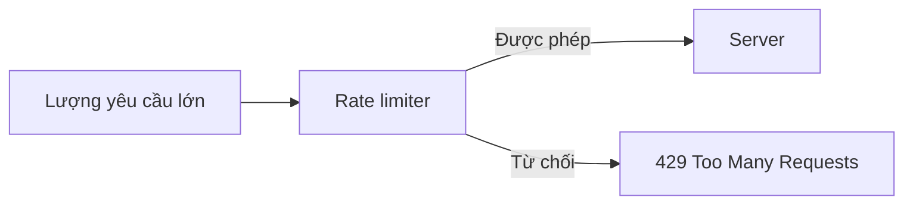

# 6.3.5 Rate limiting API và phòng thủ

## Khôi phục bản chất

Bản chất của rate limiting là: **Kiểm soát tốc độ tiêu thụ tài nguyên, ngăn chặn service bị sập**. Dù là tấn công độc hại hay loạt lưu lượng bất ngờ, rate limiting là hàng rào cuối cùng để bảo vệ hệ thống.



## Các thuật toán rate limiting phổ biến

### 1. Fixed Window (Cửa sổ cố định)

Đếm theo cửa sổ thời gian, reset lại khi cửa sổ kết thúc.

```
Cửa sổ thời gian: |----1 phút----|----1 phút----|
Số yêu cầu:          58          12
Giới hạn:          60 lần/phút
```

Nhược điểm: Biên giới cửa sổ có thể gây ra đột biến lưu lượng (cuối cửa sổ trước + đầu cửa sổ sau).

### 2. Sliding Window (Cửa sổ trượt)

Trượt cửa sổ để tính toán, kiểm soát lưu lượng mượt mà hơn.

```typescript
// Ví dụ rate limiting cửa sổ trượt
function slidingWindowRateLimit(
  requests: number[],  // Timestamp của các request gần đây
  windowMs: number,    // Kích thước cửa sổ (milliseconds)
  maxRequests: number  // Số request tối đa trong cửa sổ
): boolean {
  const now = Date.now()
  const windowStart = now - windowMs

  // Chỉ đếm request trong cửa sổ
  const recentRequests = requests.filter(t => t > windowStart)
  return recentRequests.length < maxRequests
}
```

### 3. Token Bucket (Xô token)

Thêm token vào xô với tốc độ cố định, mỗi request tiêu thụ một token. Khi xô đầy, token thừa bị bỏ đi.

Ưu điểm: Cho phép một mức độ nhất định của lưu lượng đột biến (các token tích tụ trong xô).

## Triển khai Rate limiting trong Next.js

### Sử dụng Upstash Redis

```bash
pnpm add @upstash/ratelimit @upstash/redis
```

```typescript
// lib/ratelimit.ts
import { Ratelimit } from '@upstash/ratelimit'
import { Redis } from '@upstash/redis'

export const ratelimit = new Ratelimit({
  redis: Redis.fromEnv(),
  limiter: Ratelimit.slidingWindow(10, '10 s'),  // 10 lần/10 giây
  analytics: true,
  prefix: 'ratelimit',
})
```

```typescript
// middleware.ts
import { NextResponse } from 'next/server'
import type { NextRequest } from 'next/server'
import { ratelimit } from './lib/ratelimit'

export async function middleware(request: NextRequest) {
  // Chỉ rate limit các API routes
  if (request.nextUrl.pathname.startsWith('/api')) {
    const ip = request.ip ?? '127.0.0.1'
    const { success, limit, reset, remaining } = await ratelimit.limit(ip)

    if (!success) {
      return NextResponse.json(
        { error: 'Yêu cầu quá tần suất, vui lòng thử lại sau' },
        {
          status: 429,
          headers: {
            'X-RateLimit-Limit': limit.toString(),
            'X-RateLimit-Remaining': remaining.toString(),
            'X-RateLimit-Reset': reset.toString(),
          },
        }
      )
    }
  }

  return NextResponse.next()
}
```

### Memory-based Rate limiting (Không phụ thuộc)

Thích hợp cho deployment đơn instance:

```typescript
// lib/memory-ratelimit.ts
const requests = new Map<string, number[]>()

export function rateLimit(
  key: string,
  limit: number = 10,
  windowMs: number = 60000
): { success: boolean; remaining: number } {
  const now = Date.now()
  const windowStart = now - windowMs

  // Lấy record request của key này
  let timestamps = requests.get(key) || []

  // Xóa record cũ
  timestamps = timestamps.filter(t => t > windowStart)

  if (timestamps.length >= limit) {
    return { success: false, remaining: 0 }
  }

  // Ghi lại request này
  timestamps.push(now)
  requests.set(key, timestamps)

  return { success: true, remaining: limit - timestamps.length }
}

// Định kỳ xóa dữ liệu cũ
setInterval(() => {
  const now = Date.now()
  for (const [key, timestamps] of requests.entries()) {
    const valid = timestamps.filter(t => t > now - 60000)
    if (valid.length === 0) {
      requests.delete(key)
    } else {
      requests.set(key, valid)
    }
  }
}, 60000)
```

## Chiến lược rate limiting theo cấp độ

Thiết lập giới hạn khác nhau cho các API khác nhau:

```typescript
// lib/ratelimit-config.ts
import { Ratelimit } from '@upstash/ratelimit'
import { Redis } from '@upstash/redis'

const redis = Redis.fromEnv()

// API bình thường: 60 lần/phút
export const standardLimit = new Ratelimit({
  redis,
  limiter: Ratelimit.slidingWindow(60, '1 m'),
  prefix: 'standard',
})

// API xác thực: 10 lần/giờ (ngăn brute force)
export const authLimit = new Ratelimit({
  redis,
  limiter: Ratelimit.slidingWindow(10, '1 h'),
  prefix: 'auth',
})

// API tần suất cao: 100 lần/giây
export const highFreqLimit = new Ratelimit({
  redis,
  limiter: Ratelimit.slidingWindow(100, '1 s'),
  prefix: 'highfreq',
})
```

```typescript
// app/api/login/route.ts
import { authLimit } from '@/lib/ratelimit-config'

export async function POST(request: Request) {
  const ip = request.headers.get('x-forwarded-for') ?? 'unknown'
  const { success } = await authLimit.limit(ip)

  if (!success) {
    return Response.json(
      { error: 'Quá nhiều lần thử đăng nhập, vui lòng thử lại sau 1 giờ' },
      { status: 429 }
    )
  }

  // Tiếp tục logic đăng nhập
}
```

## Phát hiện bất thường và phản hồi

### Giám sát hành vi đáng ngờ

```typescript
// lib/anomaly-detection.ts
interface RequestPattern {
  ip: string
  userAgent: string
  path: string
  timestamp: number
}

const patterns: RequestPattern[] = []

export function detectAnomaly(request: Request): boolean {
  const ip = request.headers.get('x-forwarded-for') ?? 'unknown'
  const userAgent = request.headers.get('user-agent') ?? ''
  const path = new URL(request.url).pathname

  // Ghi lại mô hình request
  patterns.push({ ip, userAgent, path, timestamp: Date.now() })

  // Phát hiện mô hình bất thường
  const recentFromIp = patterns.filter(
    p => p.ip === ip && p.timestamp > Date.now() - 60000
  )

  // 1. Nhiều path khác nhau trong thời gian ngắn (có thể quét)
  const uniquePaths = new Set(recentFromIp.map(p => p.path))
  if (uniquePaths.size > 50) {
    return true  // Bất thường
  }

  // 2. Suspicious User-Agent
  if (!userAgent || userAgent.includes('bot') || userAgent.includes('curl')) {
    // Có thể là crawler hoặc tool tự động hóa
  }

  return false
}
```

### Phản hồi Tiến triển

```typescript
// Áp dụng biện pháp khác nhau dựa trên số lần vi phạm
async function handleRateLimitViolation(ip: string, violations: number) {
  if (violations === 1) {
    // Lần đầu: cảnh báo
    return Response.json(
      { error: 'Tần suất request quá cao, vui lòng giảm tốc độ' },
      { status: 429 }
    )
  } else if (violations < 5) {
    // Nhiều lần vi phạm: tăng thời gian chờ
    return Response.json(
      { error: `Vui lòng chờ ${violations * 60} giây rồi thử lại` },
      { status: 429, headers: { 'Retry-After': (violations * 60).toString() } }
    )
  } else {
    // Vi phạm nghiêm trọng: thêm vào danh sách đen
    await addToBlacklist(ip)
    return Response.json(
      { error: 'IP của bạn đã bị khóa tạm thời' },
      { status: 403 }
    )
  }
}
```

## Configuration Checklist

::: tip Rate Limiting Configuration Recommendations
| Loại API | Giới hạn được khuyến nghị | Giải thích |
|----------|----------|------|
| Đăng nhập/Đăng ký | 10 lần/giờ | Ngăn brute force |
| Mã xác thực SMS | 5 lần/giờ | Ngăn lạm dụng |
| API bình thường | 60 lần/phút | Đủ cho sử dụng bình thường |
| Search API | 30 lần/phút | Ngăn crawler |
| File upload | 10 lần/giờ | Ngăn lạm dụng storage |
:::

::: warning Rate Limiting Security Checklist
1. [ ] Tất cả các API đều có rate limiting cơ bản
2. [ ] API nhạy cảm (đăng nhập, thanh toán) có giới hạn nghiêm ngặt hơn
3. [ ] Trả về status code 429 và Retry-After header tiêu chuẩn
4. [ ] Ghi lại các request bị rate limit để phân tích
5. [ ] Áp dụng hình phạt tiến triển cho IP vi phạm lặp lại
:::
