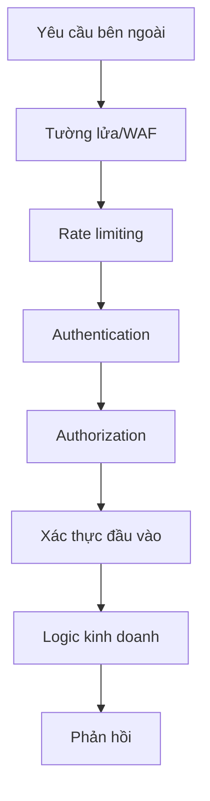

# 6.3 Bảo vệ cánh cửa chính của chương trình - Thực hành bảo vệ API

## Tái cấu trúc nhận thức

API là cửa sổ tương tác của ứng dụng với thế giới bên ngoài. Mỗi giao diện được expose là một điểm vào tiềm ẩn cho tấn công. Bảo vệ API không phải chỉ là "thêm xác thực", mà cần xây dựng hệ thống phòng thủ từ nhiều chiều: authentication, authorization, xác thực đầu vào, rate limiting, logging, v.v.



## Nội dung của phần này

| Tiểu mục | Vấn đề cốt lõi | Bạn sẽ học được |
|------|----------|----------|
| 6.3.1 Phương pháp xác thực | Làm thế nào để xác minh danh tính của người yêu cầu? | Cách chọn JWT/Session/API Key |
| 6.3.2 Cơ chế CORS | Tại sao lại có vấn đề cross-origin? | Preflight request và cấu hình bảo vệ |
| 6.3.3 Phòng chống XSS | Làm thế nào để ngăn chặn script injection? | Output encoding và CSP |
| 6.3.4 Phòng chống CSRF | Làm thế nào để ngăn chặn forged request? | Token verification và SameSite |
| 6.3.5 Rate limiting API | Làm thế nào để ngăn chặn giao diện bị lạm dụng? | Rate limiting và anomaly detection |

## Các cấp độ bảo vệ API

### Cấp độ 1: Bảo vệ truyền tải

```typescript
// Bắt buộc HTTPS
if (process.env.NODE_ENV === 'production') {
  if (request.headers.get('x-forwarded-proto') !== 'https') {
    return Response.redirect(`https://${request.headers.get('host')}${request.url}`)
  }
}
```

### Cấp độ 2: Authentication và Authorization

```typescript
// middleware.ts
import { getToken } from 'next-auth/jwt'

export async function middleware(request: NextRequest) {
  const token = await getToken({ req: request })

  if (!token) {
    return Response.json({ error: 'Không được phép' }, { status: 401 })
  }

  // Kiểm tra quyền
  if (request.nextUrl.pathname.startsWith('/api/admin')) {
    if (token.role !== 'admin') {
      return Response.json({ error: 'Cấm truy cập' }, { status: 403 })
    }
  }
}
```

### Cấp độ 3: Xác thực đầu vào

```typescript
import { z } from 'zod'

const CreatePostSchema = z.object({
  title: z.string().min(1).max(100),
  content: z.string().min(1).max(10000),
  tags: z.array(z.string()).max(10).optional(),
})

export async function POST(request: Request) {
  const body = await request.json()

  const result = CreatePostSchema.safeParse(body)
  if (!result.success) {
    return Response.json(
      { error: 'Tham số không hợp lệ', details: result.error.issues },
      { status: 400 }
    )
  }

  // Sử dụng dữ liệu đã được xác thực
  const { title, content, tags } = result.data
}
```

### Cấp độ 4: Bảo vệ Rate limiting

```typescript
import { Ratelimit } from '@upstash/ratelimit'
import { Redis } from '@upstash/redis'

const ratelimit = new Ratelimit({
  redis: Redis.fromEnv(),
  limiter: Ratelimit.slidingWindow(10, '10 s'), // 10 lần/10 giây
})

export async function middleware(request: NextRequest) {
  const ip = request.ip ?? '127.0.0.1'
  const { success } = await ratelimit.limit(ip)

  if (!success) {
    return Response.json(
      { error: 'Yêu cầu quá tần suất' },
      { status: 429 }
    )
  }
}
```

## Security Response Headers

```typescript
// next.config.js
const securityHeaders = [
  {
    key: 'X-DNS-Prefetch-Control',
    value: 'on'
  },
  {
    key: 'X-Frame-Options',
    value: 'SAMEORIGIN'
  },
  {
    key: 'X-Content-Type-Options',
    value: 'nosniff'
  },
  {
    key: 'Referrer-Policy',
    value: 'origin-when-cross-origin'
  },
]

module.exports = {
  async headers() {
    return [
      {
        source: '/:path*',
        headers: securityHeaders,
      },
    ]
  },
}
```

## Gợi ý hợp tác với AI

Khi mô tả yêu cầu bảo vệ API cho AI:

- "Thực hiện rate limiting, mỗi IP tối đa 60 requests/phút"
- "Sử dụng zod để xác thực đầu vào của người dùng một cách engg"
- "Thêm cấu hình CORS, chỉ cho phép các domain được chỉ định truy cập"
- "Thêm HTTP headers liên quan bảo vệ trong response headers"

::: warning API Security Checklist
1. [ ] Tất cả các giao diện đều có kiểm tra authentication
2. [ ] Các hoạt động nhạy cảm có xác thực authorization
3. [ ] Đầu vào của người dùng đã được xác thực và escape
4. [ ] Đã triển khai rate limiting
5. [ ] Đã cấu hình security response headers
6. [ ] Error message không rò rỉ thông tin nhạy cảm
:::
