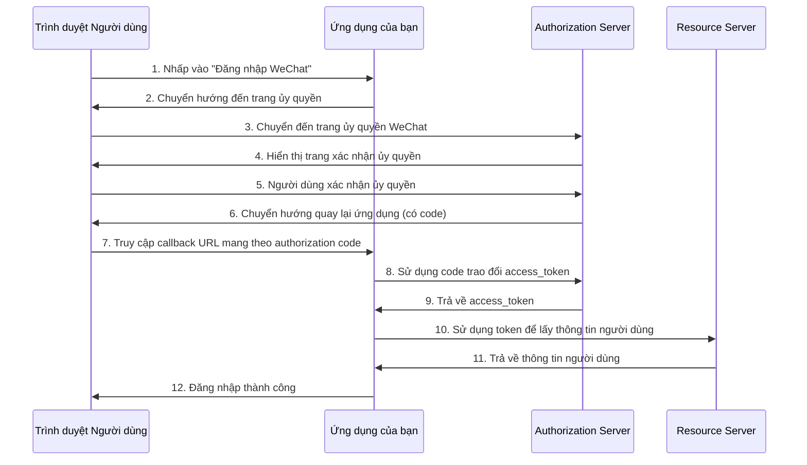

# 6.5.1 OAuth 2.0 Flow: Giải thích chi tiết chế độ Authorization Code

## Phá vỡ vấn đề bằng một câu

OAuth 2.0 giải quyết vấn đề: **Cho phép người dùng ủy quyền ứng dụng bên thứ ba truy cập dữ liệu của họ, nhưng không tiết lộ mật khẩu**. Chế độ authorization code là quy trình tiêu chuẩn an toàn nhất.

## Giá trị cốt lõi

Hiểu OAuth 2.0 sẽ cho phép bạn:
- Nắm rõ nguyên lý cơ bản của tất cả đăng nhập bên thứ ba
- Nhanh chóng làm quen bất kể tích hợp nền tảng nào
- Khắc phục các sự cố đăng nhập khi không thành công

## OAuth 2.0 Authorization Code Flow



## Bắt đầu nhanh

### Bước 1: Xây dựng Authorization URL

```typescript
// app/api/auth/wechat/route.ts
export async function GET() {
  const params = new URLSearchParams({
    appid: process.env.WECHAT_APP_ID!,
    redirect_uri: encodeURIComponent('https://your-site.com/api/auth/wechat/callback'),
    response_type: 'code',
    scope: 'snsapi_login',
    state: generateSecureState(),  // Ngăn chặn CSRF
  })

  const authUrl = `https://open.weixin.qq.com/connect/qrconnect?${params}#wechat_redirect`
  return Response.redirect(authUrl)
}
```

### Bước 2: Xử lý Callback

```typescript
// app/api/auth/wechat/callback/route.ts
export async function GET(request: Request) {
  const { searchParams } = new URL(request.url)
  const code = searchParams.get('code')
  const state = searchParams.get('state')

  // Xác minh state để ngăn chặn CSRF
  if (!verifyState(state)) {
    return Response.redirect('/login?error=invalid_state')
  }

  // Sử dụng code trao đổi access_token
  const tokenRes = await fetch(
    `https://api.weixin.qq.com/sns/oauth2/access_token?` +
    `appid=${process.env.WECHAT_APP_ID}` +
    `&secret=${process.env.WECHAT_APP_SECRET}` +
    `&code=${code}` +
    `&grant_type=authorization_code`
  )

  const { access_token, openid } = await tokenRes.json()

  // Lấy thông tin người dùng
  const userRes = await fetch(
    `https://api.weixin.qq.com/sns/userinfo?access_token=${access_token}&openid=${openid}`
  )

  const userInfo = await userRes.json()

  // Tạo hoặc tìm kiếm người dùng cục bộ, thiết lập phiên
  // ...
}
```

### Bước 3: State Parameter Protection

```typescript
import { cookies } from 'next/headers'
import { randomBytes } from 'crypto'

export function generateSecureState(): string {
  const state = randomBytes(32).toString('hex')
  cookies().set('oauth_state', state, {
    httpOnly: true,
    secure: true,
    sameSite: 'lax',
    maxAge: 60 * 10,  // Hợp lệ trong 10 phút
  })
  return state
}

export function verifyState(state: string | null): boolean {
  const stored = cookies().get('oauth_state')?.value
  cookies().delete('oauth_state')
  return !!state && state === stored
}
```

## Giải thích các tham số chính

| Tham số | Giải thích | Ví dụ |
|------|------|------|
| `client_id` | Mã nhận dạng duy nhất của ứng dụng | `wx1234567890abcdef` |
| `redirect_uri` | Địa chỉ callback sau ủy quyền | `https://example.com/callback` |
| `response_type` | Cố định là `code` | `code` |
| `scope` | Phạm vi quyền được yêu cầu | `snsapi_login` |
| `state` | Chuỗi ngẫu nhiên để ngăn chặn CSRF | `abc123xyz` |

## Hướng dẫn tránh cạm bẫy

::: danger Lỗi phổ biến nhất của người mới bắt đầu
1. Quên xác minh tham số `state`——dẫn đến lỗ hổng CSRF
2. `redirect_uri` không khớp với lúc đăng ký——ủy quyền không thành công
3. Tiết lộ `client_secret` ở phía máy khách——vấn đề bảo mật nghiêm trọng
4. Không xử lý trường hợp ủy quyền bị từ chối——trải nghiệm người dùng tồi
:::
