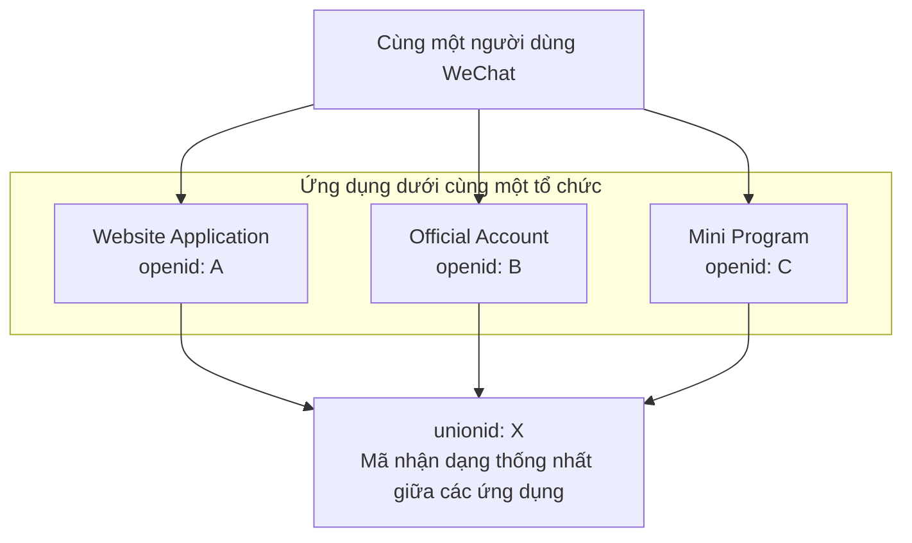

# 6.5.2 WeChat Login: WeChat Open Platform và Official Account Login

## Phá vỡ vấn đề bằng một câu

Đăng nhập WeChat chia thành hai kịch bản: **Quét mã đăng nhập web** (Open Platform) và **Đăng nhập trong Official Account** (Official Platform). Hai loại này có API khác nhau, cần tích hợp riêng biệt.

## Giá trị cốt lõi

Hiểu đăng nhập WeChat sẽ cho phép bạn:
- Cung cấp cách đăng nhập phổ biến nhất cho sản phẩm C2C
- Hiểu sự khác biệt giữa openid và unionid
- Triển khai đăng nhập vô cảm trong Official Account

## So sánh hai cách đăng nhập

| Kịch bản | Nền tảng | Trải nghiệm người dùng | Sản phẩm phù hợp |
|------|------|----------|----------|
| Quét mã web | WeChat Open Platform | Mở WeChat quét mã | Website độc lập/PC |
| Trong Official Account | WeChat Official Platform | Nhấp để ủy quyền | Official Account H5 |

## Đăng nhập quét mã web

### Điều kiện tiên quyết

1. Đăng ký tài khoản [WeChat Open Platform](https://open.weixin.qq.com/)
2. Tạo website application, vượt qua xét duyệt
3. Lấy AppID và AppSecret

### Mã triển khai

```typescript
// app/api/auth/wechat/route.ts
export async function GET() {
  const state = generateSecureState()

  const params = new URLSearchParams({
    appid: process.env.WECHAT_OPEN_APP_ID!,
    redirect_uri: 'https://your-site.com/api/auth/wechat/callback',
    response_type: 'code',
    scope: 'snsapi_login',
    state,
  })

  return Response.redirect(
    `https://open.weixin.qq.com/connect/qrconnect?${params}#wechat_redirect`
  )
}
```

```typescript
// app/api/auth/wechat/callback/route.ts
export async function GET(request: Request) {
  const { searchParams } = new URL(request.url)
  const code = searchParams.get('code')

  // Trao đổi access_token
  const tokenRes = await fetch(
    `https://api.weixin.qq.com/sns/oauth2/access_token?` +
    `appid=${process.env.WECHAT_OPEN_APP_ID}` +
    `&secret=${process.env.WECHAT_OPEN_APP_SECRET}` +
    `&code=${code}&grant_type=authorization_code`
  )

  const { access_token, openid, unionid } = await tokenRes.json()

  // Lấy thông tin người dùng
  const userRes = await fetch(
    `https://api.weixin.qq.com/sns/userinfo?access_token=${access_token}&openid=${openid}`
  )

  const { nickname, headimgurl } = await userRes.json()

  // Sử dụng unionid để liên kết người dùng (mã nhận dạng thống nhất giữa các ứng dụng)
  const user = await findOrCreateUser({
    unionid,
    openid,
    nickname,
    avatar: headimgurl,
  })

  await createSession(user)
  return Response.redirect('/dashboard')
}
```

## Đăng nhập trong Official Account

### Điều kiện tiên quyết

1. Sở hữu một Service Account đã được xác thực
2. Cấu hình authorization domain trong backend Official Account

### Hai chế độ ủy quyền

| Chế độ | scope | Cảm nhận của người dùng | Lấy thông tin |
|------|-------|----------|----------|
| Silent Authorization | `snsapi_base` | Không | Chỉ openid |
| Authorization Popup | `snsapi_userinfo` | Authorization popup | Thông tin đầy đủ |

### Mã triển khai

```typescript
// Kiểm tra xem có trong WeChat không
function isWechatBrowser(ua: string) {
  return /MicroMessenger/i.test(ua)
}

// Official Account authorization entry point
export async function GET(request: Request) {
  const ua = request.headers.get('user-agent') || ''

  if (!isWechatBrowser(ua)) {
    // Không phải môi trường WeChat, sử dụng đăng nhập quét mã
    return redirectToQrLogin()
  }

  // Trong WeChat, sử dụng web authorization
  const params = new URLSearchParams({
    appid: process.env.WECHAT_MP_APP_ID!,
    redirect_uri: encodeURIComponent('https://your-site.com/api/auth/wechat-mp/callback'),
    response_type: 'code',
    scope: 'snsapi_userinfo',  // hoặc snsapi_base
    state: generateSecureState(),
  })

  return Response.redirect(
    `https://open.weixin.qq.com/connect/oauth2/authorize?${params}#wechat_redirect`
  )
}
```

## openid vs unionid



::: tip Hiểu biết chính
- `openid`: Khác nhau đối với cùng một người dùng trong các ứng dụng khác nhau
- `unionid`: Giống nhau đối với cùng một người dùng trong các ứng dụng dưới cùng một tổ chức
- Để lấy unionid, bạn cần ràng buộc Official Account/Mini Program trên Open Platform
:::

## Hướng dẫn tránh cạm bẫy

::: danger Lỗi phổ biến nhất của người mới bắt đầu
1. Nhầm lẫn API của Open Platform và Official Platform
2. Không phân biệt kịch bản quét mã web và Official Account
3. Sử dụng openid thay vì unionid để làm mã nhận dạng người dùng duy nhất
4. Quên xử lý trường hợp người dùng từ chối ủy quyền
:::
