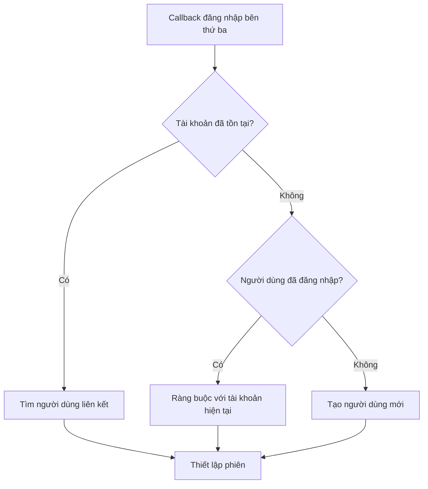

# 6.5.5 Account Binding và Unbinding

## Phá vỡ vấn đề bằng một câu

Khi người dùng có thể đăng nhập qua WeChat, QQ, số điện thoại, v.v., cần một cơ chế để **liên kết các nhận dạng này với cùng một tài khoản**, tránh người dùng tạo ra nhiều tài khoản.

## Giá trị cốt lõi

Hiểu account binding sẽ cho phép bạn:
- Tránh người dùng mất dữ liệu do thay đổi cách đăng nhập
- Cung cấp trải nghiệm đăng nhập linh hoạt hơn
- Xây dựng hệ thống nhận dạng người dùng hoàn chỉnh

## Thiết kế mô hình dữ liệu

```typescript
// prisma/schema.prisma
model User {
  id        String   @id @default(cuid())
  email     String?  @unique
  phone     String?  @unique
  name      String?
  avatar    String?
  accounts  Account[]
  createdAt DateTime @default(now())
}

model Account {
  id                String  @id @default(cuid())
  userId            String
  provider          String  // 'wechat' | 'qq' | 'dingtalk'
  providerAccountId String  // openid hoặc unionid
  accessToken       String?
  refreshToken      String?
  user              User    @relation(fields: [userId], references: [id])

  @@unique([provider, providerAccountId])
}
```

## Chiến lược đăng nhập và ràng buộc



## Mã triển khai

```typescript
// lib/account-linking.ts
interface OAuthUserInfo {
  provider: 'wechat' | 'qq' | 'dingtalk'
  providerAccountId: string  // unionid ưu tiên, nếu không thì openid
  email?: string
  name?: string
  avatar?: string
}

export async function handleOAuthLogin(
  oauthInfo: OAuthUserInfo,
  currentUserId?: string  // Nếu người dùng đã đăng nhập
) {
  // 1. Tìm kiếm xem đã có tài khoản bên thứ ba này không
  const existingAccount = await prisma.account.findUnique({
    where: {
      provider_providerAccountId: {
        provider: oauthInfo.provider,
        providerAccountId: oauthInfo.providerAccountId,
      },
    },
    include: { user: true },
  })

  // Trường hợp A: Tài khoản đã tồn tại, đăng nhập trực tiếp
  if (existingAccount) {
    return existingAccount.user
  }

  // Trường hợp B: Người dùng đã đăng nhập, ràng buộc với tài khoản hiện tại
  if (currentUserId) {
    await prisma.account.create({
      data: {
        userId: currentUserId,
        provider: oauthInfo.provider,
        providerAccountId: oauthInfo.providerAccountId,
      },
    })
    return prisma.user.findUnique({ where: { id: currentUserId } })
  }

  // Trường hợp C: Cố gắng so khớp người dùng hiện có thông qua email/số điện thoại
  if (oauthInfo.email) {
    const existingUser = await prisma.user.findUnique({
      where: { email: oauthInfo.email },
    })
    if (existingUser) {
      await prisma.account.create({
        data: {
          userId: existingUser.id,
          provider: oauthInfo.provider,
          providerAccountId: oauthInfo.providerAccountId,
        },
      })
      return existingUser
    }
  }

  // Trường hợp D: Tạo người dùng mới
  return prisma.user.create({
    data: {
      name: oauthInfo.name,
      avatar: oauthInfo.avatar,
      email: oauthInfo.email,
      accounts: {
        create: {
          provider: oauthInfo.provider,
          providerAccountId: oauthInfo.providerAccountId,
        },
      },
    },
  })
}
```

## Unbind Account

```typescript
// app/api/account/unbind/route.ts
export async function POST(request: Request) {
  const session = await getSession()
  if (!session?.userId) {
    return Response.json({ error: 'Chưa đăng nhập' }, { status: 401 })
  }

  const { provider } = await request.json()

  // Kiểm tra xem có ít nhất một cách đăng nhập còn lại không
  const accounts = await prisma.account.findMany({
    where: { userId: session.userId },
  })

  const user = await prisma.user.findUnique({
    where: { id: session.userId },
  })

  const hasPassword = !!user?.password
  const hasEmail = !!user?.email
  const otherAccounts = accounts.filter((a) => a.provider !== provider)

  if (!hasPassword && !hasEmail && otherAccounts.length === 0) {
    return Response.json(
      { error: 'Phải giữ lại ít nhất một cách đăng nhập' },
      { status: 400 }
    )
  }

  // Unbind
  await prisma.account.deleteMany({
    where: {
      userId: session.userId,
      provider,
    },
  })

  return Response.json({ success: true })
}
```

## Hướng dẫn tránh cạm bẫy

::: danger Lỗi phổ biến nhất của người mới bắt đầu
1. Sử dụng openid thay vì unionid để ràng buộc tài khoản——dẫn đến không thể ràng buộc cùng người dùng giữa các ứng dụng khác nhau
2. Không kiểm tra xem còn cách đăng nhập nào sau khi unbind——người dùng có thể không thể đăng nhập
3. Không xử lý xung đột gộp tài khoản——khi cả hai tài khoản đều có dữ liệu
4. Không thông báo cho người dùng về thay đổi trạng thái ràng buộc——người dùng không biết mình đã ràng buộc tài khoản nào
:::
