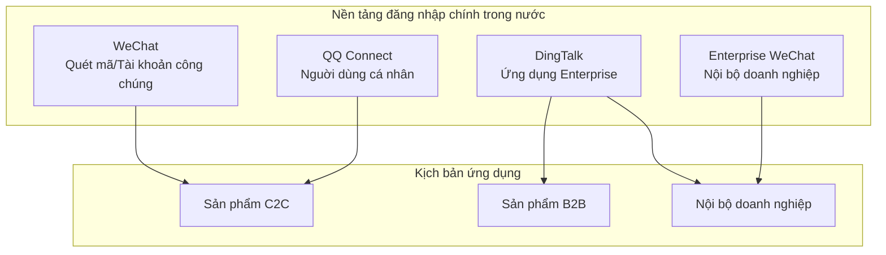

# 6.5 Tích hợp Đăng nhập WeChat/QQ——Tích hợp Sâu Đăng nhập Bên thứ ba

## Tái cấu trúc Nhận thức

Nguyên lý kỹ thuật của đăng nhập bên thứ ba trong nước và đăng nhập Google/GitHub hoàn toàn giống nhau——đều là chế độ mã hóa OAuth 2.0. Nhưng khi tích hợp thực tế, bạn sẽ gặp phải rất nhiều "đặc thù của Trung Quốc":

- Quy trình ứng tuyển phức tạp, cần tài liệu của công ty
- Hệ sinh thái WeChat bị phân mảnh (Nền tảng Mở vs Tài khoản Công chúng)
- DingTalk/Enterprise WeChat chủ yếu dành cho các ứng dụng nội bộ của doanh nghiệp
- Trải nghiệm sử dụng tài liệu và SDK không đều



## Nội dung của phần này

| Phần | Câu hỏi cốt lõi | Bạn sẽ học được |
|------|----------|----------|
| 6.5.1 OAuth Flow | OAuth 2.0 authorization code mode là gì? | Hiểu nguyên lý chung của đăng nhập bên thứ ba |
| 6.5.2 WeChat Login | Làm thế nào để tích hợp đăng nhập WeChat? | Đăng nhập nền tảng mở và tài khoản công chúng |
| 6.5.3 QQ Login | Làm thế nào để tích hợp đăng nhập QQ? | Cấu hình nền tảng QQ Connect |
| 6.5.4 DingTalk Login | Làm thế nào để tích hợp đăng nhập DingTalk? | Ứng dụng doanh nghiệp và ứng dụng bên thứ ba |
| 6.5.5 Account Binding | Làm thế nào để thống nhất tài khoản đa nền tảng? | Chiến lược gộp tài khoản người dùng |
| 6.5.6 Error Handling | Làm thế nào khi đăng nhập không thành công? | Xử lý các tình huống ngoại lệ và thông báo cho người dùng |

## Bảng so sánh nền tảng nhanh

| Nền tảng | Độ khó ứng tuyển | Kịch bản ứng dụng | Cần tài liệu công ty |
|------|----------|----------|------------------|
| WeChat Open Platform | Cao | Sản phẩm C2C | Có |
| WeChat Official Account | Trung bình | H5/Official Account | Có (Service Account) |
| QQ Connect | Trung bình | Sản phẩm C2C | Không (nhưng cần xét duyệt) |
| DingTalk | Thấp | B2B/Nội bộ doanh nghiệp | Có thể nhập vào doanh nghiệp |
| Enterprise WeChat | Thấp | Nội bộ doanh nghiệp | Có thể nhập vào doanh nghiệp |

## Mô hình phát triển chung

Bất kể tích hợp nền tảng nào, cấu trúc mã giống nhau:

```typescript
// 1. Tạo Authorization URL, chuyển hướng người dùng
export async function GET(request: Request) {
  const authUrl = buildAuthUrl({
    client_id: process.env.PLATFORM_CLIENT_ID,
    redirect_uri: 'https://your-site.com/api/auth/callback',
    state: generateState(),  // Ngăn chặn CSRF
    scope: 'user_info',
  })
  return Response.redirect(authUrl)
}

// 2. Nhận lại cuộc gọi, trao đổi access_token
export async function GET(request: Request) {
  const { code, state } = getSearchParams(request)

  // Xác minh state
  if (!verifyState(state)) {
    return Response.redirect('/login?error=invalid_state')
  }

  // Sử dụng code để trao đổi token
  const tokenResponse = await fetch(TOKEN_URL, {
    method: 'POST',
    body: new URLSearchParams({
      code,
      client_id: process.env.CLIENT_ID,
      client_secret: process.env.CLIENT_SECRET,
    }),
  })

  const { access_token } = await tokenResponse.json()

  // 3. Sử dụng token để lấy thông tin người dùng
  const userInfo = await fetchUserInfo(access_token)

  // 4. Tạo hoặc liên kết người dùng cục bộ
  const user = await findOrCreateUser(userInfo)

  // 5. Tạo phiên
  await createSession(user)

  return Response.redirect('/dashboard')
}
```

## Gợi ý hợp tác với AI

Khi mô tả nhu cầu đăng nhập bên thứ ba trong nước cho AI:

- "Triển khai đăng nhập quét mã WeChat, sử dụng chế độ mã hóa OAuth 2.0 authorization code"
- "Lưu trữ state trên máy chủ để ngăn chặn cuộc tấn công CSRF"
- "Xử lý logic cho lần đăng nhập lần đầu tiên và ràng buộc tài khoản"
- "Thêm xử lý lỗi đăng nhập và thông báo cho người dùng"

::: warning Danh sách kiểm tra tích hợp đăng nhập trong nước
1. [ ] Chuẩn bị tài liệu tài chính của công ty
2. [ ] Hoàn thành đăng ký ứng dụng trên mỗi nền tảng
3. [ ] Cấu hình địa chỉ gọi lại chính xác
4. [ ] Triển khai state parameter để ngăn chặn CSRF
5. [ ] Xử lý logic ràng buộc tài khoản đa nền tảng
6. [ ] Hoàn thiện thông báo lỗi và xử lý ngoại lệ
:::
