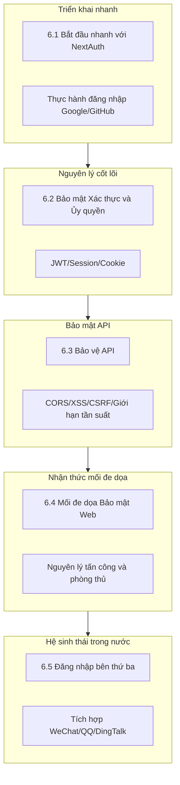

# 6 | Xác thực và Bảo mật (Bảo mật Web Nâng cao)

## Tại sao bảo mật là môn học bắt buộc bạn không thể bỏ qua

Trong thời đại Vibe Coding, AI có thể giúp bạn nhanh chóng tạo ra mã đăng nhập, đăng ký, gửi form, API, v.v. Nhưng AI sẽ không chủ động suy nghĩ về vấn đề bảo mật cho bạn—nó có thể bỏ sót bảo vệ CSRF, quên xác thực đầu vào, hoặc để lộ thông tin nhạy cảm ở phía client.

**Bảo mật không phải là "điểm cộng", mà là "yêu cầu tối thiểu".** Một sản phẩm thiếu ý thức bảo mật, sau khi ra mắt có thể đối mặt với:

- Rò rỉ dữ liệu người dùng → Rủi ro pháp lý
- Tài khoản bị đánh cắp → Mất người dùng
- Lạm dụng API → Sập dịch vụ
- Lỗ hổng thanh toán → Tổn thất kinh tế trực tiếp

## Lộ trình học tập của chương này

## Tổng quan các chương

| Chương | Câu hỏi cốt lõi | Bạn sẽ học được |
|------|----------|----------|
| **6.1 Bắt đầu nhanh với NextAuth** | Làm thế nào để nhanh chóng triển khai chức năng đăng nhập? | Thiết lập đăng nhập Google/GitHub trong 10 phút |
| **6.2 Bảo mật Xác thực và Ủy quyền** | JWT và Session chọn cái nào? | Hiểu ranh giới bảo mật của các phương án xác thực |
| **6.3 Bảo vệ API** | Làm thế nào để ngăn API bị lạm dụng? | Cấu hình CORS, giới hạn tần suất, xác thực đầu vào |
| **6.4 Mối đe dọa Bảo mật Web** | Hacker tấn công website như thế nào? | Nguyên lý và phòng thủ XSS/CSRF/Injection |
| **6.5 Tích hợp đăng nhập bên thứ ba** | Làm thế nào tích hợp đăng nhập trong nước? | Thực hành OAuth WeChat/QQ/DingTalk |

## Nguyên tắc cốt lõi của tư duy bảo mật

Trước khi đi sâu vào chi tiết kỹ thuật, hãy thiết lập tư duy bảo mật đúng đắn:

### 1. Không bao giờ tin tưởng client

Bất kỳ dữ liệu nào từ trình duyệt đều có thể bị giả mạo. Tất cả xác thực phải được thực hiện lại ở phía server.

### 2. Nguyên tắc quyền tối thiểu

Người dùng chỉ có thể truy cập tài nguyên họ cần, code chỉ có quyền nó cần.

### 3. Phòng thủ theo chiều sâu

Đừng dựa vào một biện pháp phòng thủ duy nhất. Xác thực, ủy quyền, xác thực đầu vào, mã hóa—mỗi tầng đều cần thiết lập phòng thủ.

### 4. Bảo mật là quá trình liên tục

Bảo mật không phải là cấu hình một lần. Cập nhật dependencies thường xuyên, kiểm tra code, theo dõi hành vi bất thường.

## Gợi ý hợp tác với AI

Khi yêu cầu AI tạo mã liên quan đến bảo mật, bạn có thể sử dụng các từ khóa sau:

- "Vui lòng thêm bảo vệ CSRF"
- "Xác thực và escape đầu vào người dùng"
- "Sử dụng cờ HttpOnly và Secure khi thiết lập Cookie"
- "Triển khai giới hạn request để ngăn lạm dụng"
- "Đảm bảo thông tin nhạy cảm không bị lộ ở phía client"

::: warning Danh sách kiểm tra đánh giá mã bảo mật
Bất kể AI tạo mã gì, nhất định phải kiểm tra:
1. Thông tin nhạy cảm có bị lộ ở frontend không?
2. Đầu vào người dùng đã được xác thực chưa?
3. Truy vấn database có rủi ro injection không?
4. Cookie đã thiết lập thuộc tính bảo mật chưa?
5. API có kiểm soát truy cập không?
:::
