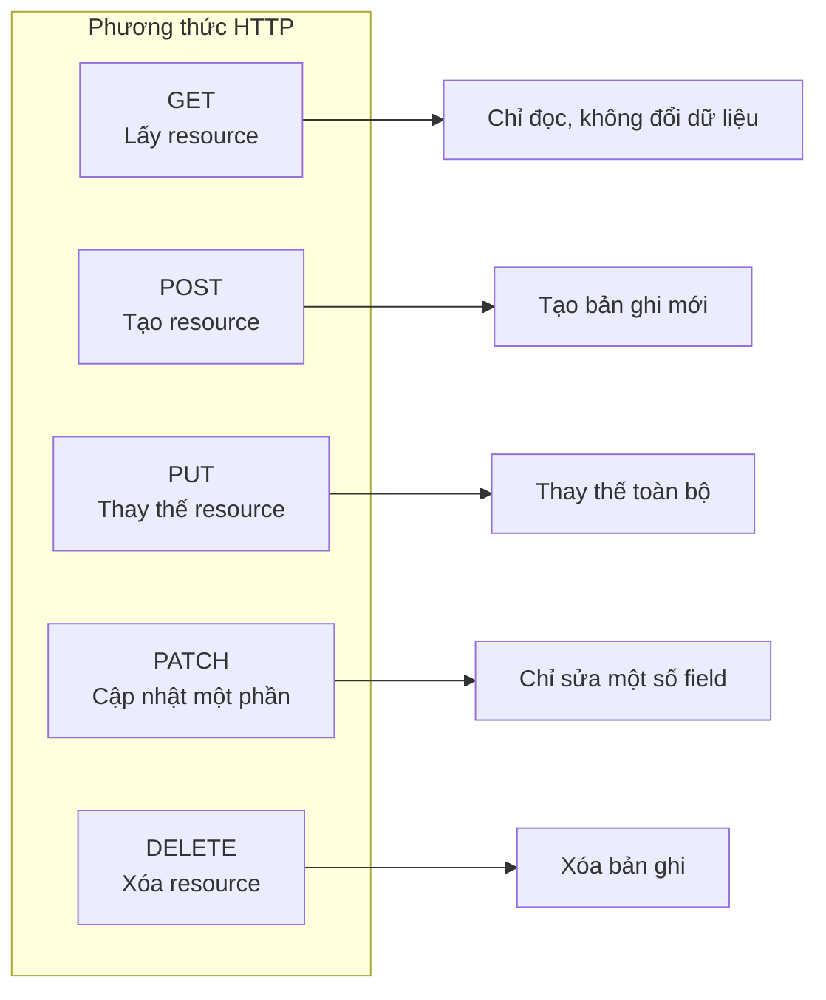

# 7.1.1 Ngữ nghĩa Phương Thức HTTP

## Tóm Tắt Một Câu

Phương thức HTTP cho server biết "bạn muốn làm gì"——GET là xem, POST là tạo, PUT là sửa, DELETE là xóa. Dùng sai phương thức giống như dùng dao để vặn ốc.

## Năm Phương Thức Cốt Lõi



| Phương thức | Ngữ nghĩa | Idempotent | Request Body | Tình huống điển hình |
|------|------|--------|--------|----------|
| **GET** | Lấy | ✅ Có | ❌ Không | Lấy danh sách user, xem chi tiết |
| **POST** | Tạo | ❌ Không | ✅ Có | Đăng ký user, gửi đơn hàng |
| **PUT** | Thay thế | ✅ Có | ✅ Có | Cập nhật toàn bộ thông tin user |
| **PATCH** | Cập nhật một phần | ✅ Có | ✅ Có | Chỉ đổi nickname user |
| **DELETE** | Xóa | ✅ Có | ❌ Không | Xóa bài viết |

## Triển Khai Trong Next.js

### Ví Dụ API Route

```typescript
// app/api/users/route.ts
import { NextRequest, NextResponse } from 'next/server'

// GET /api/users - Lấy danh sách user
export async function GET(request: NextRequest) {
  const users = await prisma.user.findMany()
  return NextResponse.json(users)
}

// POST /api/users - Tạo user
export async function POST(request: NextRequest) {
  const body = await request.json()
  const user = await prisma.user.create({ data: body })
  return NextResponse.json(user, { status: 201 })
}
```

```typescript
// app/api/users/[id]/route.ts

// GET /api/users/:id - Lấy một user
export async function GET(
  request: NextRequest,
  { params }: { params: { id: string } }
) {
  const user = await prisma.user.findUnique({
    where: { id: params.id }
  })

  if (!user) {
    return NextResponse.json(
      { error: 'User not found' },
      { status: 404 }
    )
  }

  return NextResponse.json(user)
}

// PUT /api/users/:id - Thay thế user
export async function PUT(
  request: NextRequest,
  { params }: { params: { id: string } }
) {
  const body = await request.json()
  const user = await prisma.user.update({
    where: { id: params.id },
    data: body,  // Thay thế toàn bộ
  })
  return NextResponse.json(user)
}

// PATCH /api/users/:id - Cập nhật một phần
export async function PATCH(
  request: NextRequest,
  { params }: { params: { id: string } }
) {
  const body = await request.json()
  const user = await prisma.user.update({
    where: { id: params.id },
    data: body,  // Chỉ cập nhật field được truyền vào
  })
  return NextResponse.json(user)
}

// DELETE /api/users/:id - Xóa user
export async function DELETE(
  request: NextRequest,
  { params }: { params: { id: string } }
) {
  await prisma.user.delete({
    where: { id: params.id }
  })
  return new NextResponse(null, { status: 204 })
}
```

## PUT vs PATCH

```typescript
// Dữ liệu user gốc
const user = {
  id: '1',
  name: 'Alice',
  email: 'alice@example.com',
  avatar: 'avatar.png',
}

// PUT: Cần truyền dữ liệu đầy đủ
// PUT /api/users/1
// Body: { name: 'Alice New', email: 'alice@example.com', avatar: 'avatar.png' }
// Nếu thiếu avatar, avatar sẽ bị xóa

// PATCH: Chỉ truyền field cần đổi
// PATCH /api/users/1
// Body: { name: 'Alice New' }
// Chỉ đổi name, các field khác giữ nguyên
```

| Tình huống | Dùng phương thức |
|------|----------|
| Submit form (tất cả field) | PUT |
| Chỉ đổi avatar | PATCH |
| Chỉ đổi trạng thái | PATCH |
| Import dữ liệu ghi đè | PUT |

## Nhận Thức: Lỗi Thường Gặp

### 1. Dùng POST cho mọi thứ

```typescript
// ❌ Sai: Dùng POST cho tất cả
POST /api/getUser      // Nên dùng GET
POST /api/deleteUser   // Nên dùng DELETE
POST /api/updateUser   // Nên dùng PUT/PATCH

// ✅ Đúng: Ngữ nghĩa rõ ràng
GET /api/users/123
DELETE /api/users/123
PATCH /api/users/123
```

### 2. GET request có Body

```typescript
// ❌ GET request không nên có Body
GET /api/users
Body: { filter: 'active' }

// ✅ Dùng query parameter
GET /api/users?status=active
```

### 3. DELETE trả về dữ liệu đã xóa

```typescript
// ❌ Không khuyến khích: Trả về dữ liệu đã xóa
DELETE /api/users/123
Response: { id: '123', name: 'Alice', ... }

// ✅ Khuyến khích: Trả về 204 No Content
DELETE /api/users/123
Response: (không có nội dung, status code 204)
```

## Tóm Tắt Phần Này

| Điểm chính | Giải thích |
|------|------|
| **GET chỉ đọc** | Không nên sửa đổi bất kỳ dữ liệu nào |
| **POST tạo** | Mỗi lần gọi có thể tạo resource mới |
| **PUT thay thế** | Cần truyền dữ liệu đầy đủ |
| **PATCH cập nhật** | Chỉ truyền field cần đổi |
| **DELETE xóa** | Trả về 204 không có nội dung |
