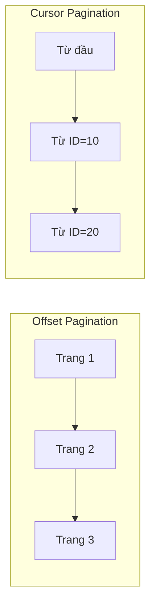
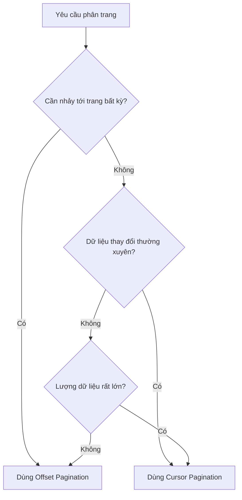

# 7.1.3 Chiến Lược Phân Trang

## Tóm Tắt Một Câu

Khi lượng dữ liệu vượt quá phạm vi hiển thị trên một màn hình, phân trang là bắt buộc——vấn đề là dùng cách phân trang nào: "trang thứ mấy" truyền thống hay "bắt đầu từ đâu" hiện đại hơn.

## Hai Cách Phân Trang



| Cách | Nguyên lý | Trường hợp sử dụng |
|------|------|----------|
| **Offset** | Bỏ qua N bản ghi trước, lấy M bản ghi | Phân trang truyền thống, quản lý backend |
| **Cursor** | Bắt đầu từ vị trí nào, lấy M bản ghi | Cuộn vô hạn, dữ liệu thời gian thực |

## Offset Pagination

### Định dạng request

```
GET /api/posts?page=2&pageSize=10
```

### Mã triển khai

```typescript
// app/api/posts/route.ts
export async function GET(request: NextRequest) {
  const { searchParams } = new URL(request.url)
  const page = parseInt(searchParams.get('page') || '1')
  const pageSize = parseInt(searchParams.get('pageSize') || '10')

  const skip = (page - 1) * pageSize

  const [posts, total] = await Promise.all([
    prisma.post.findMany({
      skip,
      take: pageSize,
      orderBy: { createdAt: 'desc' },
    }),
    prisma.post.count(),
  ])

  return NextResponse.json({
    data: posts,
    pagination: {
      page,
      pageSize,
      total,
      totalPages: Math.ceil(total / pageSize),
    },
  })
}
```

### Ví dụ response

```json
{
  "data": [
    { "id": "11", "title": "Post 11" },
    { "id": "12", "title": "Post 12" }
  ],
  "pagination": {
    "page": 2,
    "pageSize": 10,
    "total": 100,
    "totalPages": 10
  }
}
```

### Ưu và nhược điểm

| Ưu điểm | Nhược điểm |
|------|------|
| Có thể nhảy tới trang bất kỳ | Dữ liệu thay đổi có thể bị lặp hoặc thiếu |
| Trải nghiệm người dùng trực quan | Hiệu suất kém với lượng dữ liệu lớn |
| Triển khai đơn giản | Cần truy vấn COUNT |

## Cursor Pagination

### Định dạng request

```
GET /api/posts?cursor=abc123&limit=10
```

### Mã triển khai

```typescript
// app/api/posts/route.ts
export async function GET(request: NextRequest) {
  const { searchParams } = new URL(request.url)
  const cursor = searchParams.get('cursor')
  const limit = parseInt(searchParams.get('limit') || '10')

  const posts = await prisma.post.findMany({
    take: limit + 1,  // Lấy thêm 1 bản ghi để kiểm tra có trang tiếp theo
    ...(cursor && {
      cursor: { id: cursor },
      skip: 1,  // Bỏ qua bản ghi cursor
    }),
    orderBy: { createdAt: 'desc' },
  })

  const hasMore = posts.length > limit
  const data = hasMore ? posts.slice(0, -1) : posts
  const nextCursor = hasMore ? data[data.length - 1].id : null

  return NextResponse.json({
    data,
    nextCursor,
    hasMore,
  })
}
```

### Ví dụ response

```json
{
  "data": [
    { "id": "abc123", "title": "Post 1" },
    { "id": "def456", "title": "Post 2" }
  ],
  "nextCursor": "def456",
  "hasMore": true
}
```

### Sử dụng ở frontend

```typescript
// Tải thêm khi cuộn
const [posts, setPosts] = useState<Post[]>([])
const [cursor, setCursor] = useState<string | null>(null)
const [hasMore, setHasMore] = useState(true)

async function loadMore() {
  const url = cursor
    ? `/api/posts?cursor=${cursor}&limit=10`
    : '/api/posts?limit=10'

  const res = await fetch(url)
  const { data, nextCursor, hasMore } = await res.json()

  setPosts(prev => [...prev, ...data])
  setCursor(nextCursor)
  setHasMore(hasMore)
}
```

### Ưu và nhược điểm

| Ưu điểm | Nhược điểm |
|------|------|
| Tính nhất quán dữ liệu tốt | Không thể nhảy tới trang bất kỳ |
| Hiệu suất ổn định | Triển khai phức tạp hơn |
| Phù hợp với dữ liệu thời gian thực | Không biết tổng số trang |

## Cách Chọn?



| Kịch bản | Cách được khuyến khích |
|------|----------|
| Danh sách quản lý backend | Offset |
| Dòng thông tin mạng xã hội | Cursor |
| Kết quả tìm kiếm | Offset |
| Lịch sử trò chuyện | Cursor |
| Danh sách sản phẩm bán hàng điện tử | Offset |
| Thông báo thời gian thực | Cursor |

## Nhận Thức: Vấn Đề Thường Gặp

### 1. Dữ liệu lộn xộn với Offset Pagination

```
Kịch bản: Người dùng ở trang 2, lúc này ai đó đăng bài viết mới

Bản ghi cuối cùng của trang 1 (bản ghi 10) bị đẩy sang trang 2
Người dùng làm mới trang 2, sẽ thấy nội dung trùng lặp
```

### 2. Cursor không nhất thiết là ID

```typescript
// cursor có thể là bất kỳ giá trị nào duy nhất và có thứ tự
const cursor = {
  id: 'abc123',           // Theo ID
  createdAt: '2024-01-15', // Theo thời gian
  score: 100,             // Theo điểm số
}

// Mã hóa rồi truyền
const encodedCursor = Buffer.from(JSON.stringify(cursor)).toString('base64')
```

### 3. Xác thực tham số phân trang

```typescript
// Ngăn chặn request độc hại
const page = Math.max(1, Math.min(100, parseInt(params.page || '1')))
const pageSize = Math.max(1, Math.min(100, parseInt(params.pageSize || '10')))
```

## Tóm Tắt Phần Này

| Điểm chính | Giải thích |
|------|------|
| **Offset Pagination** | Phù hợp với quản lý backend, cần nhảy trang |
| **Cursor Pagination** | Phù hợp với cuộn vô hạn, dữ liệu thời gian thực |
| **Xem xét hiệu suất** | Với lượng dữ liệu lớn ưu tiên Cursor |
| **Xem xét nhất quán** | Dữ liệu thay đổi thường xuyên dùng Cursor |
