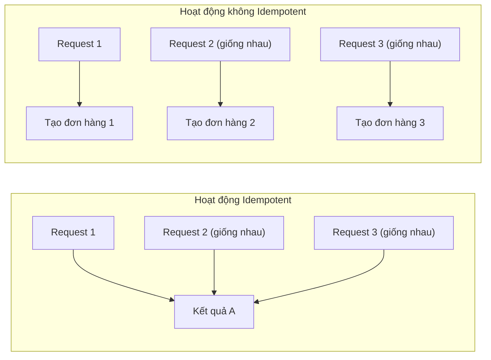

# 7.1.5 Đảm Bảo Idempotency

## Tóm Tắt Một Câu

Idempotency có nghĩa là "làm một lần và làm một trăm lần có hiệu quả như nhau"——người dùng mạng kém bấm nút gửi vài lần, sẽ không tạo nhiều đơn hàng.

## Idempotency Là Gì



| Phương thức HTTP | Idempotent | Giải thích |
|-----------|--------|------|
| GET | ✅ Có | Lấy dữ liệu, không thay đổi trạng thái |
| PUT | ✅ Có | Thay thế resource, thực thi nhiều lần kết quả giống nhau |
| DELETE | ✅ Có | Xóa resource, xóa một lần hay xóa nhiều lần kết quả giống nhau |
| PATCH | ✅ Có | Cập nhật một phần, thực thi nhiều lần kết quả giống nhau |
| POST | ❌ Không | Tạo resource, mỗi lần có thể tạo resource mới |

## Kịch Bản Vấn Đề

### Người dùng gửi lặp lại

```
1. Người dùng bấm "Gửi đơn hàng"
2. Mạng chậm, trang không phản hồi
3. Người dùng bấm lại vài lần
4. Mạng khôi phục, nhiều request tới server cùng lúc
5. Tạo nhiều đơn hàng trùng lặp!
```

### Mạng gửi lại request

```
1. Client gửi request
2. Server xử lý thành công
3. Response bị mất trên mạng
4. Client cho là thất bại, tự động gửi lại
5. Server xử lý lần nữa
```

## Giải Pháp

### Giải pháp 1: Idempotency Key

```typescript
// Client tạo Unique Key
const idempotencyKey = crypto.randomUUID()

fetch('/api/orders', {
  method: 'POST',
  headers: {
    'Content-Type': 'application/json',
    'Idempotency-Key': idempotencyKey,
  },
  body: JSON.stringify(orderData),
})
```

```typescript
// Server xử lý
// app/api/orders/route.ts
export async function POST(request: NextRequest) {
  const idempotencyKey = request.headers.get('Idempotency-Key')

  if (!idempotencyKey) {
    return NextResponse.json(
      { error: 'Thiếu Idempotency-Key' },
      { status: 400 }
    )
  }

  // Kiểm tra xem đã xử lý trước đó chưa
  const existing = await prisma.idempotencyRecord.findUnique({
    where: { key: idempotencyKey },
  })

  if (existing) {
    // Trả về kết quả trước đó
    return NextResponse.json(JSON.parse(existing.response))
  }

  // Xử lý request
  const body = await request.json()
  const order = await prisma.order.create({ data: body })

  // Ghi nhận Idempotency Key
  await prisma.idempotencyRecord.create({
    data: {
      key: idempotencyKey,
      response: JSON.stringify(order),
      expiresAt: new Date(Date.now() + 24 * 60 * 60 * 1000), // Hết hạn sau 24 giờ
    },
  })

  return NextResponse.json(order, { status: 201 })
}
```

### Giải pháp 2: Ràng buộc Unique Theo Nghiệp Vụ

```typescript
// Dùng tính duy nhất của trường nghiệp vụ
// Ví dụ: user + sản phẩm + cửa sổ thời gian = đơn hàng duy nhất

const orderKey = `${userId}_${productId}_${Date.now().toString().slice(0, -3)}`

try {
  const order = await prisma.order.create({
    data: {
      ...orderData,
      orderKey,  // Ràng buộc duy nhất
    },
  })
  return NextResponse.json(order, { status: 201 })
} catch (error) {
  if (error.code === 'P2002') {
    // Xung đột ràng buộc duy nhất, tức là đã tạo
    const existing = await prisma.order.findUnique({
      where: { orderKey },
    })
    return NextResponse.json(existing)
  }
  throw error
}
```

### Giải pháp 3: Ngăn Chặn Frontend

```typescript
// Vô hiệu hóa nút sau khi nhấp
function SubmitButton() {
  const [isSubmitting, setIsSubmitting] = useState(false)

  async function handleSubmit() {
    if (isSubmitting) return

    setIsSubmitting(true)
    try {
      await submitOrder()
    } finally {
      setIsSubmitting(false)
    }
  }

  return (
    <button
      onClick={handleSubmit}
      disabled={isSubmitting}
    >
      {isSubmitting ? 'Đang gửi...' : 'Gửi đơn hàng'}
    </button>
  )
}
```

### Giải pháp 4: Khóa Lạc Quan

```typescript
// Dùng số phiên bản ngăn chặn xung đột cập nhật song song
async function updateInventory(productId: string, quantity: number) {
  const product = await prisma.product.findUnique({
    where: { id: productId },
  })

  const updated = await prisma.product.updateMany({
    where: {
      id: productId,
      version: product.version,  // Số phiên bản phải khớp mới cập nhật
    },
    data: {
      stock: { decrement: quantity },
      version: { increment: 1 },
    },
  })

  if (updated.count === 0) {
    throw new Error('Xung đột song song, vui lòng thử lại')
  }
}
```

## Thực Hành Tốt Nhất

### Sử Dụng Kết Hợp

```typescript
// 1. Frontend: Ngăn chặn + Idempotency Key
// 2. Backend: Kiểm tra Idempotency Key + Ràng buộc nghiệp vụ

// Frontend
const [idempotencyKey] = useState(() => crypto.randomUUID())

async function submit() {
  if (isSubmitting) return
  setIsSubmitting(true)

  await fetch('/api/orders', {
    headers: { 'Idempotency-Key': idempotencyKey },
    body: JSON.stringify(data),
  })
}

// Backend
export async function POST(request: NextRequest) {
  const key = request.headers.get('Idempotency-Key')

  // 1. Kiểm tra Idempotency Key
  const cached = await checkIdempotencyKey(key)
  if (cached) return cached

  // 2. Xử lý nghiệp vụ (có ràng buộc duy nhất làm cách chắn)
  try {
    const order = await createOrder(data)
    await saveIdempotencyKey(key, order)
    return NextResponse.json(order)
  } catch (error) {
    if (isDuplicateError(error)) {
      return getExistingOrder(data)
    }
    throw error
  }
}
```

## Nhận Thức: Hiểu Lầm Thường Gặp

### 1. Chỉ dựa vào ngăn chặn frontend

```
❌ Chỉ vô hiệu hóa nút ở frontend
   - Người dùng có thể làm mới trang rồi gửi lại
   - Có thể dùng công cụ nhà phát triển để vượt qua

✅ Ngăn chặn frontend + Idempotency backend
```

### 2. Lưu trữ Idempotency Key vĩnh viễn

```typescript
// ❌ Lưu vĩnh viễn sẽ gây phình dữ liệu
await prisma.idempotencyRecord.create({
  data: { key, response },
})

// ✅ Đặt thời gian hết hạn, làm sạch định kỳ
await prisma.idempotencyRecord.create({
  data: {
    key,
    response,
    expiresAt: new Date(Date.now() + 24 * 60 * 60 * 1000),
  },
})
```

### 3. Bỏ qua nhất quán response

```typescript
// ❌ Request trùng trả về response khác
// Lần 1: { id: 1, status: 'created' }
// Lần 2: { message: 'Đã tồn tại' }

// ✅ Trả về response cấu trúc giống nhau
// Lần 1 và lần 2 đều trả về: { id: 1, status: 'created' }
```

## Tóm Tắt Phần Này

| Điểm chính | Giải thích |
|------|------|
| **Idempotency** | Thực thi nhiều lần có hiệu quả giống nhau |
| **Idempotency Key** | Client tạo, server loại bỏ trùng lặp |
| **Ràng buộc nghiệp vụ** | Dùng chỉ mục duy nhất ngăn chặn trùng lặp |
| **Bảo vệ nhiều lớp** | Ngăn chặn frontend + xác thực backend |
