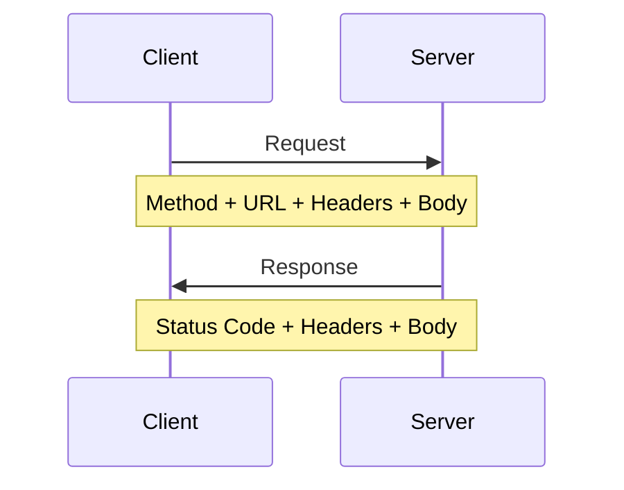

# 7.1 Interface là hợp đồng không phải mật mã——HTTP và API

## Tái Cấu Trúc Nhận Thức

API interface giống như thực đơn nhà hàng: tên món (URL) phải rõ ràng, giá cả (tham số) phải minh bạch, quy trình phục vụ (phương thức) phải chuẩn mực. Nếu thực đơn viết mơ hồ, cả bồi bàn và bếp đều sụp đổ.

```
API tốt: GET /users/123 → Lấy user có ID là 123
API tồi: POST /api/getData?type=user&action=get&id=123
```

## Bản Chất Của HTTP Request



Một HTTP request hoàn chỉnh bao gồm:

| Thành phần | Giải thích | Ví dụ |
|----------|------|------|
| **Method** | Thao tác gì | GET, POST, PUT, DELETE |
| **URL** | Thao tác resource nào | /api/users/123 |
| **Headers** | Thông tin bổ sung | Authorization, Content-Type |
| **Body** | Dữ liệu request | Dữ liệu định dạng JSON |

## Nội Dung Phần Này

- **7.1.1 Ngữ nghĩa phương thức HTTP**: Cách dùng đúng GET/POST/PUT/DELETE
- **7.1.2 Định dạng dữ liệu JSON**: Ngôn ngữ giao tiếp chung của frontend và backend
- **7.1.3 Chiến lược phân trang**: Làm thế nào lấy dữ liệu theo lô khi dữ liệu quá nhiều
- **7.1.4 Lọc và sắp xếp**: Lấy chính xác dữ liệu cần thiết
- **7.1.5 Đảm bảo idempotency**: Request trùng lặp không tạo ra side effect

## Nguyên Tắc Cốt Lõi

| Nguyên tắc | Giải thích |
|------|------|
| **Ngữ nghĩa rõ ràng** | URL và method phải thể hiện ý định thao tác |
| **Format thống nhất** | Request và response dùng format dữ liệu nhất quán |
| **Có thể dự đoán** | Request giống nhau luôn nhận được response cùng kiểu |
| **Retry an toàn** | Khi có vấn đề mạng có thể retry request một cách an toàn |
