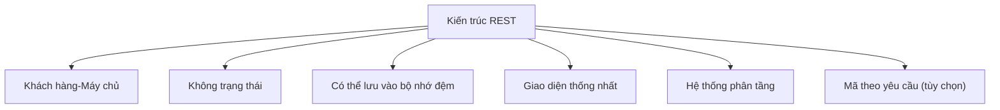
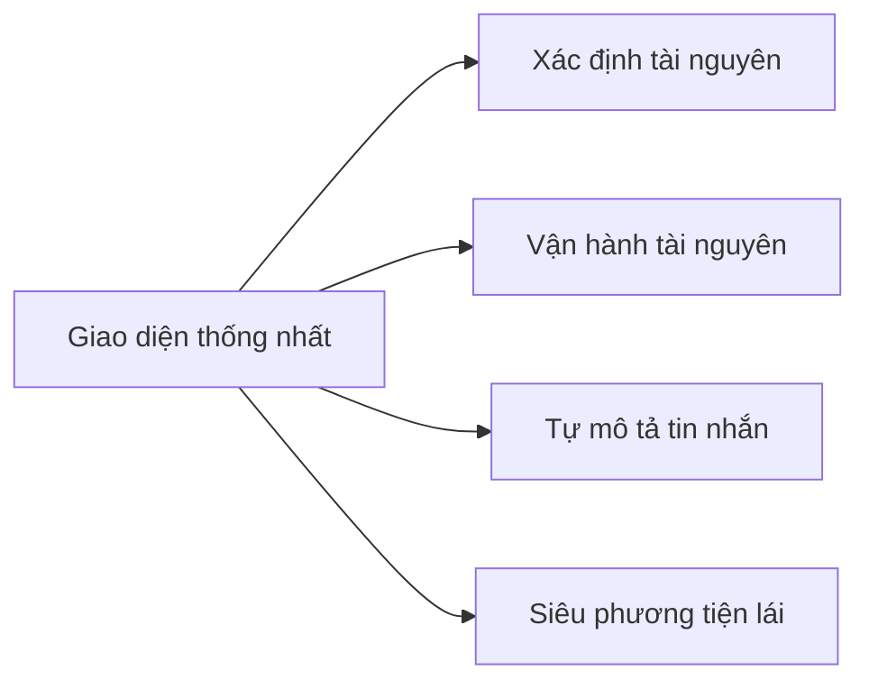
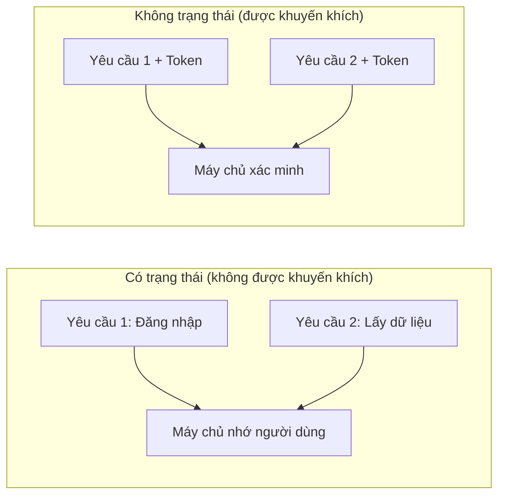
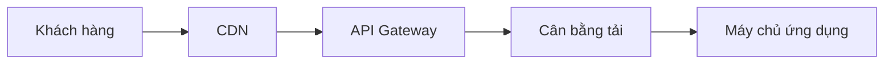

# 7.2.1 Ràng buộc REST

## Giải thích ngắn gọn

REST không phải một công nghệ, mà là một bộ ràng buộc thiết kế——tuân theo những ràng buộc này, API của bạn sẽ trở nên đơn giản, có thể dự đoán được, dễ mở rộng.

## Sáu ràng buộc chính của REST



| Ràng buộc | Ý nghĩa | Lợi ích |
|------|------|------|
| **Khách hàng-Máy chủ** | Tách biệt phía trước và phía sau | Mỗi phía phát triển độc lập |
| **Không trạng thái** | Máy chủ không lưu trạng thái phiên | Dễ mở rộng |
| **Có thể lưu vào bộ nhớ đệm** | Phản hồi có thể được lưu vào bộ nhớ đệm | Cải thiện hiệu suất |
| **Giao diện thống nhất** | Sử dụng phương thức HTTP tiêu chuẩn | Giao diện có thể dự đoán được |
| **Hệ thống phân tầng** | Có thể có lớp trung gian | Kiến trúc linh hoạt |
| **Mã theo yêu cầu** | Có thể tải xuống mã có thể thực thi | Tính năng tùy chọn |

## Giao diện thống nhất

### Nguyên tắc cốt lõi

Giao diện thống nhất là ràng buộc quan trọng nhất của REST, bao gồm bốn ràng buộc phụ:



### Xác định tài nguyên

```typescript
// Mỗi tài nguyên có một URL duy nhất
/api/users/123        // Tài nguyên người dùng
/api/posts/456        // Tài nguyên bài viết
/api/users/123/posts  // Bài viết của người dùng
```

### Vận hành tài nguyên

```typescript
// Thể hiện ý định hoạt động thông qua phương thức HTTP
GET    /api/users/123   // Đọc
POST   /api/users       // Tạo
PUT    /api/users/123   // Thay thế
PATCH  /api/users/123   // Cập nhật
DELETE /api/users/123   // Xóa
```

### Tự mô tả tin nhắn

```typescript
// Tiêu đề yêu cầu chứa đủ siêu thông tin
fetch('/api/users', {
  method: 'POST',
  headers: {
    'Content-Type': 'application/json',  // Cho biết định dạng thân yêu cầu
    'Accept': 'application/json',         // Định dạng phản hồi mong đợi
    'Authorization': 'Bearer xxx',        // Thông tin xác thực
  },
  body: JSON.stringify(data),
})
```

## Không trạng thái

### Có trạng thái là gì



### Triển khai không trạng thái

```typescript
// Mỗi yêu cầu mang theo thông tin xác thực hoàn chỉnh
fetch('/api/users', {
  headers: {
    'Authorization': `Bearer ${token}`,  // Mang Token mỗi lần
  },
})
```

### Lợi ích

| Lợi ích | Giải thích |
|------|------|
| **Dễ mở rộng** | Yêu cầu có thể gửi đến máy chủ bất kỳ |
| **Tính sẵn dùng cao** | Nếu máy chủ gặp sự cố, thay thế bằng một cái khác |
| **Đơn giản** | Không cần duy trì trạng thái phiên |

## Có thể lưu vào bộ nhớ đệm

### Tiêu đề kiểm soát bộ nhớ đệm

```typescript
// app/api/posts/route.ts
export async function GET() {
  const posts = await getPosts()

  return NextResponse.json(posts, {
    headers: {
      'Cache-Control': 'public, max-age=60',  // Lưu vào bộ nhớ đệm công khai, có hiệu lực 60 giây
      'ETag': generateETag(posts),            // Dấu vân tay tài nguyên
    },
  })
}
```

### Chiến lược lưu vào bộ nhớ đệm phổ biến

| Chiến lược | Header | Tình huống thích hợp |
|------|--------|----------|
| **Không lưu vào bộ nhớ đệm** | `no-store` | Dữ liệu nhạy cảm |
| **Xác minh bộ nhớ đệm** | `no-cache` | Cập nhật thường xuyên |
| **Bộ nhớ đệm ngắn hạn** | `max-age=60` | Dữ liệu danh sách |
| **Bộ nhớ đệm dài hạn** | `max-age=31536000` | Tài nguyên tĩnh |

```typescript
// Chiến lược lưu vào bộ nhớ đệm cho các tình huống khác nhau
const cacheStrategies = {
  sensitive: 'private, no-store',           // Dữ liệu nhạy cảm của người dùng
  dynamic: 'private, no-cache',             // Dữ liệu động cá nhân
  shared: 'public, max-age=60',             // Danh sách công khai
  static: 'public, max-age=31536000',       // Tài nguyên tĩnh
}
```

## Hệ thống phân tầng



Khách hàng không cần biết có bao nhiêu lớp ở giữa, chỉ cần biết địa chỉ API cuối cùng.

## RESTful so với không phải RESTful

| Khía cạnh | RESTful | Không phải RESTful |
|------|---------|------------|
| Thiết kế URL | `/api/users/123` | `/api/getUser?id=123` |
| Thể hiện hoạt động | Phương thức HTTP | URL hoặc tham số |
| Quản lý trạng thái | Token | Phiên |
| Bộ nhớ đệm | Tiêu đề bộ nhớ đệm HTTP | Logic tùy chỉnh |

## Nhận thức: Sai lầm phổ biến

### 1. Đặt hành động vào URL

```
❌ POST /api/createUser
❌ GET  /api/getUsers
❌ POST /api/deleteUser

✅ POST   /api/users
✅ GET    /api/users
✅ DELETE /api/users/123
```

### 2. Lạm dụng POST

```
❌ Sử dụng POST cho tất cả hoạt động
   POST /api/users/get
   POST /api/users/delete

✅ Chọn phương thức dựa trên ngữ nghĩa
   GET    /api/users
   DELETE /api/users/123
```

### 3. Không phân biệt bộ nhớ đệm công khai và riêng tư

```typescript
// ❌ Dữ liệu riêng của người dùng sử dụng bộ nhớ đệm công khai
headers: { 'Cache-Control': 'public, max-age=3600' }

// ✅ Dữ liệu riêng sử dụng bộ nhớ đệm riêng tư
headers: { 'Cache-Control': 'private, max-age=60' }
```

## Tổng kết phần này

| Điểm chính | Giải thích |
|------|------|
| **Giao diện thống nhất** | Sử dụng phương thức HTTP để thể hiện ý định hoạt động |
| **Không trạng thái** | Mỗi yêu cầu mang theo thông tin hoàn chỉnh |
| **Có thể lưu vào bộ nhớ đệm** | Tận dụng cơ chế bộ nhớ đệm HTTP |
| **Hệ thống phân tầng** | Khách hàng không nhận biết các lớp trung gian |
