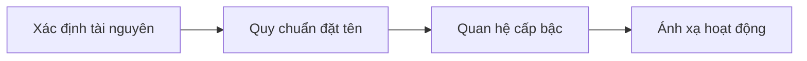
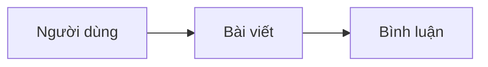

# 7.2.2 Thiết kế tài nguyên

## Giải thích ngắn gọn

REST của R là Resource (tài nguyên), URL là địa chỉ của tài nguyên——thiết kế URL tốt giúp API rõ ràng một cách trực tiếp.

## Nguyên tắc thiết kế URL



| Nguyên tắc | Giải thích | Ví dụ |
|------|------|------|
| **Danh từ chứ không phải động từ** | URL biểu diễn tài nguyên | `/users` chứ không `/getUsers` |
| **Dạng số nhiều** | Tập hợp tài nguyên dùng số nhiều | `/posts` chứ không `/post` |
| **Chữ thường** | Sử dụng thống nhất chữ thường | `/api/users` chứ không `/api/Users` |
| **Ngăn cách bằng dấu gạch ngang** | Nhiều từ dùng dấu gạch ngang | `/blog-posts` chứ không `/blogPosts` |

## Hoạt động CRUD cơ bản

```typescript
// Tài nguyên: bài viết (posts)

// Hoạt động trên tập hợp
GET    /api/posts          // Lấy danh sách bài viết
POST   /api/posts          // Tạo bài viết

// Hoạt động trên tài nguyên đơn
GET    /api/posts/:id      // Lấy một bài viết
PUT    /api/posts/:id      // Thay thế bài viết
PATCH  /api/posts/:id      // Cập nhật một số trường của bài viết
DELETE /api/posts/:id      // Xóa bài viết
```

### Triển khai Next.js

```typescript
// app/api/posts/route.ts - Hoạt động trên tập hợp
export async function GET(request: NextRequest) {
  const posts = await prisma.post.findMany()
  return NextResponse.json({ data: posts })
}

export async function POST(request: NextRequest) {
  const body = await request.json()
  const post = await prisma.post.create({ data: body })
  return NextResponse.json(post, { status: 201 })
}

// app/api/posts/[id]/route.ts - Hoạt động trên tài nguyên đơn
export async function GET(
  request: NextRequest,
  { params }: { params: { id: string } }
) {
  const post = await prisma.post.findUnique({
    where: { id: params.id },
  })

  if (!post) {
    return NextResponse.json(
      { error: { code: 'NOT_FOUND', message: 'Bài viết không tồn tại' } },
      { status: 404 }
    )
  }

  return NextResponse.json(post)
}
```

## Tài nguyên lồng nhau



### Mô hình thiết kế

```typescript
// Bài viết của người dùng
GET    /api/users/:userId/posts
POST   /api/users/:userId/posts

// Bình luận trên bài viết
GET    /api/posts/:postId/comments
POST   /api/posts/:postId/comments

// Nhiều nhất lồng nhau hai lớp, sâu hơn thì dùng tham số truy vấn
GET    /api/comments?postId=123&userId=456
```

### Ví dụ triển khai

```typescript
// app/api/users/[userId]/posts/route.ts
export async function GET(
  request: NextRequest,
  { params }: { params: { userId: string } }
) {
  const posts = await prisma.post.findMany({
    where: { authorId: params.userId },
  })
  return NextResponse.json({ data: posts })
}

export async function POST(
  request: NextRequest,
  { params }: { params: { userId: string } }
) {
  const body = await request.json()
  const post = await prisma.post.create({
    data: {
      ...body,
      authorId: params.userId,
    },
  })
  return NextResponse.json(post, { status: 201 })
}
```

## Hoạt động không phải CRUD

Một số hoạt động không phải CRUD đơn giản, cần xử lý đặc biệt:

### Phương án 1: Sử dụng tài nguyên hành động

```typescript
// Công bố bài viết
POST   /api/posts/:id/publish

// Hủy công bố
POST   /api/posts/:id/unpublish

// Lưu trữ
POST   /api/posts/:id/archive
```

### Phương án 2: Sử dụng PATCH cập nhật trạng thái

```typescript
// Cập nhật trường trạng thái
PATCH  /api/posts/:id
{ "status": "published" }
```

### Phương án 3: Hoạt động hàng loạt

```typescript
// Xóa hàng loạt
POST   /api/posts/batch-delete
{ "ids": ["1", "2", "3"] }

// Cập nhật hàng loạt
POST   /api/posts/batch-update
{ "ids": ["1", "2"], "data": { "status": "archived" } }
```

## Ví dụ thiết kế URL

### Hệ thống thương mại điện tử

```typescript
// Sản phẩm
GET    /api/products
GET    /api/products/:id
GET    /api/products/:id/reviews

// Giỏ hàng
GET    /api/cart
POST   /api/cart/items
DELETE /api/cart/items/:itemId

// Đơn hàng
GET    /api/orders
POST   /api/orders
GET    /api/orders/:id
POST   /api/orders/:id/cancel
POST   /api/orders/:id/pay
```

### Hệ thống blog

```typescript
// Bài viết
GET    /api/posts
GET    /api/posts/:id
GET    /api/posts/:slug          // Sử dụng slug làm định danh

// Danh mục và thẻ
GET    /api/categories
GET    /api/categories/:id/posts

GET    /api/tags
GET    /api/tags/:name/posts     // Bài viết được gắn thẻ

// Bình luận
GET    /api/posts/:id/comments
POST   /api/posts/:id/comments
```

## Truy vấn và lọc

```typescript
// Phân trang
GET /api/posts?page=2&pageSize=10

// Lọc
GET /api/posts?status=published&authorId=123

// Sắp xếp
GET /api/posts?sort=-createdAt

// Tìm kiếm
GET /api/posts?search=typescript

// Chọn trường
GET /api/posts?fields=id,title,createdAt

// Kết hợp sử dụng
GET /api/posts?status=published&sort=-createdAt&page=1&pageSize=10
```

## Nhận thức: Lỗi phổ biến

### 1. Động từ vào URL

```
❌ GET  /api/getUsers
❌ POST /api/createPost
❌ POST /api/deleteUser/123

✅ GET    /api/users
✅ POST   /api/posts
✅ DELETE /api/users/123
```

### 2. Hỗn hợp số ít và số nhiều

```
❌ GET /api/user          // Nên là số nhiều
❌ GET /api/users/1/post  // Lồng nhau cũng nên là số nhiều

✅ GET /api/users
✅ GET /api/users/1/posts
```

### 3. Lồng nhau quá sâu

```
❌ /api/users/1/posts/2/comments/3/replies/4
   Quá sâu, khó duy trì

✅ /api/replies/4
✅ /api/comments?postId=2&replyTo=3
```

### 4. Sử dụng định danh vô nghĩa ngoài ID

```
❌ /api/posts/abc123xyz   // Định danh vô nghĩa

✅ /api/posts/123         // ID cơ sở dữ liệu
✅ /api/posts/my-first-post  // Slug có ý nghĩa
```

## Tổng kết phần này

| Điểm chính | Giải thích |
|------|------|
| **Danh từ số nhiều** | `/users` chứ không `/getUser` |
| **Phương thức HTTP** | Dùng phương thức để thể hiện ý định hoạt động |
| **Lồng nhau hai lớp** | Nhiều nhất lồng nhau hai lớp, sâu hơn thì dùng truy vấn |
| **Không phải CRUD** | Sử dụng tài nguyên hành động hoặc cập nhật trạng thái |
