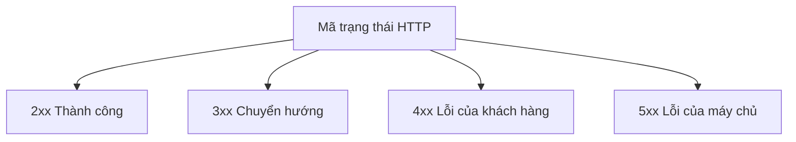
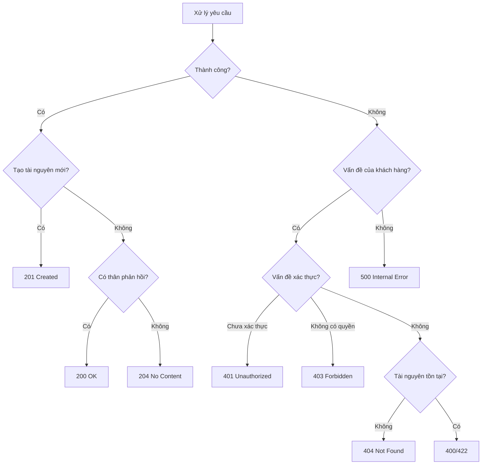

# 7.2.3 Mã trạng thái HTTP

## Giải thích ngắn gọn

Mã trạng thái là "phán quyết" của máy chủ đối với yêu cầu——2xx là thành công, 4xx là "bạn sai rồi", 5xx là "tôi sai rồi".

## Phân loại mã trạng thái



| Phân loại | Ý nghĩa | Trường hợp điển hình |
|------|------|----------|
| **2xx** | Thành công | Xử lý yêu cầu bình thường |
| **3xx** | Chuyển hướng | Vị trí của tài nguyên đã thay đổi |
| **4xx** | Lỗi của khách hàng | Yêu cầu có vấn đề |
| **5xx** | Lỗi của máy chủ | Máy chủ xử lý thất bại |

## Mã trạng thái 2xx phổ biến

| Mã trạng thái | Ý nghĩa | Trường hợp sử dụng |
|--------|------|----------|
| **200 OK** | Yêu cầu thành công | GET, PUT, PATCH thành công |
| **201 Created** | Tài nguyên đã được tạo | POST tạo thành công |
| **204 No Content** | Không có nội dung trả về | DELETE thành công |

### Ví dụ sử dụng

```typescript
// 200 OK - Lấy thành công
export async function GET() {
  const posts = await prisma.post.findMany()
  return NextResponse.json({ data: posts })  // Mặc định 200
}

// 201 Created - Tạo thành công
export async function POST(request: NextRequest) {
  const body = await request.json()
  const post = await prisma.post.create({ data: body })
  return NextResponse.json(post, { status: 201 })
}

// 204 No Content - Xóa thành công
export async function DELETE() {
  await prisma.post.delete({ where: { id } })
  return new NextResponse(null, { status: 204 })
}
```

## Mã trạng thái 4xx phổ biến

| Mã trạng thái | Ý nghĩa | Trường hợp sử dụng |
|--------|------|----------|
| **400 Bad Request** | Định dạng yêu cầu sai | Xác thực tham số thất bại |
| **401 Unauthorized** | Chưa xác thực | Chưa đăng nhập |
| **403 Forbidden** | Không có quyền | Quyền không đủ |
| **404 Not Found** | Tài nguyên không tồn tại | Không tìm thấy tài nguyên |
| **409 Conflict** | Xung đột | Tài nguyên đã tồn tại |
| **422 Unprocessable Entity** | Lỗi ngữ nghĩa | Xác thực quy tắc kinh doanh thất bại |
| **429 Too Many Requests** | Quá nhiều yêu cầu | Kích hoạt giới hạn tốc độ |

### Ví dụ sử dụng

```typescript
// 400 Bad Request - Định dạng tham số sai
if (!body.email || !isValidEmail(body.email)) {
  return NextResponse.json(
    { error: { code: 'INVALID_EMAIL', message: 'Định dạng email không chính xác' } },
    { status: 400 }
  )
}

// 401 Unauthorized - Chưa đăng nhập
const token = request.headers.get('Authorization')
if (!token) {
  return NextResponse.json(
    { error: { code: 'UNAUTHORIZED', message: 'Vui lòng đăng nhập trước' } },
    { status: 401 }
  )
}

// 403 Forbidden - Không có quyền
if (post.authorId !== currentUser.id) {
  return NextResponse.json(
    { error: { code: 'FORBIDDEN', message: 'Không có quyền vận hành tài nguyên này' } },
    { status: 403 }
  )
}

// 404 Not Found - Tài nguyên không tồn tại
const post = await prisma.post.findUnique({ where: { id } })
if (!post) {
  return NextResponse.json(
    { error: { code: 'NOT_FOUND', message: 'Bài viết không tồn tại' } },
    { status: 404 }
  )
}

// 409 Conflict - Xung đột tài nguyên
const existing = await prisma.user.findUnique({ where: { email } })
if (existing) {
  return NextResponse.json(
    { error: { code: 'EMAIL_EXISTS', message: 'Email đã được đăng ký' } },
    { status: 409 }
  )
}

// 429 Too Many Requests - Giới hạn tốc độ
if (await isRateLimited(ip)) {
  return NextResponse.json(
    { error: { code: 'RATE_LIMITED', message: 'Yêu cầu quá thường xuyên' } },
    { status: 429 }
  )
}
```

## Mã trạng thái 5xx phổ biến

| Mã trạng thái | Ý nghĩa | Trường hợp sử dụng |
|--------|------|----------|
| **500 Internal Server Error** | Lỗi nội bộ máy chủ | Ngoại lệ không xác định |
| **502 Bad Gateway** | Lỗi cổng | Dịch vụ hạ tầng thất bại |
| **503 Service Unavailable** | Dịch vụ không khả dụng | Đang bảo trì |
| **504 Gateway Timeout** | Cổng hết thời gian chờ | Hạ tầng hết giờ |

### Ví dụ sử dụng

```typescript
export async function GET() {
  try {
    const data = await fetchExternalAPI()
    return NextResponse.json(data)
  } catch (error) {
    console.error('Gọi API thất bại:', error)

    // 500 Internal Server Error
    return NextResponse.json(
      { error: { code: 'INTERNAL_ERROR', message: 'Lỗi nội bộ máy chủ' } },
      { status: 500 }
    )
  }
}
```

## Hướng dẫn lựa chọn mã trạng thái



## 401 so với 403

| Tình huống | Mã trạng thái | Giải thích |
|------|--------|------|
| Không có Token | 401 | Cần đăng nhập |
| Token hết hạn | 401 | Cần đăng nhập lại |
| Token hợp lệ nhưng không có quyền | 403 | Quyền không đủ |
| Truy cập tài nguyên của người khác | 403 | Không có quyền truy cập |

```typescript
// Middleware xác thực
async function authMiddleware(request: NextRequest) {
  const token = request.headers.get('Authorization')?.replace('Bearer ', '')

  if (!token) {
    return { status: 401, message: 'Vui lòng đăng nhập trước' }
  }

  try {
    const user = await verifyToken(token)
    return { user }
  } catch {
    return { status: 401, message: 'Token đã hết hạn' }
  }
}

// Kiểm tra quyền
if (user.role !== 'admin') {
  return NextResponse.json(
    { error: { code: 'FORBIDDEN', message: 'Cần quyền của quản trị viên' } },
    { status: 403 }
  )
}
```

## 400 so với 422

| Tình huống | Mã trạng thái | Giải thích |
|------|--------|------|
| Định dạng JSON sai | 400 | Lỗi cú pháp |
| Thiếu trường bắt buộc | 400 | Cấu trúc không hoàn chỉnh |
| Định dạng trường sai | 422 | Lỗi ngữ nghĩa |
| Vi phạm quy tắc kinh doanh | 422 | Lỗi logic |

```typescript
// 400 - Định dạng yêu cầu sai
if (!request.body) {
  return NextResponse.json(
    { error: { code: 'MISSING_BODY', message: 'Thân yêu cầu không thể trống' } },
    { status: 400 }
  )
}

// 422 - Xác thực quy tắc kinh doanh thất bại
if (user.age < 18) {
  return NextResponse.json(
    { error: { code: 'AGE_RESTRICTION', message: 'Phải đủ 18 tuổi' } },
    { status: 422 }
  )
}
```

## Nhận thức: Lỗi phổ biến

### 1. Tất cả lỗi đều trả về 200

```typescript
// ❌ Đặt thông báo lỗi vào thân phản hồi, mã trạng thái là 200
return NextResponse.json({
  success: false,
  error: 'Người dùng không tồn tại',
})

// ✅ Sử dụng mã trạng thái chính xác
return NextResponse.json(
  { error: { code: 'NOT_FOUND', message: 'Người dùng không tồn tại' } },
  { status: 404 }
)
```

### 2. Nhầm lẫn 401 và 403

```typescript
// ❌ Trả về 401 khi không có quyền
if (user.role !== 'admin') {
  return NextResponse.json({ error: 'Chưa được phép' }, { status: 401 })
}

// ✅ Không có quyền phải trả về 403
if (user.role !== 'admin') {
  return NextResponse.json(
    { error: { code: 'FORBIDDEN', message: 'Cần quyền của quản trị viên' } },
    { status: 403 }
  )
}
```

### 3. 500 lộ chi tiết nội bộ

```typescript
// ❌ Trả về stack trace lỗi cho khách hàng
return NextResponse.json({ error: error.stack }, { status: 500 })

// ✅ Chỉ trả về thông báo lỗi chung, ghi chi tiết nhật ký trên máy chủ
console.error('Lỗi nội bộ:', error)
return NextResponse.json(
  { error: { code: 'INTERNAL_ERROR', message: 'Lỗi nội bộ máy chủ' } },
  { status: 500 }
)
```

## Tổng kết phần này

| Điểm chính | Giải thích |
|------|------|
| **2xx** | Thành công, 201 biểu diễn tạo |
| **4xx** | Lỗi của khách hàng |
| **5xx** | Lỗi của máy chủ |
| **401 so với 403** | Chưa xác thực so với không có quyền |
