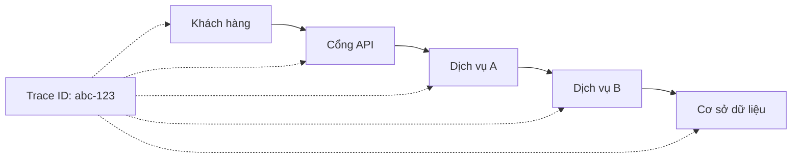

# 7.2.5 ID theo dõi

## Giải thích ngắn gọn

Khi người dùng nói "có lỗi", bạn cần Trace ID để tìm nhật ký hoàn chỉnh của yêu cầu đó——đây là chìa khóa để xác định vấn đề.

## Tại sao cần Trace ID



| Vấn đề | Không có Trace ID | Có Trace ID |
|------|--------------|-------------|
| Người dùng báo cáo lỗi | Yêu cầu nào gặp lỗi? | Tìm theo ID từ nhật ký |
| Xác định vấn đề | Tìm kiếm trong nhiều nhật ký | Lọc chính xác |
| Phân tích hiệu suất | Không thể chuỗi chuỗi yêu cầu | Chuỗi liên kết hoàn chỉnh |

## Triển khai Trace ID

### Tạo Trace ID

```typescript
// lib/trace.ts
import { v4 as uuidv4 } from 'uuid'

export function generateTraceId(): string {
  return uuidv4()
}

// Hoặc sử dụng định dạng ngắn hơn
export function generateShortTraceId(): string {
  return `${Date.now().toString(36)}-${Math.random().toString(36).slice(2, 8)}`
}
```

### Middleware tiêm nhiễm

```typescript
// middleware.ts
import { NextResponse, NextRequest } from 'next/server'
import { generateTraceId } from '@/lib/trace'

export function middleware(request: NextRequest) {
  const traceId = request.headers.get('X-Trace-ID') || generateTraceId()

  const response = NextResponse.next()
  response.headers.set('X-Trace-ID', traceId)

  return response
}

export const config = {
  matcher: '/api/:path*',
}
```

### Sử dụng tuyến API

```typescript
// app/api/posts/route.ts
export async function GET(request: NextRequest) {
  const traceId = request.headers.get('X-Trace-ID') || generateTraceId()

  try {
    const posts = await prisma.post.findMany()

    console.log(`[${traceId}] GET /api/posts - thành công, số lượng: ${posts.length}`)

    return NextResponse.json(
      { data: posts },
      { headers: { 'X-Trace-ID': traceId } }
    )
  } catch (error) {
    console.error(`[${traceId}] GET /api/posts - lỗi:`, error)

    return NextResponse.json(
      {
        error: {
          code: 'INTERNAL_ERROR',
          message: 'Lỗi nội bộ máy chủ',
          traceId,
        },
      },
      { status: 500, headers: { 'X-Trace-ID': traceId } }
    )
  }
}
```

## Nhật ký có cấu trúc

### Công cụ nhật ký

```typescript
// lib/logger.ts
interface LogContext {
  traceId?: string
  userId?: string
  method?: string
  path?: string
}

class Logger {
  private context: LogContext = {}

  withContext(context: LogContext): Logger {
    const logger = new Logger()
    logger.context = { ...this.context, ...context }
    return logger
  }

  info(message: string, data?: Record<string, unknown>) {
    this.log('INFO', message, data)
  }

  error(message: string, error?: Error, data?: Record<string, unknown>) {
    this.log('ERROR', message, { ...data, error: error?.message, stack: error?.stack })
  }

  warn(message: string, data?: Record<string, unknown>) {
    this.log('WARN', message, data)
  }

  private log(level: string, message: string, data?: Record<string, unknown>) {
    const logEntry = {
      timestamp: new Date().toISOString(),
      level,
      message,
      ...this.context,
      ...data,
    }
    console.log(JSON.stringify(logEntry))
  }
}

export const logger = new Logger()
```

### Ví dụ sử dụng

```typescript
// app/api/posts/route.ts
export async function POST(request: NextRequest) {
  const traceId = request.headers.get('X-Trace-ID') || generateTraceId()

  const log = logger.withContext({
    traceId,
    method: 'POST',
    path: '/api/posts',
  })

  try {
    const body = await request.json()
    log.info('Tạo bài viết', { title: body.title })

    const post = await prisma.post.create({ data: body })
    log.info('Bài viết được tạo', { postId: post.id })

    return NextResponse.json(post, {
      status: 201,
      headers: { 'X-Trace-ID': traceId },
    })
  } catch (error) {
    log.error('Lỗi tạo bài viết', error as Error)

    return NextResponse.json(
      { error: { code: 'INTERNAL_ERROR', message: 'Tạo thất bại', traceId } },
      { status: 500 }
    )
  }
}
```

### Đầu ra nhật ký

```json
{"timestamp":"2024-01-15T10:30:00.000Z","level":"INFO","message":"Tạo bài viết","traceId":"abc-123","method":"POST","path":"/api/posts","title":"Bài viết của tôi"}
{"timestamp":"2024-01-15T10:30:00.100Z","level":"INFO","message":"Bài viết được tạo","traceId":"abc-123","method":"POST","path":"/api/posts","postId":"1"}
```

## Tích hợp phía trước

### Bộ chặn yêu cầu

```typescript
// lib/api-client.ts
class ApiClient {
  private traceId: string | null = null

  async fetch<T>(url: string, options?: RequestInit): Promise<T> {
    const traceId = crypto.randomUUID()

    const response = await fetch(url, {
      ...options,
      headers: {
        ...options?.headers,
        'X-Trace-ID': traceId,
      },
    })

    // Lưu Trace ID từ phản hồi
    this.traceId = response.headers.get('X-Trace-ID')

    if (!response.ok) {
      const error = await response.json()
      throw new ApiError(error.error)
    }

    return response.json()
  }

  // Lấy Trace ID của yêu cầu cuối cùng
  getLastTraceId(): string | null {
    return this.traceId
  }
}

export const apiClient = new ApiClient()
```

### Hiển thị lỗi

```typescript
// Thành phần hiển thị lỗi
function ErrorMessage({ error }: { error: ApiError }) {
  return (
    <div className="error-message">
      <p>{error.message}</p>
      {error.traceId && (
        <p className="trace-id">
          Nếu cần trợ giúp, vui lòng cung cấp mã lỗi: {error.traceId}
        </p>
      )}
    </div>
  )
}
```

## Truyền đạt qua các dịch vụ

### Gọi API bên ngoài

```typescript
// Truyền Trace ID khi gọi dịch vụ khác
async function callExternalService(data: unknown, traceId: string) {
  const response = await fetch('https://external-api.com/endpoint', {
    method: 'POST',
    headers: {
      'Content-Type': 'application/json',
      'X-Trace-ID': traceId,  // Truyền Trace ID
    },
    body: JSON.stringify(data),
  })

  return response.json()
}
```

## Truy vấn nhật ký

### Tìm kiếm theo Trace ID

```bash
# Tìm kiếm trong hệ thống nhật ký
grep "abc-123" /var/log/app.log

# Sử dụng jq để lọc nhật ký JSON
cat /var/log/app.log | jq 'select(.traceId == "abc-123")'
```

### Truy vấn dịch vụ đám mây

```
// AWS CloudWatch
fields @timestamp, @message
| filter traceId = "abc-123"
| sort @timestamp asc

// Google Cloud Logging
trace="abc-123"
```

## Nhận thức: Thực tiễn tốt nhất

### 1. Tên Header thống nhất

```typescript
// ✅ Sử dụng đặt tên tiêu chuẩn
'X-Trace-ID'
'X-Request-ID'

// ❌ Tên tùy chỉnh kỳ lạ
'My-Trace'
'RequestTrace'
```

### 2. Nhật ký bao gồm Trace ID

```typescript
// ❌ Nhật ký không có Trace ID
console.log('Người dùng được tạo')

// ✅ Nhật ký bao gồm Trace ID
logger.info('Người dùng được tạo', { traceId, userId: user.id })
```

### 3. Phản hồi lỗi bao gồm Trace ID

```typescript
// ❌ Phản hồi lỗi không có Trace ID
return NextResponse.json({ error: 'Thất bại' }, { status: 500 })

// ✅ Phản hồi lỗi bao gồm Trace ID
return NextResponse.json(
  { error: { code: 'ERROR', message: 'Thất bại', traceId } },
  { status: 500 }
)
```

### 4. Độ dài ID phù hợp

```typescript
// UUID (36 ký tự) - Đảm bảo tính duy nhất
'550e8400-e29b-41d4-a716-446655440000'

// ID ngắn (16 ký tự) - Dễ đọc hơn
'lxq8z3k2-a1b2c3'
```

## Tổng kết phần này

| Điểm chính | Giải thích |
|------|------|
| **Tạo** | Gán một ID duy nhất cho mỗi yêu cầu |
| **Truyền đạt** | Truyền qua Header giữa các dịch vụ |
| **Ghi lại** | Tất cả nhật ký bao gồm Trace ID |
| **Trả về** | Phản hồi lỗi bao gồm Trace ID |
