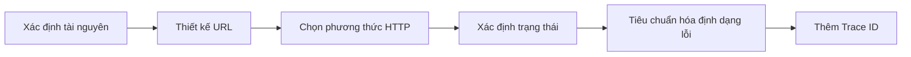

# 7.2 REST và xử lý lỗi

## Vấn đề cốt lõi

| Vấn đề | Phần này giải đáp |
|------|----------|
| REST là gì? | Một bộ ràng buộc thiết kế API, giúp giao diện thống nhất và dự đoán được |
| URL nên thiết kế như thế nào? | Hướng tới tài nguyên, danh từ số nhiều, cấp bậc rõ ràng |
| Trạng thái thế nào? | 2xx thành công, 4xx lỗi của khách hàng, 5xx lỗi của máy chủ |
| Thông báo lỗi nên trả về như thế nào? | Cấu trúc thống nhất, bao gồm mã lỗi, tin nhắn, chi tiết |
| Làm cách nào để theo dõi yêu cầu? | Gán một Trace ID duy nhất cho mỗi yêu cầu |

## Quy trình thiết kế REST



## Nội dung phần này

| Tiểu phần | Chủ đề | Điểm kiến thức cốt lõi |
|------|------|------------|
| 7.2.1 | Ràng buộc REST | Giao diện thống nhất, không trạng thái, có thể lưu vào bộ nhớ đệm |
| 7.2.2 | Thiết kế tài nguyên | Đường dẫn URL, ánh xạ tài nguyên, quy chuẩn đặt tên |
| 7.2.3 | Tiêu chuẩn trạng thái | Quy chuẩn sử dụng mã trạng thái HTTP |
| 7.2.4 | Định dạng phản hồi lỗi | Cấu trúc thông báo lỗi thống nhất |
| 7.2.5 | ID theo dõi | Theo dõi và gỡ lỗi chuỗi yêu cầu |

## Ví dụ nhanh

### Thiết kế REST API

```typescript
// Tài nguyên: người dùng (users)
GET    /api/users         // Lấy danh sách người dùng
GET    /api/users/:id     // Lấy một người dùng
POST   /api/users         // Tạo người dùng
PUT    /api/users/:id     // Cập nhật người dùng
DELETE /api/users/:id     // Xóa người dùng

// Tài nguyên lồng nhau: bài viết của người dùng
GET    /api/users/:id/posts      // Lấy bài viết của người dùng
POST   /api/users/:id/posts      // Tạo bài viết cho người dùng
```

### Định dạng lỗi thống nhất

```json
{
  "error": {
    "code": "VALIDATION_ERROR",
    "message": "Xác thực tham số yêu cầu thất bại",
    "details": [
      { "field": "email", "message": "Định dạng email không chính xác" }
    ],
    "traceId": "abc-123-xyz"
  }
}
```

## Mục tiêu học tập

Sau khi hoàn thành phần này, bạn sẽ có khả năng:

1. Hiểu ràng buộc kiến trúc REST và ý nghĩa của nó
2. Thiết kế URL API phù hợp với tiêu chuẩn RESTful
3. Sử dụng đúng mã trạng thái HTTP
4. Triển khai định dạng phản hồi lỗi thống nhất
5. Sử dụng Trace ID để theo dõi chuỗi yêu cầu
