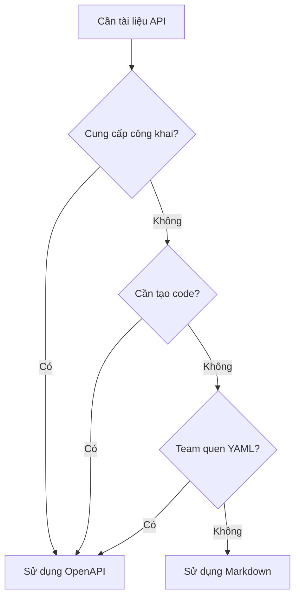

# 7.3.1 Chọn định dạng tài liệu

## Một câu giải quyết vấn đề

Markdown phù hợp để ghi chép nhanh, OpenAPI phù hợp để phát hành chính thức——việc chọn lựa phụ thuộc vào ai đang đọc tài liệu, cách họ dùng tài liệu.

## So sánh hai định dạng

| Khía cạnh | Markdown | OpenAPI |
|------|----------|---------|
| **Chi phí học tập** | Thấp | Trung bình |
| **Tốc độ viết** | Nhanh | Chậm |
| **Tính tương tác** | Không | Có |
| **Tạo code** | Không hỗ trợ | Hỗ trợ |
| **Khả năng xác thực** | Không | Có |
| **Trường hợp sử dụng** | Tài liệu nội bộ | API công khai |

## Tài liệu Markdown

### Ưu điểm

- Mọi người đều biết viết
- Thân thiện với kiểm soát phiên bản Git
- Để cùng với code
- Không cần công cụ bổ sung

### Ví dụ template

```markdown
# API Quản lý người dùng

## Tạo người dùng

**POST** `/api/users`

Tạo một tài khoản người dùng mới.

### Xác thực

Cần Token với quyền `Admin`.

### Yêu cầu

**Headers:**

| Header | Loại | Bắt buộc | Mô tả |
|--------|------|------|------|
| Authorization | string | Có | Bearer Token |

**Body:**

| Trường | Loại | Bắt buộc | Mô tả |
|------|------|------|------|
| email | string | Có | Email người dùng, phải duy nhất |
| password | string | Có | Mật khẩu, tối thiểu 8 ký tự |
| name | string | Không | Tên hiển thị |

**Ví dụ:**

\`\`\`json
{
  "email": "user@example.com",
  "password": "securepassword123",
  "name": "Nguyễn Văn A"
}
\`\`\`

### Phản hồi

**Thành công (201 Created):**

\`\`\`json
{
  "data": {
    "id": "user_abc123",
    "email": "user@example.com",
    "name": "Nguyễn Văn A",
    "createdAt": "2024-01-15T10:30:00Z"
  }
}
\`\`\`

**Lỗi (400 Bad Request):**

\`\`\`json
{
  "error": {
    "code": "VALIDATION_ERROR",
    "message": "Xác thực tham số yêu cầu thất bại",
    "details": [
      { "field": "email", "message": "Định dạng email không hợp lệ" }
    ]
  }
}
\`\`\`

**Lỗi (409 Conflict):**

\`\`\`json
{
  "error": {
    "code": "EMAIL_EXISTS",
    "message": "Email đã được đăng ký"
  }
}
\`\`\`
```

### Cấu trúc dự án

```
docs/
├── api/
│   ├── README.md        # Tổng quan API
│   ├── auth.md          # Liên quan xác thực
│   ├── users.md         # Quản lý người dùng
│   ├── posts.md         # Quản lý bài viết
│   └── errors.md        # Danh sách mã lỗi
```

## Tài liệu OpenAPI

### Ưu điểm

- Định dạng chuẩn hóa
- Có thể tạo UI tương tác
- Có thể tạo client code
- Có thể làm xác thực yêu cầu

### Cấu trúc cơ bản

```yaml
# openapi.yaml
openapi: 3.0.0
info:
  title: API Quản lý người dùng
  version: 1.0.0
  description: API liên quan người dùng

servers:
  - url: https://api.example.com
    description: Môi trường sản xuất
  - url: http://localhost:3000
    description: Phát triển cục bộ

paths:
  /api/users:
    post:
      summary: Tạo người dùng
      description: Tạo một tài khoản người dùng mới
      tags:
        - Quản lý người dùng
      security:
        - bearerAuth: []
      requestBody:
        required: true
        content:
          application/json:
            schema:
              $ref: '#/components/schemas/CreateUserRequest'
            example:
              email: user@example.com
              password: securepassword123
              name: Nguyễn Văn A
      responses:
        '201':
          description: Tạo thành công
          content:
            application/json:
              schema:
                $ref: '#/components/schemas/UserResponse'
        '400':
          description: Xác thực thất bại
          content:
            application/json:
              schema:
                $ref: '#/components/schemas/ErrorResponse'
        '409':
          description: Email đã tồn tại
          content:
            application/json:
              schema:
                $ref: '#/components/schemas/ErrorResponse'

components:
  securitySchemes:
    bearerAuth:
      type: http
      scheme: bearer
      bearerFormat: JWT

  schemas:
    CreateUserRequest:
      type: object
      required:
        - email
        - password
      properties:
        email:
          type: string
          format: email
          description: Email người dùng
        password:
          type: string
          minLength: 8
          description: Mật khẩu, tối thiểu 8 ký tự
        name:
          type: string
          description: Tên hiển thị

    UserResponse:
      type: object
      properties:
        data:
          type: object
          properties:
            id:
              type: string
            email:
              type: string
            name:
              type: string
            createdAt:
              type: string
              format: date-time

    ErrorResponse:
      type: object
      properties:
        error:
          type: object
          properties:
            code:
              type: string
            message:
              type: string
            details:
              type: array
              items:
                type: object
                properties:
                  field:
                    type: string
                  message:
                    type: string
```

## Cách chọn?



| Tình huống | Định dạng được khuyến nghị |
|------|----------|
| Microservice nội bộ | Markdown |
| REST API công khai | OpenAPI |
| Dự án nhóm nhỏ | Markdown |
| Cần tạo SDK | OpenAPI |
| Prototype nhanh | Markdown |
| API sản phẩm chính thức | OpenAPI |

## Sử dụng kết hợp

```
docs/
├── api/
│   ├── overview.md      # Markdown: Tổng quan và bắt đầu nhanh
│   ├── openapi.yaml     # OpenAPI: Định nghĩa interface chi tiết
│   └── examples/        # Markdown: Ví dụ sử dụng
```

## Cảnh báo: Câu hỏi thường gặp

### 1. Tài liệu quá sơ lược

```markdown
❌
## Tạo người dùng
POST /api/users

✅
## Tạo người dùng
POST /api/users

Tạo tài khoản người dùng mới. Cần quyền quản trị.

**Tham số yêu cầu:**
| Trường | Loại | Bắt buộc | Mô tả |
|------|------|------|------|
| email | string | Có | Địa chỉ email hợp lệ |
...
```

### 2. Thiếu phản hồi lỗi

```markdown
❌ Chỉ viết phản hồi thành công

✅ Bao gồm tất cả lỗi có thể
- 400: Xác thực tham số thất bại
- 401: Không xác thực
- 403: Không có quyền
- 409: Xung đột tài nguyên
```

### 3. Dữ liệu ví dụ không thực tế

```json
// ❌ Ví dụ vô nghĩa
{ "name": "test", "email": "test@test.com" }

// ✅ Ví dụ thực tế
{ "name": "Nguyễn Văn A", "email": "nguyenvana@company.com" }
```

## Tóm tắt phần này

| Điểm chính | Mô tả |
|------|------|
| **Markdown** | Đơn giản nhanh chóng, phù hợp nội bộ |
| **OpenAPI** | Chuẩn hóa, có tính tương tác |
| **Cơ sở chọn lựa** | Ai đọc, cách họ dùng |
| **Sử dụng kết hợp** | Dùng MD cho tổng quan, OpenAPI cho chi tiết |
