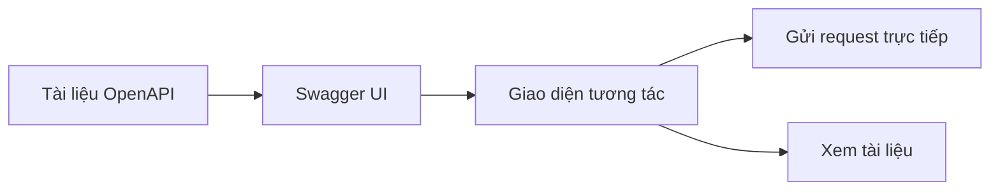

# 7.3.2 Swagger UI

## Một câu giải quyết vấn đề

Swagger UI biến tài liệu OpenAPI của bạn thành một trang web mà bạn có thể nhấn trực tiếp để test——dễ dùng hơn tài liệu tĩnh nhiều lần.

## Swagger UI là gì



| Chức năng | Mô tả |
|------|------|
| **Hiển thị trực quan** | Tự động render tài liệu API |
| **Có thể test** | Gọi API trực tiếp trong trình duyệt |
| **Xác thực** | Hỗ trợ nhập Token |
| **Tạo tự động** | Tạo từ OpenAPI tự động |

## Sử dụng trong Next.js

### Cài đặt phụ thuộc

```bash
npm install swagger-ui-react next-swagger-doc
```

### Tạo tài liệu OpenAPI

```typescript
// lib/swagger.ts
import { createSwaggerSpec } from 'next-swagger-doc'

export const getApiDocs = () => {
  return createSwaggerSpec({
    apiFolder: 'app/api',
    definition: {
      openapi: '3.0.0',
      info: {
        title: 'API của tôi',
        version: '1.0.0',
        description: 'Tài liệu API',
      },
      servers: [
        { url: 'http://localhost:3000', description: 'Môi trường phát triển' },
      ],
      components: {
        securitySchemes: {
          bearerAuth: {
            type: 'http',
            scheme: 'bearer',
            bearerFormat: 'JWT',
          },
        },
      },
    },
  })
}
```

### Thêm chú thích JSDoc

```typescript
// app/api/users/route.ts

/**
 * @swagger
 * /api/users:
 *   get:
 *     summary: Lấy danh sách người dùng
 *     tags:
 *       - Quản lý người dùng
 *     security:
 *       - bearerAuth: []
 *     parameters:
 *       - name: page
 *         in: query
 *         schema:
 *           type: integer
 *           default: 1
 *       - name: pageSize
 *         in: query
 *         schema:
 *           type: integer
 *           default: 10
 *     responses:
 *       200:
 *         description: Thành công
 *         content:
 *           application/json:
 *             schema:
 *               type: object
 *               properties:
 *                 data:
 *                   type: array
 *                   items:
 *                     $ref: '#/components/schemas/User'
 *   post:
 *     summary: Tạo người dùng
 *     tags:
 *       - Quản lý người dùng
 *     requestBody:
 *       required: true
 *       content:
 *         application/json:
 *           schema:
 *             $ref: '#/components/schemas/CreateUserRequest'
 *     responses:
 *       201:
 *         description: Tạo thành công
 */
export async function GET(request: NextRequest) {
  // Triển khai...
}

export async function POST(request: NextRequest) {
  // Triển khai...
}
```

### Tạo trang tài liệu

```typescript
// app/api-docs/page.tsx
'use client'

import dynamic from 'next/dynamic'
import 'swagger-ui-react/swagger-ui.css'

const SwaggerUI = dynamic(() => import('swagger-ui-react'), { ssr: false })

export default function ApiDocsPage() {
  return (
    <div className="swagger-container">
      <SwaggerUI url="/api/docs" />
    </div>
  )
}
```

### Cung cấp JSON OpenAPI

```typescript
// app/api/docs/route.ts
import { getApiDocs } from '@/lib/swagger'

export async function GET() {
  return Response.json(getApiDocs())
}
```

## Cú pháp chú thích thường dùng

### Path parameter

```typescript
/**
 * @swagger
 * /api/users/{id}:
 *   get:
 *     summary: Lấy một người dùng
 *     parameters:
 *       - name: id
 *         in: path
 *         required: true
 *         schema:
 *           type: string
 *         description: ID người dùng
 */
```

### Request body

```typescript
/**
 * @swagger
 * components:
 *   schemas:
 *     CreateUserRequest:
 *       type: object
 *       required:
 *         - email
 *         - password
 *       properties:
 *         email:
 *           type: string
 *           format: email
 *           example: user@example.com
 *         password:
 *           type: string
 *           minLength: 8
 *           example: password123
 */
```

### Error response

```typescript
/**
 * @swagger
 * /api/users:
 *   post:
 *     responses:
 *       201:
 *         description: Tạo thành công
 *       400:
 *         description: Lỗi tham số
 *         content:
 *           application/json:
 *             schema:
 *               $ref: '#/components/schemas/ErrorResponse'
 *       401:
 *         description: Không xác thực
 *       409:
 *         description: Email đã tồn tại
 */
```

## Định nghĩa component chung

```typescript
// lib/swagger-components.ts

/**
 * @swagger
 * components:
 *   schemas:
 *     User:
 *       type: object
 *       properties:
 *         id:
 *           type: string
 *         email:
 *           type: string
 *         name:
 *           type: string
 *         createdAt:
 *           type: string
 *           format: date-time
 *
 *     ErrorResponse:
 *       type: object
 *       properties:
 *         error:
 *           type: object
 *           properties:
 *             code:
 *               type: string
 *             message:
 *               type: string
 *             traceId:
 *               type: string
 *
 *     PaginationMeta:
 *       type: object
 *       properties:
 *         page:
 *           type: integer
 *         pageSize:
 *           type: integer
 *         total:
 *           type: integer
 *         totalPages:
 *           type: integer
 */
```

## Tùy chỉnh kiểu dáng

```css
/* app/api-docs/swagger.css */
.swagger-container {
  margin: 0 auto;
  max-width: 1200px;
}

.swagger-ui .topbar {
  display: none;
}

.swagger-ui .info {
  margin: 20px 0;
}
```

## Cảnh báo: Lưu ý quan trọng

### 1. Bảo vệ môi trường sản xuất

```typescript
// Chỉ kích hoạt trong môi trường phát triển
// app/api-docs/page.tsx
export default function ApiDocsPage() {
  if (process.env.NODE_ENV === 'production') {
    return <div>Tài liệu không khả dụng trong môi trường sản xuất</div>
  }

  return <SwaggerUI url="/api/docs" />
}
```

### 2. Cấu hình xác thực

```typescript
// Cấu hình Token mặc định trong Swagger UI
<SwaggerUI
  url="/api/docs"
  requestInterceptor={(req) => {
    req.headers['Authorization'] = `Bearer ${getToken()}`
    return req
  }}
/>
```

### 3. Giữ tài liệu đồng bộ

```typescript
// Chú thích phải sát với code
/**
 * @swagger
 * /api/users:
 *   post:
 *     summary: Tạo người dùng
 */
export async function POST(request: NextRequest) {
  // Nhớ cập nhật chú thích trên khi thay đổi code
}
```

## Tóm tắt phần này

| Điểm chính | Mô tả |
|------|------|
| **Swagger UI** | Tài liệu API trực quan, tương tác |
| **Chú thích JSDoc** | Định nghĩa OpenAPI trong code |
| **Tạo tự động** | Tạo tài liệu từ chú thích |
| **Bảo mật** | Bảo vệ trong môi trường sản xuất |
