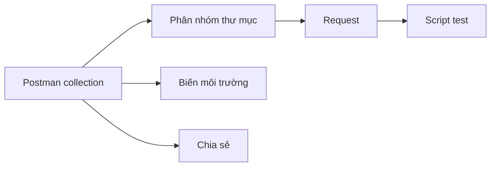

# 7.3.3 Postman collection

## Một câu giải quyết vấn đề

Postman không chỉ là công cụ test, mà là một "tài liệu sống" có thể chia sẻ cho nhóm——một collection chứa tất cả ví dụ gọi API.

## Postman collection là gì



| Thành phần | Tác dụng |
|------|------|
| **Collection** | Container cho các request API |
| **Thư mục** | Phân nhóm theo module |
| **Request** | Gọi API cụ thể |
| **Environment** | Biến cho các môi trường khác nhau |
| **Script** | Tự động hóa test |

## Tạo collection

### Cấu trúc collection

```
API của tôi
├── Xác thực
│   ├── Đăng nhập
│   ├── Đăng ký
│   └── Làm mới Token
├── Quản lý người dùng
│   ├── Lấy danh sách người dùng
│   ├── Lấy một người dùng
│   ├── Tạo người dùng
│   ├── Cập nhật người dùng
│   └── Xóa người dùng
└── Quản lý bài viết
    ├── Lấy danh sách bài viết
    ├── Tạo bài viết
    └── ...
```

### Biến môi trường

```json
// Môi trường phát triển
{
  "base_url": "http://localhost:3000",
  "token": ""
}

// Môi trường sản xuất
{
  "base_url": "https://api.example.com",
  "token": ""
}
```

### Cấu hình request

```
POST {{base_url}}/api/auth/login

Headers:
  Content-Type: application/json

Body:
{
  "email": "user@example.com",
  "password": "password123"
}
```

## Script tự động hóa

### Lưu Token

```javascript
// Script Tests của request đăng nhập
const response = pm.response.json()

if (response.data && response.data.token) {
  pm.environment.set('token', response.data.token)
  console.log('Token đã được lưu!')
}
```

### Sử dụng Token

```
GET {{base_url}}/api/users

Headers:
  Authorization: Bearer {{token}}
```

### Test phản hồi

```javascript
// Script Tests
pm.test('Status code là 200', () => {
  pm.response.to.have.status(200)
})

pm.test('Dữ liệu trả về là mảng', () => {
  const response = pm.response.json()
  pm.expect(response.data).to.be.an('array')
})

pm.test('Thời gian phản hồi dưới 500ms', () => {
  pm.expect(pm.response.responseTime).to.be.below(500)
})
```

## Script tiền request

### Tạo dữ liệu động

```javascript
// Pre-request Script
const timestamp = Date.now()
const email = `user_${timestamp}@test.com`

pm.environment.set('test_email', email)
```

### Sử dụng dữ liệu động

```json
{
  "email": "{{test_email}}",
  "password": "password123"
}
```

## Xuất và chia sẻ

### Xuất collection

```json
// collection.json
{
  "info": {
    "name": "API của tôi",
    "schema": "https://schema.getpostman.com/json/collection/v2.1.0/collection.json"
  },
  "item": [
    {
      "name": "Xác thực",
      "item": [
        {
          "name": "Đăng nhập",
          "request": {
            "method": "POST",
            "url": "{{base_url}}/api/auth/login",
            "body": {
              "mode": "raw",
              "raw": "{\"email\":\"user@example.com\",\"password\":\"password123\"}"
            }
          }
        }
      ]
    }
  ]
}
```

### Để vào kho lưu trữ

```
project/
├── src/
├── docs/
│   └── postman/
│       ├── collection.json      # Collection
│       ├── env.development.json # Môi trường phát triển
│       └── env.production.json  # Môi trường sản xuất
```

## Nhập từ OpenAPI

### Bước

1. Mở Postman
2. Nhấp Import
3. Chọn file OpenAPI
4. Tự động tạo collection

### Đồng bộ cập nhật

```bash
# Sau mỗi lần API thay đổi
# 1. Cập nhật tài liệu OpenAPI
# 2. Nhập lại vào Postman
# 3. Hợp nhất thay đổi
```

## Chạy test

### Sử dụng Newman (dòng lệnh)

```bash
# Cài đặt
npm install -g newman

# Chạy collection
newman run collection.json -e env.development.json

# Tạo báo cáo
newman run collection.json -e env.development.json -r html
```

### Tích hợp CI/CD

```yaml
# .github/workflows/api-test.yml
name: API Tests

on: [push]

jobs:
  test:
    runs-on: ubuntu-latest
    steps:
      - uses: actions/checkout@v3

      - name: Khởi động server
        run: npm start &

      - name: Chạy Postman tests
        run: |
          npm install -g newman
          newman run docs/postman/collection.json \
            -e docs/postman/env.development.json
```

## Thực hành tốt nhất

### 1. Sử dụng biến

```
❌ Hardcode URL
   http://localhost:3000/api/users

✅ Sử dụng biến
   {{base_url}}/api/users
```

### 2. Thêm mô tả

```markdown
## Tạo người dùng

Tạo một tài khoản người dùng mới.

**Yêu cầu quyền:** Admin

**Lưu ý:**
- Email phải duy nhất
- Mật khẩu tối thiểu 8 ký tự
```

### 3. Lưu ví dụ phản hồi

```
Mỗi request lưu ít nhất hai ví dụ:
- Phản hồi thành công
- Phản hồi lỗi thường gặp
```

### 4. Cách ly môi trường

```
Môi trường phát triển: Dữ liệu test thực tế
Môi trường test: Dữ liệu test tự động
Môi trường sản xuất: Chỉ hoạt động đọc
```

## Tóm tắt phần này

| Điểm chính | Mô tả |
|------|------|
| **Collection** | Tổ chức tất cả request API |
| **Environment** | Quản lý biến cho các môi trường khác nhau |
| **Script** | Tự động hóa test và trích xuất dữ liệu |
| **Chia sẻ** | Xuất để lưu trong kho lưu trữ |
