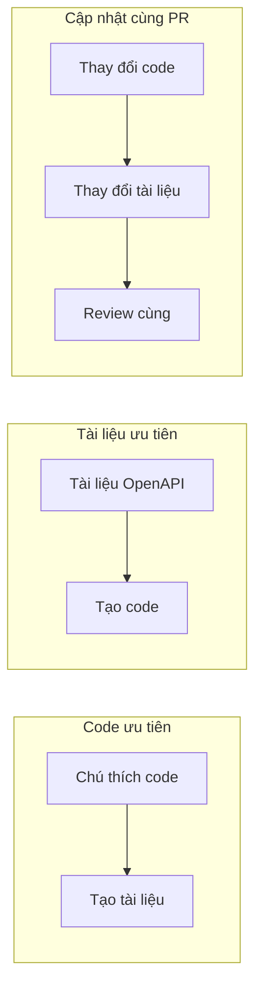

# 7.3.4 Đồng bộ tài liệu

## Một câu giải quyết vấn đề

Tài liệu lỗi thời còn tồi tệ hơn không có tài liệu——hãy làm cho tài liệu thay đổi theo code, để đảm bảo tài liệu luôn đúng.

## Chiến lược đồng bộ



| Chiến lược | Ưu điểm | Nhược điểm |
|------|------|------|
| **Code ưu tiên** | Code là tài liệu, không lỗi thời | Chú thích có thể không đủ chi tiết |
| **Tài liệu ưu tiên** | Thiết kế trước, interface ổn định | Cần bảo trì thêm |
| **Cập nhật cùng PR** | Đơn giản khả thi | Phụ thuộc vào tự giác con người |

## Code ưu tiên: Chú thích tạo tài liệu

### JSDoc + TypeScript

```typescript
// app/api/users/route.ts

/**
 * @swagger
 * /api/users:
 *   post:
 *     summary: Tạo người dùng
 *     description: Tạo một tài khoản người dùng mới
 *     tags: [Quản lý người dùng]
 *     requestBody:
 *       required: true
 *       content:
 *         application/json:
 *           schema:
 *             type: object
 *             required: [email, password]
 *             properties:
 *               email:
 *                 type: string
 *                 format: email
 *               password:
 *                 type: string
 *                 minLength: 8
 *     responses:
 *       201:
 *         description: Tạo thành công
 */
export async function POST(request: NextRequest) {
  // Code triển khai và chú thích để cùng
  // Khi thay đổi code tự nhiên sẽ chú ý tới chú thích
}
```

### Tạo từ kiểu

```typescript
// types/api.ts
import { z } from 'zod'

export const CreateUserSchema = z.object({
  email: z.string().email(),
  password: z.string().min(8),
  name: z.string().optional(),
})

export type CreateUserInput = z.infer<typeof CreateUserSchema>
```

```typescript
// Sử dụng zod-to-openapi để tạo tài liệu
import { extendZodWithOpenApi } from '@asteasolutions/zod-to-openapi'

extendZodWithOpenApi(z)

const CreateUserSchema = z.object({
  email: z.string().email().openapi({ example: 'user@example.com' }),
  password: z.string().min(8).openapi({ example: 'password123' }),
}).openapi('CreateUserRequest')
```

## Cập nhật cùng PR

### Checklist PR

```markdown
## PR Checklist

- [ ] Code triển khai
- [ ] Unit test
- [ ] Cập nhật tài liệu API  <-- Check bắt buộc
- [ ] Cập nhật Postman collection (nếu cần)
```

### Template PR

```markdown
<!-- .github/pull_request_template.md -->

## Mô tả thay đổi

### Thay đổi API

- [ ] Endpoint mới
- [ ] Thay đổi endpoint
- [ ] Xóa endpoint
- [ ] Không thay đổi API

### Cập nhật tài liệu

- [ ] Đã cập nhật chú thích JSDoc
- [ ] Đã cập nhật README
- [ ] Đã cập nhật Postman collection
- [ ] Không cần cập nhật tài liệu
```

### Kiểm tra CI

```yaml
# .github/workflows/docs-check.yml
name: Docs Check

on: [pull_request]

jobs:
  check:
    runs-on: ubuntu-latest
    steps:
      - uses: actions/checkout@v3

      - name: Kiểm tra thay đổi API
        run: |
          # Kiểm tra có sửa file API không
          API_CHANGED=$(git diff --name-only origin/main | grep -E "app/api/.*\.ts$" | wc -l)

          # Kiểm tra có cập nhật tài liệu không
          DOCS_CHANGED=$(git diff --name-only origin/main | grep -E "\.md$|openapi|swagger" | wc -l)

          if [ $API_CHANGED -gt 0 ] && [ $DOCS_CHANGED -eq 0 ]; then
            echo "Cảnh báo: File API thay đổi nhưng không cập nhật tài liệu"
            echo "Vui lòng cập nhật tài liệu API"
            # exit 1  # Tùy chọn: bắt buộc thất bại
          fi
```

## Công cụ tự động hóa

### Tạo tài liệu OpenAPI

```typescript
// scripts/generate-docs.ts
import { writeFileSync } from 'fs'
import { getApiDocs } from '../lib/swagger'

const spec = getApiDocs()
writeFileSync('docs/openapi.json', JSON.stringify(spec, null, 2))
console.log('Tài liệu OpenAPI đã được tạo!')
```

```json
// package.json
{
  "scripts": {
    "docs:generate": "ts-node scripts/generate-docs.ts",
    "docs:serve": "npx swagger-ui-watcher docs/openapi.json"
  }
}
```

### Phát hiện thay đổi tài liệu

```typescript
// scripts/check-api-changes.ts
import { execSync } from 'child_process'

// Lấy file đã thay đổi
const changedFiles = execSync('git diff --name-only HEAD~1')
  .toString()
  .split('\n')

const apiFiles = changedFiles.filter(f => f.startsWith('app/api/'))
const docFiles = changedFiles.filter(f =>
  f.endsWith('.md') ||
  f.includes('openapi') ||
  f.includes('swagger')
)

if (apiFiles.length > 0 && docFiles.length === 0) {
  console.warn('API thay đổi nhưng không cập nhật tài liệu:')
  apiFiles.forEach(f => console.warn(`  - ${f}`))
  process.exit(1)
}
```

## Kiểm soát phiên bản tài liệu

### Cùng kho lưu trữ

```
project/
├── src/
│   └── app/
│       └── api/           # Code API
├── docs/
│   ├── api/               # Tài liệu Markdown
│   ├── openapi.json       # Thông số OpenAPI
│   └── postman/           # Postman collection
├── scripts/
│   └── generate-docs.ts   # Script tạo tài liệu
```

### Git Hooks

```bash
# .husky/pre-commit
#!/bin/sh

# Tạo tài liệu mới nhất
npm run docs:generate

# Thêm vào commit
git add docs/openapi.json
```

## Cảnh báo: Vấn đề thường gặp

### 1. Chú thích và code không đồng bộ

```typescript
// ❌ Chú thích nói khác với code làm
/**
 * @swagger
 * /api/users:
 *   get:
 *     parameters:
 *       - name: status
 *         in: query          // Tài liệu nói có param này
 */
export async function GET(request: NextRequest) {
  // Code không dùng param status
}

// ✅ Cập nhật chú thích khi thay đổi code
```

### 2. Cập nhật tài liệu không kịp

```
Vấn đề: Sau khi PR merge mới phát hiện quên cập nhật tài liệu

Giải pháp:
1. Template PR bắt buộc check
2. CI kiểm tra thay đổi API
3. Code Review kiểm tra
```

### 3. Dữ liệu ví dụ lỗi thời

```json
// ❌ Ví dụ còn là trường cũ
{ "userName": "Nguyễn Văn A" }

// ✅ Nên là trường mới
{ "name": "Nguyễn Văn A", "displayName": "Nguyễn Văn A" }
```

## Tóm tắt phần này

| Điểm chính | Mô tả |
|------|------|
| **Code ưu tiên** | Chú thích tạo tài liệu, không lỗi thời |
| **Cập nhật cùng PR** | Code và tài liệu submit cùng |
| **Kiểm tra CI** | Tự động phát hiện thay đổi API |
| **Cùng kho lưu trữ** | Tài liệu và code để cùng |
