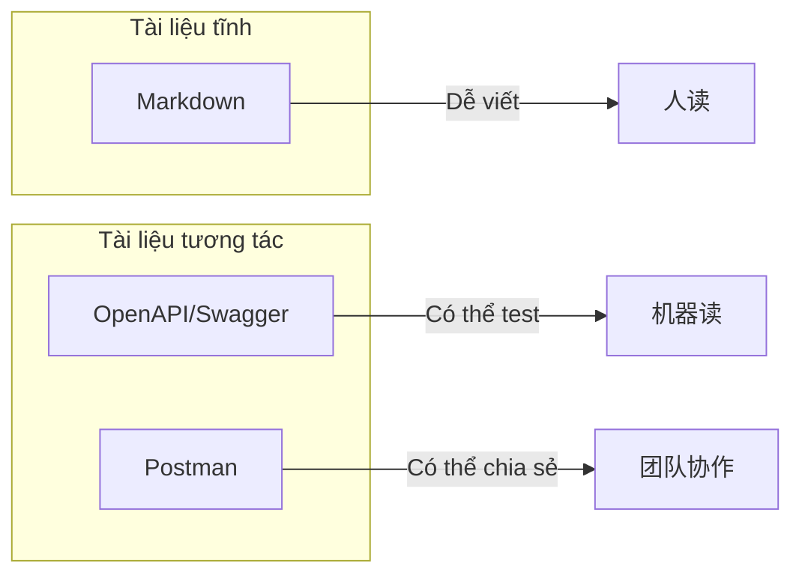

# 7.3 Tài liệu API

## Vấn đề cốt lõi

| Vấn đề | Phần này trả lời |
|------|----------|
| Tài liệu nên dùng định dạng nào? | Markdown đơn giản trực tiếp, OpenAPI có tính tương tác |
| Làm cách nào để tài liệu có thể nhấn vào để thử? | Sử dụng Swagger UI |
| Làm cách nào để test API? | Sử dụng Postman collection |
| Làm cách nào để đồng bộ tài liệu khi code thay đổi? | Tự động tạo tài liệu từ chú thích code |

## So sánh loại tài liệu



| Định dạng | Ưu điểm | Trường hợp sử dụng |
|------|------|----------|
| **Markdown** | Đơn giản, thân thiện với kiểm soát phiên bản | Tài liệu nội bộ, ghi chép nhanh |
| **OpenAPI** | Chuẩn hóa, có thể tạo UI | API chính thức, interface công khai |
| **Postman** | Có thể test, có thể chia sẻ | Debug interface, cộng tác nhóm |

## Nội dung phần này

| Tiểu mục | Chủ đề | Điểm kiến thức cốt lõi |
|------|------|------------|
| 7.3.1 | Chọn định dạng tài liệu | Markdown vs OpenAPI |
| 7.3.2 | Swagger UI | Tài liệu API tương tác |
| 7.3.3 | Postman collection | Test và chia sẻ API |
| 7.3.4 | Đồng bộ tài liệu | Cập nhật tài liệu khi thay đổi code |

## Tiêu chuẩn tài liệu tốt

### Nội dung bắt buộc

```markdown
## POST /api/users

Tạo người dùng mới

### Yêu cầu

**Headers:**
- `Authorization: Bearer <token>` (bắt buộc)

**Body:**
| Trường | Loại | Bắt buộc | Mô tả |
|------|------|------|------|
| email | string | Có | Email người dùng |
| password | string | Có | Mật khẩu, tối thiểu 8 ký tự |
| name | string | Không | Tên hiển thị |

### Phản hồi

**Thành công (201):**
```json
{
  "data": {
    "id": "user_123",
    "email": "user@example.com",
    "name": "Nguyễn Văn A"
  }
}
```

**Lỗi (400):**
```json
{
  "error": {
    "code": "VALIDATION_ERROR",
    "message": "Định dạng email không hợp lệ"
  }
}
```
```

### Checklist tài liệu

| Mục | Bắt buộc | Mô tả |
|------|------|------|
| Địa chỉ endpoint | ✅ | Đường dẫn URL đầy đủ |
| HTTP method | ✅ | GET/POST/PUT/DELETE |
| Mô tả chức năng | ✅ | Một dòng mô tả chức năng |
| Parameter yêu cầu | ✅ | Tên, loại, có bắt buộc không |
| Ví dụ yêu cầu | ✅ | JSON yêu cầu thực tế |
| Ví dụ phản hồi | ✅ | Phản hồi thành công và lỗi |
| Status code | ✅ | Các status code có thể trả về |
| Cách xác thực | ✅ | Cần xác thực gì |
| Mã lỗi | Khuyến nghị | Danh sách mã lỗi kinh doanh |

## Mục tiêu học tập

Sau khi hoàn thành phần này, bạn sẽ có khả năng:

1. Chọn định dạng tài liệu phù hợp
2. Viết tài liệu API rõ ràng
3. Sử dụng Swagger UI tạo tài liệu tương tác
4. Sử dụng Postman test và chia sẻ API
5. Triển khai đồng bộ tài liệu với code
