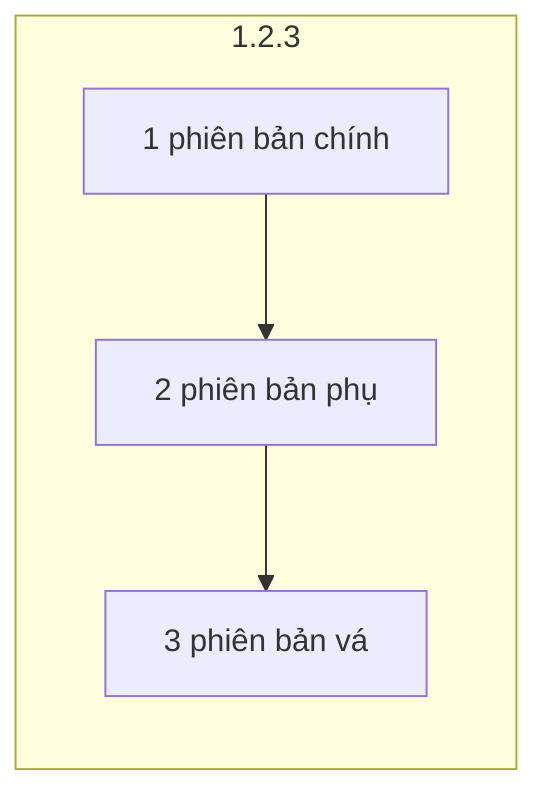
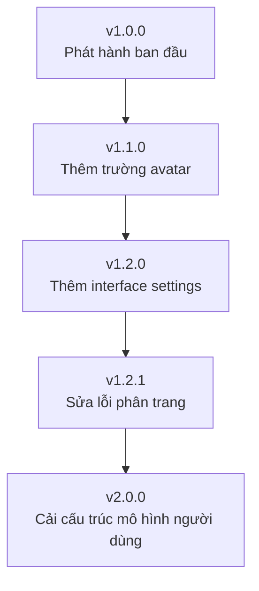

# 7.4.1 Semantic versioning

## Giải thích một câu

Phiên bản không phải là những con số tùy ý——phiên bản chính thay đổi có nghĩa là thay đổi không tương thích, phiên bản phụ có nghĩa là tính năng mới, phiên bản vá có nghĩa là sửa chữa.

## Định dạng semantic versioning

```
MAJOR.MINOR.PATCH
phiên bản chính.phiên bản phụ.phiên bản vá
```



| Phần | Khi nào thay đổi | Ví dụ |
|------|----------|------|
| **Phiên bản chính (MAJOR)** | Thay đổi API không tương thích | 1.0.0 → 2.0.0 |
| **Phiên bản phụ (MINOR)** | Thêm tính năng mới, tương thích về phía sau | 1.0.0 → 1.1.0 |
| **Phiên bản vá (PATCH)** | Sửa lỗi, tương thích về phía sau | 1.0.0 → 1.0.1 |

## Quy tắc thay đổi phiên bản

### Thay đổi phiên bản chính (MAJOR)

**Thay đổi không tương thích**:

```typescript
// v1.0.0
interface User {
  id: string
  name: string
}

// v2.0.0 - Đổi tên trường, không tương thích
interface User {
  id: string
  fullName: string  // name → fullName
}
```

### Thay đổi phiên bản phụ (MINOR)

**Thêm tính năng mới, duy trì tương thích**:

```typescript
// v1.0.0
interface User {
  id: string
  name: string
}

// v1.1.0 - Thêm trường tùy chọn mới, tương thích về phía sau
interface User {
  id: string
  name: string
  avatar?: string  // Mới
}
```

### Thay đổi phiên bản vá (PATCH)

**Sửa lỗi**:

```typescript
// v1.0.0 - Có lỗi
function getAge(birthDate: string) {
  return new Date().getFullYear() - new Date(birthDate).getFullYear()
}

// v1.0.1 - Sửa lỗi
function getAge(birthDate: string) {
  const today = new Date()
  const birth = new Date(birthDate)
  let age = today.getFullYear() - birth.getFullYear()
  // Sửa: kiểm tra xem sinh nhật đã qua chưa
  if (today.getMonth() < birth.getMonth()) age--
  return age
}
```

## API versioning

### Đơn giản hóa phiên bản

Đối với API, thường chỉ sử dụng phiên bản chính:

```
/api/v1/users    # Phiên bản chính 1
/api/v2/users    # Phiên bản chính 2
```

### Khi nào nâng cấp phiên bản chính

| Loại thay đổi | Có cần phiên bản mới? |
|----------|---------------|
| Xóa trường | ✅ Có |
| Đổi tên trường | ✅ Có |
| Thay đổi loại trường | ✅ Có |
| Thay đổi trạng thái bắt buộc (tùy chọn→bắt buộc) | ✅ Có |
| Thêm trường bắt buộc | ✅ Có |
| Thêm trường tùy chọn | ❌ Không |
| Thêm interface | ❌ Không |
| Sửa lỗi | ❌ Không |

## Ví dụ tiến hóa phiên bản



### Lịch sử phiên bản

```
v1.0.0 (2024-01-01)
- Phát hành ban đầu
- Interface CRUD người dùng

v1.1.0 (2024-02-01)
- Thêm: trường avatar người dùng
- Thêm: interface tải lên avatar

v1.2.0 (2024-03-01)
- Thêm: interface cài đặt người dùng

v1.2.1 (2024-03-15)
- Sửa: vấn đề xác thực tham số phân trang

v2.0.0 (2024-06-01)
- Thay đổi phá vỡ: chia trường name thành firstName và lastName
- Thay đổi phá vỡ: xóa trường nickname không dùng nữa
```

## Phiên bản tiền phát hành

```
1.0.0-alpha    # Kiểm thử nội bộ
1.0.0-beta     # Kiểm thử công khai
1.0.0-rc.1     # Ứng cử viên phát hành
1.0.0          # Phát hành chính thức
```

### Trường hợp áp dụng

| Giai đoạn | Mục đích |
|------|------|
| **alpha** | Tính năng không hoàn chỉnh, chỉ kiểm thử nội bộ |
| **beta** | Tính năng hoàn chỉnh, có thể có lỗi |
| **rc** | Chuẩn bị phát hành, kiểm thử cuối cùng |
| **Phiên bản chính thức** | Ổn định, có thể sử dụng |

## So sánh phiên bản

```typescript
// Quy tắc so sánh phiên bản
// 1.0.0 < 1.0.1 < 1.1.0 < 2.0.0
// 1.0.0-alpha < 1.0.0-beta < 1.0.0-rc.1 < 1.0.0

function compareVersions(v1: string, v2: string): number {
  const parts1 = v1.split('.').map(Number)
  const parts2 = v2.split('.').map(Number)

  for (let i = 0; i < 3; i++) {
    if (parts1[i] > parts2[i]) return 1
    if (parts1[i] < parts2[i]) return -1
  }
  return 0
}
```

## Nhận thức: Lỗi thường gặp

### 1. Tăng phiên bản tùy ý

```
❌ Sửa một lỗi nhỏ lại nâng lên 2.0.0
❌ Mỗi lần phát hành lại nâng phiên bản chính

✅ Nâng cấp theo quy tắc semantic versioning
   - Thay đổi không tương thích → phiên bản chính
   - Tính năng mới → phiên bản phụ
   - Sửa lỗi → phiên bản vá
```

### 2. Bỏ qua ý nghĩa của 0.x.x

```
0.x.x biểu thị giai đoạn phát triển, API có thể thay đổi bất cứ lúc nào
1.0.0 là phiên bản ổn định đầu tiên

0.1.0 → 0.2.0  có thể có thay đổi không tương thích
1.1.0 → 1.2.0  phải tương thích về phía sau
```

### 3. Nhầm lẫn phiên bản API với phiên bản gói

```
Phiên bản API: /api/v1/users, /api/v2/users
Phiên bản gói: 1.2.3, 2.0.0

Hai phiên bản độc lập, không cần đồng bộ
```

## Tóm tắt phần này

| Điểm | Giải thích |
|------|------|
| **Phiên bản chính** | Thay đổi không tương thích |
| **Phiên bản phụ** | Tính năng mới, tương thích về phía sau |
| **Phiên bản vá** | Sửa lỗi |
| **Phiên bản API** | Thường chỉ dùng phiên bản chính |
