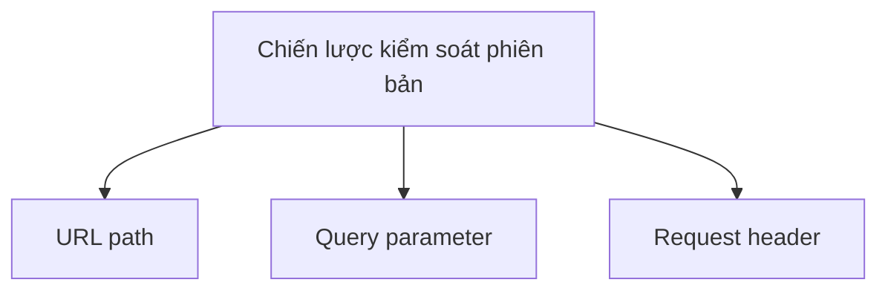
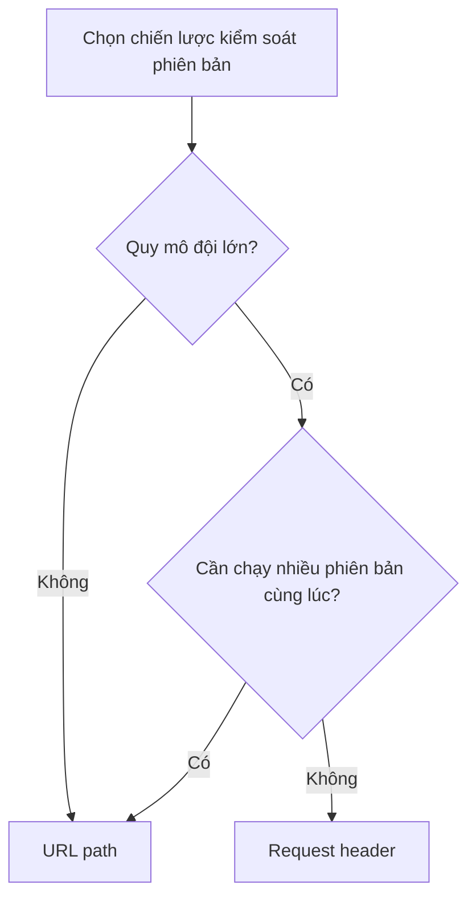

# 7.4.2 Chiến lược kiểm soát phiên bản

## Giải thích một câu

Đặt phiên bản trong URL trực quan dễ hiểu, đặt trong Header linh hoạt hơn——dự án nhỏ dùng URL, dự án lớn có thể cân nhắc Header.

## Ba chiến lược



| Chiến lược | Ví dụ | Ưu điểm | Nhược điểm |
|------|------|------|------|
| **URL path** | `/api/v1/users` | Trực quan, dễ cache | URL thay đổi lớn |
| **Query parameter** | `/api/users?v=1` | Đơn giản, tùy chọn | Không đủ ngữ nghĩa |
| **Request header** | `Accept: application/vnd.api.v1+json` | Linh hoạt, URL ổn định | Không trực quan |

## Phiên bản URL path

### Cách triển khai

```
GET /api/v1/users
GET /api/v2/users
```

### Triển khai Next.js

```
app/
├── api/
│   ├── v1/
│   │   └── users/
│   │       └── route.ts    # Phiên bản v1
│   └── v2/
│       └── users/
│           └── route.ts    # Phiên bản v2
```

```typescript
// app/api/v1/users/route.ts
export async function GET() {
  const users = await prisma.user.findMany({
    select: { id: true, name: true }  // v1: cấu trúc đơn giản
  })
  return NextResponse.json({ data: users })
}

// app/api/v2/users/route.ts
export async function GET() {
  const users = await prisma.user.findMany({
    select: {
      id: true,
      firstName: true,
      lastName: true,  // v2: chia name
      avatar: true,
    }
  })
  return NextResponse.json({ data: users })
}
```

### Chia sẻ mã

```typescript
// lib/services/user.service.ts
export class UserService {
  async getUsers() {
    return prisma.user.findMany()
  }
}

// app/api/v1/users/route.ts
export async function GET() {
  const users = await userService.getUsers()
  return NextResponse.json({
    data: users.map(u => ({
      id: u.id,
      name: `${u.firstName} ${u.lastName}`,  // Định dạng v1
    }))
  })
}

// app/api/v2/users/route.ts
export async function GET() {
  const users = await userService.getUsers()
  return NextResponse.json({
    data: users.map(u => ({
      id: u.id,
      firstName: u.firstName,
      lastName: u.lastName,  // Định dạng v2
    }))
  })
}
```

## Phiên bản request header

### Cách triển khai

```
GET /api/users
Accept: application/vnd.myapp.v1+json
```

### Triển khai Next.js

```typescript
// app/api/users/route.ts
export async function GET(request: NextRequest) {
  const accept = request.headers.get('Accept') || ''
  const version = extractVersion(accept) || 'v1'  // Mặc định v1

  const users = await prisma.user.findMany()

  if (version === 'v2') {
    return NextResponse.json({
      data: users.map(formatUserV2),
    })
  }

  return NextResponse.json({
    data: users.map(formatUserV1),
  })
}

function extractVersion(accept: string): string | null {
  const match = accept.match(/application\/vnd\.myapp\.(v\d+)\+json/)
  return match ? match[1] : null
}
```

## Làm thế nào để chọn?



| Kịch bản | Chiến lược đề xuất |
|------|----------|
| Dự án nhỏ | URL path |
| API công khai | URL path |
| Microservices nội bộ | URL path |
| Cần kiểm soát chi tiết | Request header |
| Ứng dụng di động | URL path |

## Quy chuẩn đặt tên phiên bản

### Chỉ phiên bản chính

```
/api/v1/users
/api/v2/users
```

**Trường hợp áp dụng**: Hầu hết các API

### Phiên bản theo ngày tháng

```
/api/2024-01-15/users
/api/2024-06-01/users
```

**Trường hợp áp dụng**: API cập nhật thường xuyên (như Stripe)

### Không có phiên bản

```
/api/users
```

**Trường hợp áp dụng**: GraphQL, API nội bộ

## Phiên bản mặc định

```typescript
// Thực hành tốt nhất: chỉ định phiên bản mặc định
export async function GET(request: NextRequest) {
  const version = getVersion(request) || 'v1'  // Mặc định v1

  // ...
}

// Hoặc: phiên bản mới nhất là mặc định
const LATEST_VERSION = 'v2'
const version = getVersion(request) || LATEST_VERSION
```

## Middleware định tuyến phiên bản

```typescript
// middleware.ts
import { NextResponse } from 'next/server'

export function middleware(request: NextRequest) {
  // Kiểm tra phiên bản không dùng nữa
  if (request.nextUrl.pathname.startsWith('/api/v1')) {
    const response = NextResponse.next()
    response.headers.set(
      'Deprecation',
      'true'
    )
    response.headers.set(
      'Sunset',
      'Sat, 01 Jan 2025 00:00:00 GMT'
    )
    return response
  }
}
```

## Nhận thức: Câu hỏi thường gặp

### 1. Quá nhiều phiên bản khó bảo trì

```
❌ /api/v1, /api/v2, /api/v3, /api/v4...

✅ Chỉ bảo trì 2-3 phiên bản cùng lúc
   - Phiên bản hiện tại (v2)
   - Phiên bản trước (v1) - đang loại bỏ
   - Phiên bản tiếp theo (v3) - beta
```

### 2. Quên đặt phiên bản mặc định

```typescript
// ❌ Không có phiên bản mặc định, client mới không biết dùng cái nào
if (version === 'v1') { ... }
else if (version === 'v2') { ... }
// else ???

// ✅ Đặt phiên bản mặc định rõ ràng
const version = getVersion(request) || 'v2'
```

### 3. Phiên bản URL và phiên bản thực tế không nhất quán

```
❌ /api/v2 trả về cấu trúc dữ liệu của v1

✅ Đảm bảo phiên bản nhất quán với cách triển khai
   Phiên bản thay đổi = cấu trúc dữ liệu thay đổi
```

## Tóm tắt phần này

| Điểm | Giải thích |
|------|------|
| **URL path** | Phổ biến nhất, trực quan dễ hiểu |
| **Request header** | Linh hoạt hơn, URL không đổi |
| **Phiên bản mặc định** | Phải chỉ định |
| **Số lượng phiên bản** | Bảo trì 2-3 phiên bản cùng lúc |
