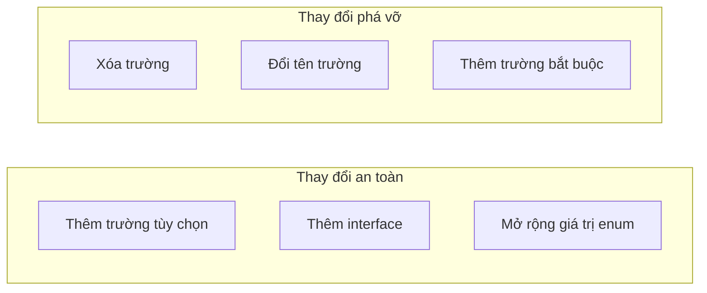
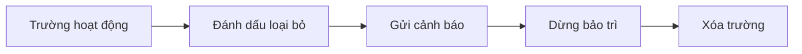

# 7.4.3 Backward compatibility

## Giải thích một câu

Nâng cấp API tốt giống như thay động cơ máy bay——người dùng vẫn đang bay, nhưng động cơ đã được thay im lặng, người dùng hoàn toàn cảm thấy không được.

## Nguyên tắc tương thích



| Loại thay đổi | Tương thích? | Cách xử lý |
|----------|---------|----------|
| Thêm trường tùy chọn | ✅ Tương thích | Thêm trực tiếp |
| Thêm interface | ✅ Tương thích | Thêm trực tiếp |
| Xóa trường | ❌ Không tương thích | Trước loại bỏ, sau đó xóa |
| Đổi tên trường | ❌ Không tương thích | Thêm + loại bỏ trường cũ |
| Thay đổi loại trường | ❌ Không tương thích | Phiên bản mới |
| Thêm trường bắt buộc | ❌ Không tương thích | Phiên bản mới |

## Thay đổi an toàn

### Thêm trường tùy chọn

```typescript
// Phiên bản ban đầu
interface User {
  id: string
  name: string
}

// Phiên bản mới - Thêm avatar, tương thích về phía sau
interface User {
  id: string
  name: string
  avatar?: string  // Tùy chọn, client cũ bỏ qua
}
```

### Thêm interface

```typescript
// Interface ban đầu không thay đổi
GET /api/users
GET /api/users/:id

// Thêm interface mới, không ảnh hưởng client hiện tại
POST /api/users/:id/avatar
GET /api/users/:id/settings
```

### Mở rộng giá trị enum

```typescript
// Phiên bản ban đầu
type Status = 'pending' | 'completed'

// Phiên bản mới - Thêm cancelled, tương thích về phía sau
type Status = 'pending' | 'completed' | 'cancelled'

// Client nên xử lý giá trị chưa biết
function handleStatus(status: string) {
  if (status === 'pending') { ... }
  else if (status === 'completed') { ... }
  else { /* Xử lý trạng thái chưa biết */ }
}
```

## Chiến lược loại bỏ trường

### Đánh dấu loại bỏ

```typescript
// Phản hồi chứa cảnh báo loại bỏ
interface UserResponse {
  id: string
  name: string        // Sẽ loại bỏ
  firstName: string   // Trường mới
  lastName: string    // Trường mới
}

// Đặt response header loại bỏ
response.headers.set('Deprecation', 'true')
response.headers.set('Sunset', '2025-01-01')
response.headers.set('Link', '</api/v2/users>; rel="successor-version"')
```

### Quy trình loại bỏ



### Lập kế hoạch thời gian

| Giai đoạn | Thời gian | Hành động |
|------|------|------|
| Thông báo loại bỏ | T+0 | Phát hành thông báo loại bỏ |
| Thời gian cảnh báo | T+3 tháng | Phản hồi chứa cảnh báo |
| Dừng cập nhật | T+6 tháng | Không còn sửa lỗi |
| Xóa | T+12 tháng | Xóa hoàn toàn |

## Đổi tên trường

### Cách sai

```typescript
// ❌ Đổi tên trực tiếp, phá vỡ tương thích
// Phiên bản cũ
{ "name": "Nguyễn Văn A" }
// Phiên bản mới
{ "fullName": "Nguyễn Văn A" }  // Client cũ tìm không thấy name
```

### Cách đúng

```typescript
// ✅ Trả về cả hai trường
{
  "name": "Nguyễn Văn A",        // Loại bỏ, sẽ xóa vào 2025-01-01
  "fullName": "Nguyễn Văn A"     // Trường mới, hãy dùng cái này
}
```

```typescript
// Triển khai server
function formatUser(user: User) {
  return {
    id: user.id,
    name: user.fullName,      // Loại bỏ, duy trì tương thích
    fullName: user.fullName,  // Trường mới
  }
}
```

## Thay đổi loại

### Số thành chuỗi

```typescript
// Phiên bản ban đầu
{ "id": 123 }

// Sai: thay đổi loại trực tiếp
{ "id": "user_123" }

// Đúng: thêm trường mới
{
  "id": 123,              // Giữ lại
  "userId": "user_123"    // Trường mới
}
```

### Thay đổi cấu trúc

```typescript
// Phiên bản ban đầu
{
  "address": "Hà Nội, Thanh Xuân"
}

// Đúng: thêm trường cấu trúc hóa
{
  "address": "Hà Nội, Thanh Xuân",  // Giữ lại
  "addressDetail": {                // Trường mới
    "city": "Hà Nội",
    "district": "Thanh Xuân",
    "street": "xxx"
  }
}
```

## Tương thích yêu cầu

### Chấp nhận cả định dạng mới lẫn cũ

```typescript
// app/api/users/route.ts
export async function POST(request: NextRequest) {
  const body = await request.json()

  // Hỗ trợ cả định dạng mới lẫn cũ
  const name = body.fullName || body.name
  const avatar = body.avatarUrl || body.avatar

  const user = await prisma.user.create({
    data: {
      name,
      avatar,
    }
  })

  return NextResponse.json(user)
}
```

### Xác thực tương thích

```typescript
import { z } from 'zod'

const CreateUserSchema = z.object({
  // Cả trường cũ lẫn mới đều được chấp nhận
  name: z.string().optional(),
  fullName: z.string().optional(),
}).refine(
  data => data.name || data.fullName,
  { message: 'Phải cung cấp name hoặc fullName' }
)
```

## Thực hành tốt nhất của client

### Bỏ qua trường chưa biết

```typescript
// ✅ Chỉ lấy các trường cần thiết
const { id, name } = await response.json()

// ❌ Xác thực nghiêm ngặt tất cả trường
const user: StrictUser = await response.json()  // Trường mới sẽ báo lỗi
```

### Xử lý giá trị enum mới

```typescript
function renderStatus(status: string) {
  switch (status) {
    case 'pending':
      return 'Chờ xử lý'
    case 'completed':
      return 'Đã hoàn thành'
    default:
      return 'Trạng thái chưa biết'  // Xử lý các giá trị mới trong tương lai
  }
}
```

## Nhận thức: Lỗi thường gặp

### 1. Xóa trường trực tiếp

```typescript
// ❌ Xóa bất ngờ
v1: { id, name, nickname }
v2: { id, name }  // nickname mất, client cũ lỗi

// ✅ Xóa dần dần
v1.0: { id, name, nickname }
v1.1: { id, name, nickname: "loại bỏ" }  // Đánh dấu loại bỏ
v1.2: { id, name }  // Xóa sau 6 tháng
```

### 2. Bắt buộc thành tùy chọn

```typescript
// ❌ Client mong đợi có giá trị
v1: { name: "Nguyễn Văn A" }  // Bắt buộc
v2: { name: null }    // Tùy chọn, client có thể gặp sự cố

// ✅ Giữ bắt buộc, hoặc cung cấp giá trị mặc định
v2: { name: "" }  // Chuỗi trống chứ không phải null
```

### 3. Không thông báo thay đổi

```
❌ Thay đổi im lặng, không ai biết

✅ Quy trình thay đổi hoàn chỉnh:
   1. Cập nhật Changelog
   2. Gửi thông báo email
   3. Đánh dấu loại bỏ trong tài liệu
   4. Bao gồm cảnh báo trong response header
```

## Tóm tắt phần này

| Điểm | Giải thích |
|------|------|
| **Thay đổi an toàn** | Thêm trường tùy chọn, thêm interface |
| **Quy trình loại bỏ** | Đánh dấu → Cảnh báo → Xóa |
| **Đổi tên trường** | Trả về cả trường mới lẫn cũ |
| **Client** | Bỏ qua trường chưa biết |
