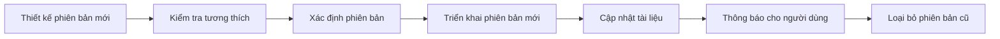

# 7.4 Quản lý phiên bản API

## Vấn đề cốt lõi

| Vấn đề | Phần này giải đáp |
|------|----------|
| Phiên bản được định nghĩa như thế nào? | Sử dụng semantic versioning: phiên bản chính.phiên bản phụ.phiên bản vá |
| Đặt phiên bản ở đâu? | URL path đơn giản trực quan, Header linh hoạt hơn |
| Phiên bản mới được phát hành rồi, phiên bản cũ thế nào? | Duy trì backward compatibility, loại bỏ dần |
| Thông báo cho người dùng như thế nào? | Duy trì Changelog, gửi thông báo thay đổi |

## Quy trình quản lý phiên bản



## Nội dung phần này

| Tiểu mục | Chủ đề | Kiến thức cốt lõi |
|------|------|------------|
| 7.4.1 | Semantic versioning | Phiên bản chính/phụ/vá |
| 7.4.2 | Chiến lược kiểm soát phiên bản | URL path vs request header |
| 7.4.3 | Backward compatibility | Chiến lược thêm và loại bỏ trường |
| 7.4.4 | Changelog | Ghi chép và thông báo thay đổi API |

## Ví dụ nhanh

### Phiên bản URL

```
GET /api/v1/users
GET /api/v2/users
```

### Phiên bản Header

```
GET /api/users
Accept: application/vnd.myapp.v2+json
```

### Backward compatibility

```typescript
// Thêm trường mới, không làm hỏng client cũ
interface User {
  id: string
  name: string
  email: string
  avatar?: string  // Mới, tùy chọn
}
```

## Mục tiêu học tập

Sau khi hoàn thành phần này, bạn sẽ có khả năng:

1. Sử dụng đúng semantic versioning
2. Chọn chiến lược kiểm soát phiên bản phù hợp
3. Thiết kế API backward compatible
4. Quản lý quy trình thay đổi và loại bỏ API
5. Duy trì changelog rõ ràng
