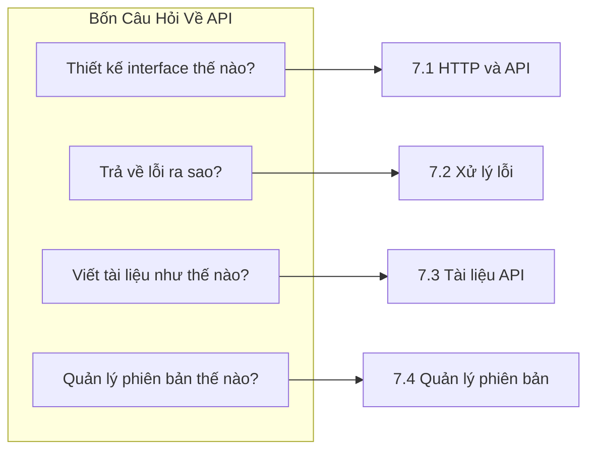

# 7 ｜Thiết Kế và Quy Chuẩn Phát Triển API

## Tái Cấu Trúc Nhận Thức

API không phải là chi tiết kỹ thuật, mà là **hợp đồng giữa frontend và backend**. Một hợp đồng tốt, cả hai bên đều hiểu và sẵn sàng tuân thủ; một hợp đồng tồi, tranh cãi khi phát triển, đổ lỗi khi lên production.

```
Nhận thức truyền thống: API chỉ là viết vài endpoint
Nhận thức đúng: API là cam kết công khai của hệ thống, cần nghiêm túc như hợp đồng pháp lý
```

## Câu Hỏi Cốt Lõi Của Chương



## Điều Hướng Chương

### 7.1 Interface là hợp đồng không phải mật mã——HTTP và API

- Ngữ nghĩa phương thức HTTP: GET/POST/PUT/DELETE nên dùng thế nào
- Định dạng dữ liệu JSON: Serialization và deserialization
- Chiến lược phân trang: Cân nhắc giữa offset và cursor pagination
- Lọc và sắp xếp: Thiết kế query parameter chuẩn mực
- Đảm bảo tính idempotency: Request trùng lặp không làm hỏng dữ liệu

### 7.2 Báo lỗi cũng phải nói người——REST và Xử lý lỗi

- Ràng buộc REST: Giao diện thống nhất/stateless/cacheable
- Thiết kế resource: Mapping URL path và resource
- Tiêu chuẩn status code: 404/500 nghĩa là gì
- Format error response: Cấu trúc thông báo lỗi thống nhất
- Trace ID: Theo dõi và debug request chain

### 7.3 Tài liệu sống mới hữu ích——Tài liệu API

- Lựa chọn format tài liệu: Markdown vs OpenAPI
- Swagger UI: Tài liệu API có thể tương tác
- Postman collection: Test và chia sẻ API
- Đồng bộ tài liệu: Thay đổi code dẫn dắt cập nhật tài liệu

### 7.4 Interface nâng cấp rồi phiên bản cũ thế nào——Quản lý phiên bản

- Semantic versioning: Sự tinh tế của v1/v2
- Chiến lược kiểm soát phiên bản: URL path vs request header
- Forward compatibility: Chiến lược thêm và deprecate field
- Changelog: Ghi chép và thông báo thay đổi API

## Mục Tiêu Học Tập Của Chương

| Mục tiêu | Năng lực |
|------|------|
| **Thiết kế API chuẩn mực** | Thiết kế interface tuân thủ nguyên tắc RESTful |
| **Xử lý tình huống lỗi** | Trả về thông tin lỗi rõ ràng, có thể trace |
| **Duy trì tài liệu API** | Tài liệu và code đồng bộ cập nhật |
| **Quản lý phiên bản API** | Nâng cấp mượt mà, không phá vỡ client hiện tại |
