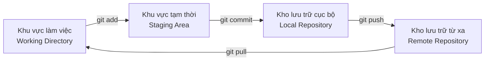

# 8.1.1 Cách dùng thuốc cảm——Git cơ bản

Bốn lệnh cốt lõi——add, commit, push, pull——tạo nên vòng tròn hoạt động cơ bản hàng ngày của phát triển.

## Khái niệm cốt lõi: Ba khu vực



| Khu vực | Giải thích | Tương tự |
|------|------|------|
| Khu vực làm việc | Các tệp bạn đang chỉnh sửa | Giấy nháp |
| Khu vực tạm thời | Các thay đổi chuẩn bị gửi | Giỏ hàng |
| Kho lưu trữ cục bộ | Lịch sử phiên bản đã gửi | Lưu trữ cá nhân |
| Kho lưu trữ từ xa | Kho mã được chia sẻ trong nhóm | Sao lưu đám mây |

## Bốn lệnh cốt lõi

### 1. git add: Thêm thay đổi vào khu vực tạm thời

```bash
# Thêm tệp đơn
git add src/index.ts

# Thêm tất cả thay đổi
git add .

# Thêm tệp loại cụ thể
git add "*.tsx"

# Thêm tương tác (xác nhận từng cái)
git add -p
```

**Lưu ý**: `git add .` sẽ thêm tất cả thay đổi trong thư mục hiện tại, đảm bảo `.gitignore` được cấu hình đúng.

### 2. git commit: Tạo ảnh nhanh phiên bản

```bash
# Gửi với tin nhắn
git commit -m "feat: Thêm chức năng đăng nhập người dùng"

# Thêm và gửi (bỏ qua add)
git commit -am "fix: Sửa vấn đề xác minh đăng nhập"

# Sửa lần gửi trước
git commit --amend -m "feat: Thêm chức năng đăng nhập người dùng (có xác minh)"
```

**Thực tiễn tốt nhất**:
- Mỗi lần gửi nên là một thay đổi "hoàn chỉnh về logic"
- Tin nhắn gửi tuân theo quy chuẩn Conventional Commits
- Tránh gửi mã chưa hoàn thành hoặc có lỗi rõ ràng

### 3. git push: Đẩy đến kho lưu trữ từ xa

```bash
# Đẩy nhánh hiện tại
git push

# Đẩy nhánh mới lần đầu
git push -u origin feat/login

# Đẩy mạnh (hãy thận trọng!)
git push --force
```

**Cảnh báo**: `--force` sẽ ghi đè lịch sử từ xa, chỉ sử dụng trên nhánh riêng của bạn.

### 4. git pull: Kéo cập nhật từ xa

```bash
# Kéo và hợp nhất
git pull

# Kéo và rebase (giữ lịch sử gửi tuyến tính)
git pull --rebase

# Chỉ lấy không hợp nhất
git fetch
```

**Khuyến nghị**: Sử dụng `git pull --rebase` để giữ lịch sử gửi gọn gàng.

## Lệnh phụ trợ thường dùng

```bash
# Xem trạng thái hiện tại
git status

# Xem nội dung thay đổi
git diff

# Xem lịch sử gửi
git log --oneline -10

# Xem thông tin kho lưu trữ từ xa
git remote -v
```

## Quy trình làm việc điển hình

```bash
# 1. Trước khi bắt đầu làm việc, kéo mã mới nhất
git pull --rebase

# 2. Tiến hành phát triển...

# 3. Xem thay đổi
git status
git diff

# 4. Thêm thay đổi vào khu vực tạm thời
git add .

# 5. Gửi thay đổi
git commit -m "feat: Hoàn thành trang đăng ký người dùng"

# 6. Đẩy đến từ xa
git push
```

## Hướng dẫn hợp tác với AI

Khi mô tả nhu cầu hoạt động Git cho AI, hãy nêu:
- Bạn muốn hoàn thành thao tác gì (ví dụ "hoàn tác lần gửi cuối cùng")
- Trạng thái hiện tại (đã đẩy hay chưa, có thay đổi chưa gửi hay không)
- Có cần giữ nội dung thay đổi không

**Ví dụ Prompt**:
> "Tôi vừa gửi một commit nhưng chưa push, phát hiện quên một tệp, làm cách nào để thêm tệp này vào lần gửi trước?"

## Hướng dẫn tránh lỗi

| Vấn đề | Nguyên nhân | Giải pháp |
|------|------|----------|
| push bị từ chối | Từ xa có gửi mới | Trước tiên `git pull --rebase` |
| Gửi tệp nhạy cảm | .gitignore chưa cấu hình | Sử dụng `git rm --cached` để xóa |
| Tin nhắn gửi sai | Gõ nhầm | `git commit --amend` để sửa |
| Xóa tệp nhầm | Thao tác sai | `git checkout -- filename` để phục hồi |
