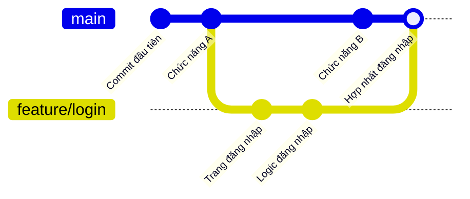
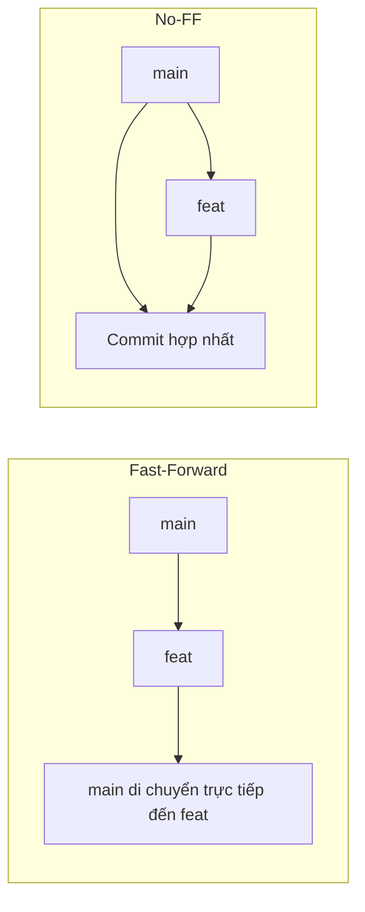

# 8.1.2 Viết mã trong thế giới song song——Hoạt động nhánh

Nhánh cho phép bạn thử nghiệm mà không ảnh hưởng đến mã chính——giống như phát triển trong thế giới song song, khi hài lòng thì hợp nhất lại.

## Bản chất của nhánh

Bản chất của nhánh là một con trỏ có thể di chuyển được chỉ đến một commit. Tạo nhánh hầu như không tiêu tốn tài nguyên, hợp nhất nhánh cũng chỉ là di chuyển con trỏ.



## Hoạt động nhánh cốt lõi

### Tạo và chuyển nhánh

```bash
# Xem tất cả nhánh
git branch

# Tạo nhánh mới
git branch feat/user-profile

# Chuyển đến nhánh
git checkout feat/user-profile

# Tạo và chuyển (được khuyến nghị)
git checkout -b feat/user-profile

# Lệnh phiên bản mới (Git 2.23+)
git switch -c feat/user-profile
```

### Quy chuẩn đặt tên nhánh

| Tiền tố | Mục đích | Ví dụ |
|------|------|------|
| `feat/` | Phát triển chức năng mới | `feat/user-login` |
| `fix/` | Sửa lỗi | `fix/login-validation` |
| `hotfix/` | Sửa khẩn cấp | `hotfix/security-patch` |
| `refactor/` | Tái cấu trúc mã | `refactor/auth-module` |
| `docs/` | Cập nhật tài liệu | `docs/api-guide` |

### Hợp nhất nhánh

```bash
# Chuyển đến nhánh đích (thường là main hoặc develop)
git checkout main

# Hợp nhất nhánh được chỉ định vào nhánh hiện tại
git merge feat/user-profile

# Tạo commit hợp nhất khi hợp nhất (giữ lịch sử nhánh)
git merge --no-ff feat/user-profile
```

**So sánh chiến lược hợp nhất**:



- **Fast-Forward**: Nếu nhánh đích không có commit mới, di chuyển con trỏ trực tiếp
- **No-FF**: Luôn tạo commit hợp nhất, giữ lịch sử nhánh

### Xóa nhánh

```bash
# Xóa nhánh cục bộ đã hợp nhất
git branch -d feat/user-profile

# Xóa mạnh nhánh chưa hợp nhất
git branch -D feat/user-profile

# Xóa nhánh từ xa
git push origin --delete feat/user-profile
```

## Hoạt động nhánh từ xa

```bash
# Xem nhánh từ xa
git branch -r

# Xem tất cả nhánh (cục bộ + từ xa)
git branch -a

# Kéo nhánh từ xa xuống cục bộ
git checkout -b feat/login origin/feat/login

# Đẩy nhánh cục bộ lên từ xa
git push -u origin feat/login

# Đồng bộ thông tin nhánh từ xa
git fetch --prune
```

## Tình huống thường gặp

### Tình huống 1: Tạo nhánh chức năng từ main

```bash
# Đảm bảo main là mới nhất
git checkout main
git pull

# Tạo nhánh chức năng
git checkout -b feat/new-feature

# Sau khi phát triển xong, đẩy lên
git push -u origin feat/new-feature
```

### Tình huống 2: Đồng bộ cập nhật nhánh chính vào nhánh chức năng

```bash
# Phương pháp 1: Hợp nhất (giữ lịch sử)
git checkout feat/my-feature
git merge main

# Phương pháp 2: Rebase (lịch sử tuyến tính)
git checkout feat/my-feature
git rebase main
```

### Tình huống 3: Dọn dẹp nhánh đã hợp nhất

```bash
# Liệt kê nhánh đã hợp nhất vào main
git branch --merged main

# Xóa hàng loạt nhánh cục bộ đã hợp nhất
git branch --merged main | grep -v "main" | xargs git branch -d
```

## Hướng dẫn hợp tác với AI

**Ý định cốt lõi**: Cho AI biết mục tiêu hoạt động nhánh bạn muốn đạt được.

**Thuật ngữ chính**: `checkout`, `branch`, `merge`, `rebase`, `fast-forward`

**Ví dụ Prompt**:
> "Tôi đang phát triển ở nhánh feat/login đến nửa chừng, nhánh main có cập nhật mới, tôi muốn đồng bộ cập nhật từ main vào nhánh của mình nhưng giữ lịch sử gửi gọn gàng, phải làm cách nào?"

## Hướng dẫn tránh lỗi

| Vấn đề | Nguyên nhân | Giải pháp |
|------|------|----------|
| Chuyển nhánh thất bại | Có thay đổi chưa gửi | Trước tiên commit hoặc stash |
| Mã bị mất sau hợp nhất | Xung đột hợp nhất không xử lý đúng | Kiểm tra kỹ dấu xung đột |
| Không thể xóa nhánh | Nhánh chưa hợp nhất | Xác nhận có cần dùng `-D` xóa mạnh không |
| Nhánh từ xa không tồn tại | Chưa push hoặc đã xóa | Dùng `git fetch --prune` để đồng bộ |
