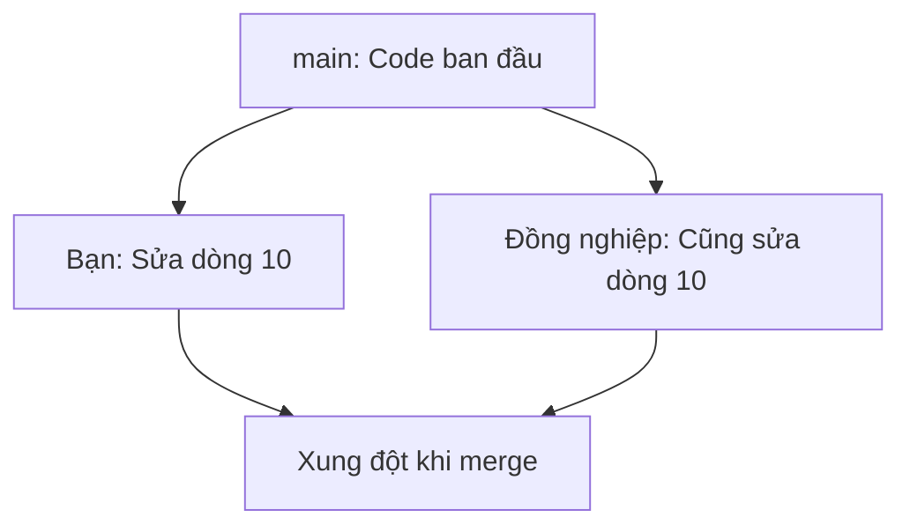

# 8.1.3 Code xung đột rồi phải làm sao——Giải quyết xung đột

Khi hai người cùng sửa đổi phần giống nhau của cùng một file, Git không thể tự động xác định phiên bản nào sẽ giữ lại, điều này tạo ra xung đột.

## Xung đột được tạo ra như thế nào



**Điều kiện tạo ra xung đột**:
- Hai branch sửa đổi **cùng vùng trong cùng file**
- Git không thể tự động quyết định giữ phiên bản nào

**Trường hợp không có xung đột**:
- Sửa đổi các file khác nhau
- Sửa đổi các vùng khác nhau trong cùng file
- Một bên chỉ thêm nội dung mới

## Biểu hiện của xung đột

Khi xung đột xảy ra, Git sẽ chèn các dấu hiệu xung đột vào file:

```
<<<<<<< HEAD
Nội dung sửa đổi của bạn
=======
Nội dung sửa đổi của đối phương
>>>>>>> feat/other-branch
```

| Dấu hiệu | Ý nghĩa |
|------|------|
| `<<<<<<< HEAD` | Bắt đầu nội dung của branch hiện tại |
| `=======` | Dòng phân cách |
| `>>>>>>> branch` | Kết thúc nội dung của branch được merge |

## Các bước giải quyết xung đột

### Bước 1: Xác định file xung đột

```bash
# Xung đột khi merge
git merge feat/login
# Auto-merging src/auth.ts
# CONFLICT (content): Merge conflict in src/auth.ts

# Xem trạng thái xung đột
git status
# Unmerged paths:
#   both modified: src/auth.ts
```

### Bước 2: Mở file xem xung đột

```typescript
// src/auth.ts
function login(user: string) {
<<<<<<< HEAD
  // Phiên bản của bạn: Sử dụng JWT
  return jwt.sign({ user });
=======
  // Phiên bản của đồng nghiệp: Sử dụng Session
  return session.create({ user });
>>>>>>> feat/session-auth
}
```

### Bước 3: Giải quyết xung đột thủ công

Dựa trên nhu cầu nghiệp vụ, chọn giữ phiên bản nào (hoặc kết hợp cả hai):

```typescript
// Code sau khi giải quyết
function login(user: string) {
  // Quyết định cuối cùng: Sử dụng JWT
  return jwt.sign({ user });
}
```

**Xóa tất cả dấu hiệu xung đột** (`<<<<<<<`, `=======`, `>>>>>>>`) rồi lưu file.

### Bước 4: Đánh dấu xung đột đã được giải quyết

```bash
# Thêm file đã giải quyết vào staging area
git add src/auth.ts

# Hoàn thành merge
git commit -m "merge: Giải quyết xung đột module auth, áp dụng phương án JWT"
```

## Sử dụng IDE để giải quyết xung đột

Các IDE hiện đại (như VS Code, Cursor) cung cấp công cụ giải quyết xung đột trực quan:

```
┌─────────────────────────────────────────┐
│  Accept Current Change  │  Phiên bản branch hiện tại  │
│  Accept Incoming Change │  Phiên bản branch được merge│
│  Accept Both Changes    │  Giữ cả hai      │
│  Compare Changes        │  So sánh xem      │
└─────────────────────────────────────────┘
```

**Cách làm được khuyến nghị**:
1. Nhấp "Compare Changes" để xem sự khác biệt
2. Hiểu ý định sửa đổi của cả hai bên
3. Chọn phương án phù hợp hoặc chỉnh sửa thủ công

## Best practice phòng ngừa xung đột

1. **Đồng bộ thường xuyên**: Thường xuyên pull cập nhật remote, giảm sự khác biệt giữa các branch
2. **Commit nhỏ**: Mỗi commit phạm vi thay đổi nhỏ, xung đột dễ giải quyết hơn
3. **Phân công rõ ràng**: Thành viên nhóm cố gắng tránh sửa cùng file đồng thời
4. **Giao tiếp kịp thời**: Thông báo cho đồng đội trước khi sửa module chung

## Kỹ thuật xử lý xung đột phức tạp

### Hủy merge, quay về trước khi merge

```bash
git merge --abort
```

### Sử dụng phiên bản của một bên

```bash
# Sử dụng phiên bản của branch hiện tại
git checkout --ours src/auth.ts

# Sử dụng phiên bản của branch được merge
git checkout --theirs src/auth.ts
```

### Xem thông tin chi tiết về xung đột

```bash
# Xem so sánh ba phía của xung đột
git diff --cc src/auth.ts

# Xem nội dung của tổ tiên chung
git show :1:src/auth.ts  # Tổ tiên chung
git show :2:src/auth.ts  # Branch hiện tại
git show :3:src/auth.ts  # Branch được merge
```

## Hướng dẫn hợp tác với AI

Khi gặp xung đột phức tạp, có thể nhờ AI giúp phân tích:

**Ví dụ Prompt**:
> "Đây là xung đột Git tôi gặp phải:
> ```
> <<<<<<< HEAD
> function validateUser(user) { return user.email && user.password; }
> =======
> function validateUser(user) { return user.email?.trim() && user.password?.length > 6; }
> >>>>>>> feat/validation
> ```
> Hãy giúp tôi phân tích sự khác biệt giữa hai phiên bản và đề xuất cách merge?"

## Checklist nghiệm thu

- [ ] Hiểu nguyên nhân tạo ra xung đột
- [ ] Có thể nhận diện dấu hiệu xung đột và giải quyết thủ công
- [ ] Có thể sử dụng công cụ trực quan của IDE để giải quyết xung đột
- [ ] Biết cách hủy merge hoặc chọn phiên bản của một bên
