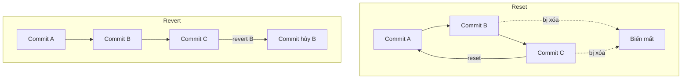
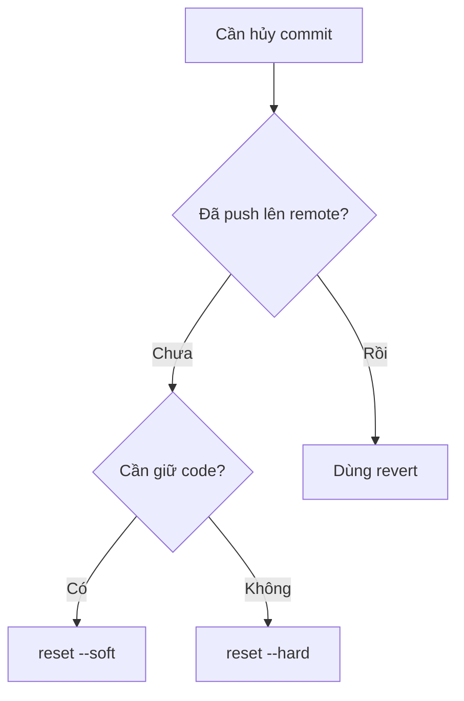

# 8.1.4 Khôi phục về ngày hôm qua chỉ bằng một cú nhấp——Rollback phiên bản

Code viết bị lỗi? Đừng hoảng, tính năng rollback của Git chính là thuốc hối hận của bạn——nhưng thuốc khác nhau chữa bệnh khác nhau.

## reset vs revert: Sự khác biệt cốt lõi

| Đặc tính | git reset | git revert |
|------|-----------|------------|
| Nguyên lý | Di chuyển con trỏ HEAD, "xóa" lịch sử | Tạo commit mới để "hủy bỏ" thay đổi |
| Lịch sử | Sẽ thay đổi lịch sử | Giữ nguyên lịch sử đầy đủ |
| Code đã push | Không khuyến nghị | An toàn để sử dụng |
| Tình huống áp dụng | Commit cục bộ chưa push | Commit đã push lên remote |



## git reset: Quay về quá khứ

### Ba chế độ của reset

```bash
# --soft: Giữ nguyên thay đổi trong working directory và staging area
git reset --soft HEAD~1

# --mixed (mặc định): Giữ nguyên working directory, xóa staging area
git reset HEAD~1

# --hard: Xóa hoàn toàn working directory và staging area (cẩn thận!)
git reset --hard HEAD~1
```

| Chế độ | Working Directory | Staging Area | Lịch sử Commit |
|------|--------|--------|----------|
| --soft | Giữ nguyên | Giữ nguyên | Rollback |
| --mixed | Giữ nguyên | Xóa | Rollback |
| --hard | Xóa | Xóa | Rollback |

### Tình huống sử dụng thường gặp

```bash
# Tình huống 1: Hủy commit gần nhất, nhưng giữ code để tiếp tục sửa
git reset --soft HEAD~1

# Tình huống 2: Hủy 3 commit gần nhất
git reset --hard HEAD~3

# Tình huống 3: Rollback về commit chỉ định
git reset --hard abc1234

# Tình huống 4: Hủy git add, nhưng giữ nguyên sửa đổi file
git reset HEAD file.ts
```

### Khắc phục thao tác nguy hiểm

Nếu không cẩn thận `reset --hard`, có thể dùng reflog để tìm lại:

```bash
# Xem lịch sử thao tác
git reflog

# Tìm hash của commit bị mất, sau đó khôi phục
git reset --hard abc1234
```

## git revert: Tạo "commit ngược"

revert không xóa lịch sử, mà tạo một commit mới để "đối lập" với thay đổi trước đó.

```bash
# Hủy commit gần nhất
git revert HEAD

# Hủy commit chỉ định
git revert abc1234

# Hủy nhiều commit liên tiếp
git revert HEAD~3..HEAD

# Hủy nhưng không tự động commit
git revert --no-commit abc1234
```

### revert merge commit

Merge commit cần chỉ định giữ branch cha nào:

```bash
# -m 1 nghĩa là giữ nhánh chính (parent commit đầu tiên)
git revert -m 1 merge-commit-hash
```

## Hướng dẫn quyết định theo tình huống



### Bảng đối chiếu tình huống

| Tình huống | Lệnh khuyến nghị | Lý do |
|------|----------|------|
| Vừa commit phát hiện viết sai | `git reset --soft HEAD~1` | Giữ code để tiếp tục sửa |
| Muốn xóa hoàn toàn mấy commit gần đây | `git reset --hard HEAD~n` | Dọn dẹp cục bộ |
| Code đã push có bug | `git revert HEAD` | Không thay đổi lịch sử remote |
| Muốn hủy một commit ở giữa | `git revert abc1234` | Hủy chính xác commit đơn lẻ |
| Không cẩn thận merge nhầm branch | `git revert -m 1 merge` | Hủy merge |

## Kỹ thuật rollback khác

### Khôi phục file đơn lẻ về phiên bản chỉ định

```bash
# Khôi phục file về phiên bản trước
git checkout HEAD~1 -- src/file.ts

# Khôi phục file về commit chỉ định
git checkout abc1234 -- src/file.ts
```

### Lưu trữ tạm thời công việc hiện tại

```bash
# Lưu tạm công việc hiện tại
git stash

# Xem danh sách stash
git stash list

# Khôi phục stash gần nhất
git stash pop

# Khôi phục stash chỉ định
git stash apply stash@{1}
```

## Hướng dẫn hợp tác với AI

**Ý định cốt lõi**: Cho AI biết tình huống cụ thể của bạn (đã push hay chưa, có cần giữ code không).

**Ví dụ Prompt**:
> "Tôi vừa push một commit lên branch main, nhưng phát hiện code có bug nghiêm trọng, cần hủy ngay commit này, đồng thời giữ toàn vẹn lịch sử Git, phải làm thế nào?"

## Checklist nghiệm thu

- [ ] Hiểu sự khác biệt giữa reset và revert
- [ ] Có thể chọn cách rollback đúng theo tình huống
- [ ] Biết cách dùng reflog để tìm lại commit đã xóa nhầm
- [ ] Có thể sử dụng stash để lưu trữ tạm tiến độ công việc
